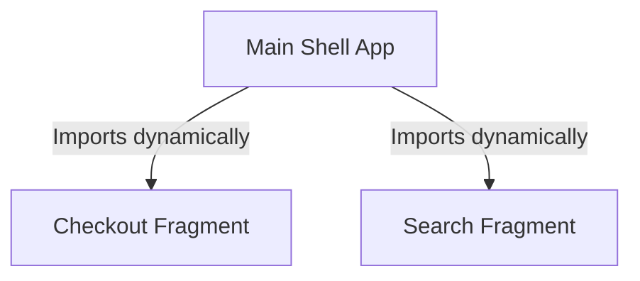

# 24: Micro-Frontends & Web Architecture

  

## 🎯 The Big Goal

> **After this chapter, you will know how to scale heavy web applications efficiently. You will understand how multiple teams can build a single website without stepping on each other's toes.**

Microservices fix back-end chaos. But what about the front-end? 

If 50 developers all edit the same massive React app, things break. Deployments slow down. **Micro-frontends** solve this.

---

## 1. 🍰 Vertical vs Horizontal Slicing

How do you break a website into independent pieces?

### 🥩 Horizontal Slicing (The Old Way)
*   You organize teams by technical function. 
*   One team handles the UI (React).
*   Another team handles logic and DB (Java).
*   ⚠️ **Problem**: To add a single new button, both teams must talk. Delivery slows down to a crawl.

### 🥪 Vertical Slicing (The Micro-Frontend Way)
*   You organize teams by **business feature**.
*   A "Checkout Team" owns everything about checkout: the UI, the backend, and the database.
*   Another "Search Team" owns the search bar UI and search backend.
*   ✅ **Result**: Total independence. Teams deploy their own features without asking for permission.

---

## 2. 🧩 How Do They Fit Together?

If the "Search" and "Checkout" features are built separately, how does the user see just ONE unified website?

**Answer: Module Federation (Webpack 5+)**

This is a modern technical tool. It lets you load separate JavaScript applications dynamically at runtime.

1.  **The Shell App**: The core website frame (Header, Footer, Navigation). This is its own app.
2.  **The Fragments**: The independent apps (Checkout, Search, Feed).
3.  **The Assembly**: When the user opens the website, the Shell App reaches out and fetches the exact fragments needed for that specific page, plugging them in instantly.

---

## 🤔 Reflection Questions

1. **What happens if the Search Fragment breaks?** Does the entire e-commerce site crash, or just the search bar?

💡 View Answer

Just the search bar breaks — the rest of the site continues functioning normally. This is the core resilience benefit of Micro Frontends: each fragment is **independently deployed and isolated**. If the Search Fragment throws a JavaScript error, it's contained within its own iframe or Web Component boundary. The Product Catalog, Cart, and Checkout fragments are unaffected. As Luca Mezzalira explains in *Building Micro-Frontends*, this failure isolation is why micro frontends are superior to a monolithic frontend — a bug in one team's code cannot take down another team's feature.

2. **If each team builds their own UI, how do you prevent the website from looking like a Frankenstein monster?** (Hint: Design Systems).

💡 View Answer

You enforce visual consistency through a **shared Design System** — a library of reusable UI components (buttons, forms, typography, colors) that all teams must use. The Design System is maintained by a dedicated platform team and distributed as an npm package. Each micro frontend imports and uses these shared components instead of creating their own. As *Building Micro-Frontends* emphasizes, the Design System is the "contract" that guarantees visual coherence across independently developed fragments. Without it, each team's UI diverges over time, creating a disjointed user experience.

---

## 📝 Key Interview Talking Points

*   **Autonomy**: The main benefit of Micro-frontends is organizational speed. It removes deployment bottlenecks.
*   **Independent Deployments**: Highlight that the Search team can update their UI 10 times a day, while the Checkout team updates their UI once a week.
*   **Performance Hit**: Be honest about the tradeoffs. Loading 5 different React apps can bloat the web bundle. You must manage shared dependencies carefully.
*   **When NOT to use them**: They add massive complexity. Do not use them for small teams or simple apps.

---

[<< Previous: CQRS and Event Sourcing](./23_CQRS_and_Event_Sourcing.md) | [Home: System Design Curriculum](./README.md) | [Next: Architecture Hard Parts >>](./25_Software_Architecture_Hard_Parts.md)
