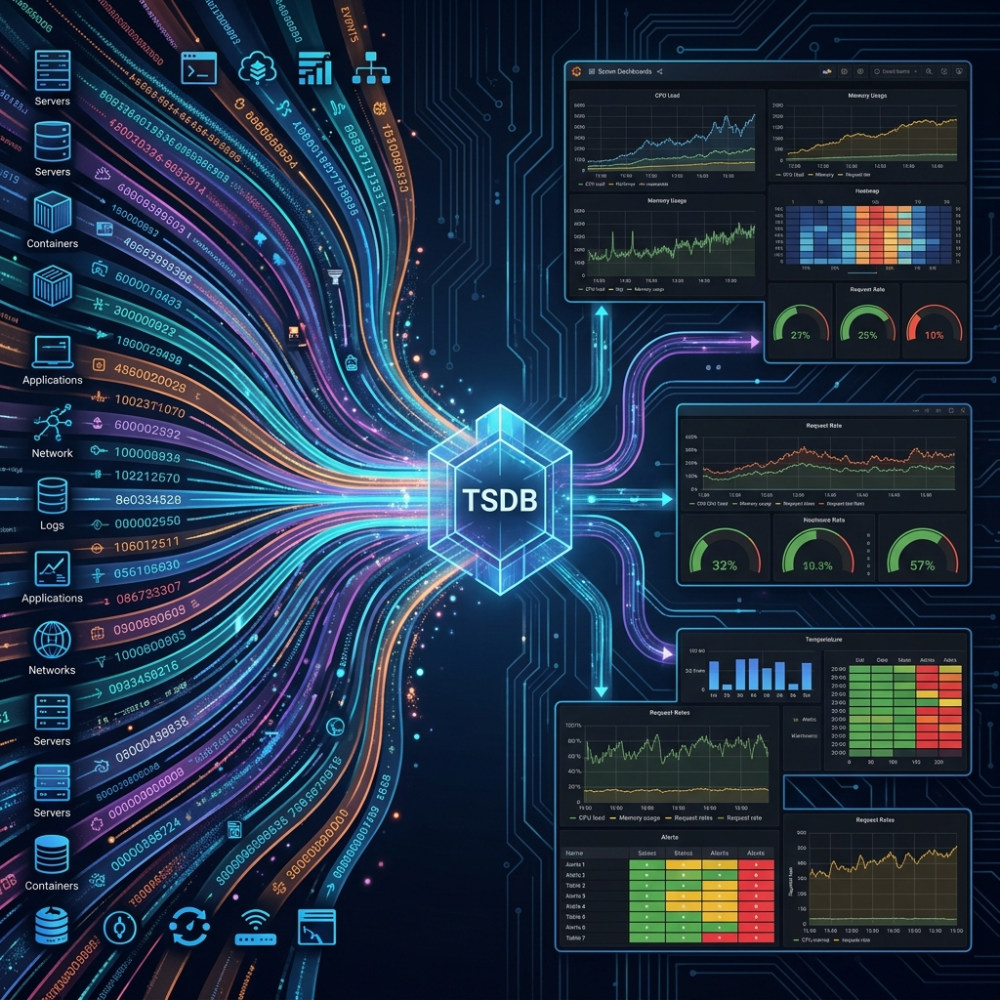

# 29: Design a Metrics Monitoring System

  

## 🎯 The Big Goal

> **After this chapter, you will know how to design massive systems that monitor system health, like Datadog or Prometheus.**

Every large system generates millions of logs and metrics every second (e.g., CPU load: 85%). Where does that data go? How do you query it without crashing the database?

You need specialized pipelines that handle pure telemetry data at extreme speed.

---

## 1. 🗃️ Time-Series Databases (TSDB)

You cannot use MySQL or PostgreSQL to store billions of CPU readings per minute. It will die.

You must build the system entirely around a **Time-Series Database (TSDB)**, like InfluxDB or Prometheus.

*   🕒 **Time is the Index**: Every single row of data is indexed purely by a timestamp.
*   📉 **Compression**: TSDBs use heavy algorithmic compression uniquely designed for numbers that change slightly over time.
*   🧊 **Downsampling**: Old data is automatically summarized. Last week's minute-by-minute data gets compressed into hourly averages automatically to save space.

---

## 2. 🧲 Push vs Pull Data Models

How does the telemetry data actually get completely into your central TSDB? 

There are two massive industry camps:

### 📥 The Pull Model (Direct Fetching)
*   Used by **Prometheus**.
*   The central monitoring server "pulls" or scrapes data actively from your microservices every 10 seconds.
*   ✅ **Pros**: The central server cannot be easily overwhelmed. It controls the tempo securely. Easy to know if a server is entirely dead (it won't respond to the pull).

### 📤 The Push Model (Direct Sending)
*   Used by **Datadog** and **New Relic**.
*   The individual microservices "push" their data into a central log aggregator automatically.
*   ✅ **Pros**: Better for temporary environments completely (like AWS Lambda) where the server spins up, pushes data, and permanently dies before a Pull model could scrape it.

---

## 🤔 Reflection Questions

1. **If a thousand thousands (a million) servers suddenly push metrics to your system at the exact same second, how do you completely prevent your backend from melting?** (Hint: Place a highly scaled Kafka queue directly in front of your TSDB).
2. **When scaling out a Time-Series Database, what makes more architectural sense: Sharding the database by Server ID or safely sharding it by Timestamp exactly?**

---

## 📝 Key Interview Talking Points

*   **TSDBs vs Relational DBs**: Prove you distinctly know that Time-Series databases exactly are highly specialized for heavy sequential writes comprehensively and compressed time-range queries cleverly. 
*   **Decoupling Ingestion**: Never write data directly to the database. Always explicitly put an event broker nicely (like Kafka/Kinesis) comfortably between your metric agents and your TSDB efficiently.
*   **The Pull vs Push Argument**: Explain perfectly when to clearly use actively push actively (ephemeral containers, lambda functions) versus elegantly pull purely (long-running servers cleanly).

---

[<< Previous: Proximity Service](./28_Design_Proximity_Service_Maps.md) | [Home: System Design Curriculum](./README.md) | [Next: Distributed Message Queue >>](./30_Design_Distributed_Message_Queue.md)
