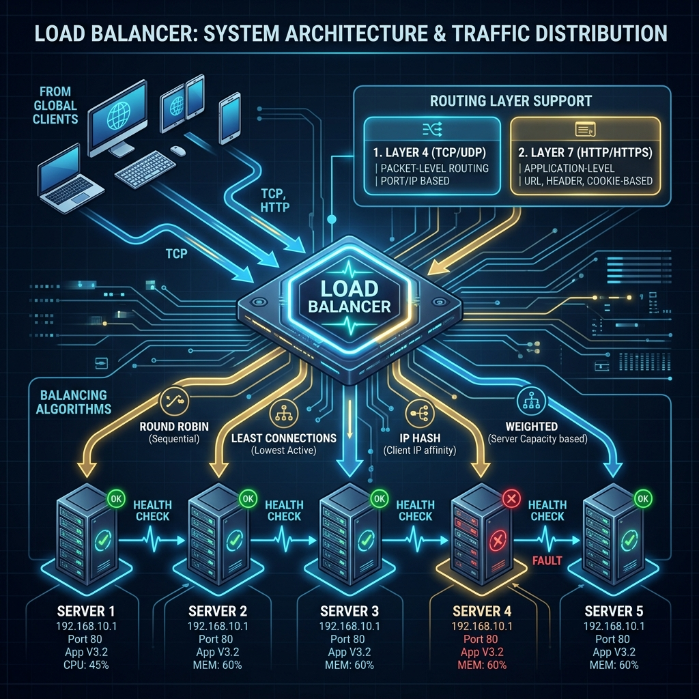

# 32: Load Balancers Deep Dive

<p align="center">
  
</p>

> 🧠 **The Feynman Hook:** A load balancer is an airport runway controller. Without one, every pilot would choose the same runway — all traffic queues on Runway 1 while Runways 2 and 3 sit empty. The controller distributes landings across all available runways based on traffic and runway conditions. A Layer 4 controller sees only "aircraft inbound" (IP + port). A Layer 7 controller knows "this is a cargo jet that needs a reinforced runway" (HTTP content inspection) and routes accordingly.

## 🎯 What You'll Learn

> **After this chapter, you'll understand how Load Balancers act as traffic cops for your distributed systems, preventing any single server from becoming overwhelmed. You will learn the difference between Layer 4 and Layer 7 load balancing, master common routing algorithms, and be able to deploy a fully functional load balancing cluster locally using Docker and NGINX.**

As your user base grows from hundreds to millions, a single server is no longer enough to handle the traffic. You must scale horizontally by adding more servers. But how do thousands of user requests know *which* specific server to talk to? 

That is the job of the **Load Balancer**. It sits between clients and servers, accepting incoming network and application traffic and distributing it across multiple backend servers using various algorithms.

---

## 1. High-Level Architecture: Where Does It Sit?

A typical highly available architecture places load balancers in multiple layers:

1. **DNS Load Balancing:** At the highest level, DNS can return different IP addresses for the same domain (e.g., routing users to the nearest data center).
2. **External Load Balancer:** Sits at the edge of your cloud network. It receives internet traffic and routes it to an active frontend web server.
3. **Internal Load Balancer:** Sits *behind* the web servers, routing API requests from the web layer to the backend microservices, or from microservices to database read-replicas.

---

## 2. Layer 4 vs Layer 7 Load Balancing

> **Feynman Insight:** Layer 4 is a motorway toll booth — it sees the vehicle type (car, truck) and lets it through. It has no idea what's in the cargo. Layer 7 is a customs officer — they open the boot, check the contents, and send different cargo to different inspection areas (pasta to Italy, alcohol to the duty-free warehouse). The customs search is thorough but takes longer. The toll booth is fast. Choose based on whether you need content-based routing (customs) or raw throughput (toll booth).

Load balancers operate at different layers of the OSI model:

### Layer 4 (Transport Layer - TCP/UDP)
- **How it works:** It routes traffic based *only* on network-level information: IP addresses and Port numbers. It does not inspect the contents of the message.
- **Pros:** Extremely fast, low CPU overhead, works for any TCP/UDP traffic (e.g., database connections, game servers).
- **Cons:** Cannot make smart routing decisions based on what a user is trying to do.

### Layer 7 (Application Layer - HTTP/HTTPS)
- **How it works:** It looks *inside* the HTTP request. It reads the URL path, Headers, Cookies, and HTTP Methods.
- **Pros:** "Smart" routing. For example, it can send requests for `/images/*` to a dedicated media-processing cluster, and `/api/checkout` to a highly secure payment server cluster.
- **Cons:** Slower, as it must terminate the SSL/TLS connection, decrypt the payload, read it, and re-encrypt it before sending it to the backend.

---

## 3. Routing Algorithms

> **Feynman Insight:** Round Robin is a taxi dispatcher assigning cabs in sequence without thought — fair but ignoring that Cab 3 is stuck in traffic (slow server). Weighted Round Robin fixes this by giving Cab 1 (faster server) two fares for every one fare that slow Cab 3 gets. Least Connections picks the cab with fewest current passengers. IP Hash is assigning each regular customer to "their" dedicated cab driver for personalised service (sticky sessions).

How does the load balancer choose the next server?

1. **Round Robin:** The simplest algorithm. Requests are distributed sequentially (Server 1, Server 2, Server 3, Server 1, Server 2...).
2. **Weighted Round Robin:** Some servers have more RAM/CPU. You give them a higher "weight." For every 1 request Server A gets, Server B (which is twice as powerful) gets 2.
3. **Least Connections:** Requests are sent to the server with the fewest active, ongoing connections. Ideal for workloads where connection times vary wildly.
4. **IP Hash:** Computes a fast mathematical hash of the client's IP address. This guarantees that a specific user will *always* be routed to the exact same backend server (useful for maintaining sticky sessions/caches).

---

## 4. Health Checks

> **Feynman Insight:** Health checks are a pool lifeguard. Every 5 seconds, the lifeguard scans each swimmer (server). If a swimmer doesn't respond to three wave signals in a row, they're pulled from the pool immediately — other swimmers don't get redirected to a drowning swimmer. The load balancer does the same: a server that fails three consecutive `/health` checks is removed from the routing pool instantly, with traffic redistributing to healthy servers automatically.

A load balancer is useless if it sends traffic to a server that has crashed. 

Load balancers constantly send "Heartbeats" (Health Checks) independently to the backend servers. For example, an HTTP load balancer might send a `GET /health` request every 5 seconds. If a server fails to respond with an `HTTP 200 OK` three times in a row, the load balancer temporarily removes it from the routing pool.

---

## 🐳 Hands-on: Dockerized NGINX Load Balancer

Let's build a real load balancer using **NGINX**. We will spin up 3 simple web servers and 1 load balancer to distribute traffic among them using Round Robin.

### Step 1: Create the Project Files

Create a directory on your computer and add the following two files.

**1. `nginx.conf`**
This file configures NGINX to act as a Layer 7 Round Robin load balancer.

```nginx
events {}

http {
    # Define the pool of backend servers
    upstream backend_servers {
        server web1:80;
        server web2:80;
        server web3:80;
    }

    server {
        listen 80;

        location / {
            # Proxy all requests to the upstream pool defined above
            proxy_pass http://backend_servers;
            
            # Pass original headers to the backend
            proxy_set_header Host $host;
            proxy_set_header X-Real-IP $remote_addr;
        }
    }
}
```

**2. `docker-compose.yml`**
This file defines our three backend servers (using a simple image that prints its own hostname) and our NGINX load balancer.

```yaml
version: '3.8'

services:
  # The Load Balancer
  loadbalancer:
    image: nginx:latest
    volumes:
      - ./nginx.conf:/etc/nginx/nginx.conf:ro
    ports:
      - "8080:80"
    depends_on:
      - web1
      - web2
      - web3

  # Backend Server 1
  web1:
    image: hashicorp/http-echo:latest
    command: -text="Hello from Server ONE" -listen=:80

  # Backend Server 2
  web2:
    image: hashicorp/http-echo:latest
    command: -text="Hello from Server TWO" -listen=:80

  # Backend Server 3
  web3:
    image: hashicorp/http-echo:latest
    command: -text="Hello from Server THREE" -listen=:80
```

### Step 2: Run and Test

1. Open your terminal in the directory where you saved those files.
2. Start the cluster:
   ```bash
   docker-compose up -d
   ```
3. Test the load balancer by sending repeated requests using `curl`:
   ```bash
   for i in {1..6}; do curl http://localhost:8080; done
   ```
   **Output:**
   ```text
   Hello from Server ONE
   Hello from Server TWO
   Hello from Server THREE
   Hello from Server ONE
   Hello from Server TWO
   Hello from Server THREE
   ```
   
Notice the perfect Round Robin distribution! If you suddenly run `docker stop web2`, the load balancer will detect the failure and automatically reroute traffic exclusively between `web1` and `web3`.

---

## 🤔 Reflection Questions

1. **If you are building a real-time multiplayer shooting game that uses UDP sockets, should you use a Layer 4 or a Layer 7 Load Balancer?**
<details>
<summary>💡 View Answer</summary>

You must use a **Layer 4 (Transport Layer) Load Balancer**. Layer 7 load balancers only understand specific application protocols like HTTP/HTTPS or gRPC. UDP traffic for a game server does not use HTTP headers, so a Layer 7 load balancer wouldn't know how to inspect or route it. A Layer 4 load balancer simply routes the raw UDP packets incredibly fast.
</details>

2. **Imagine your backend servers hold user "Session State" closely in their local RAM (e.g. keeping track of a shopping cart). If you use Round Robin load balancing, what problem will the user experience when they refresh the page?**
<details>
<summary>💡 View Answer</summary>

The user's shopping cart will mysteriously disappear and reappear! 
Request 1 might hit Server A, where the cart is created in RAM. Upon refresh, Request 2 might hit Server B, which has an empty RAM cache, making it look like the cart is gone. 
**Solution:** You either need to use an **IP Hash** routing algorithm (Sticky Sessions) so the user is always pinned to Server A, OR (the better architectural choice) move the session state completely out of the servers into a distributed cache like **Redis**, making the servers stateless.
</details>

3. **What is the "Single Point of Failure" in the architecture diagram where all clients point to a single Load Balancer? How do massive companies solve this?**
<details>
<summary>💡 View Answer</summary>

If the Load Balancer machine itself crashes, your entire system goes offline, even if 1,000 backend servers behind it are perfectly healthy. 
Companies solve this by running multiple Load Balancers in an **Active-Passive** or **Active-Active** cluster. They share a "Virtual IP Address" (VIP). If the primary load balancer crashes, the networking hardware (or cloud provider, like AWS ELB) instantly detects the failure and reassigns the public IP address to the backup load balancer immediately, ensuring uninterrupted service.
</details>

---

<div align="center">

[<< Previous: Apache Kafka Deep Dive](./31_Apache_Kafka_Deep_Dive.md) | [Home: System Design Curriculum](./README.md) | [Next: Content Delivery Networks >>](./33_Content_Delivery_Networks.md)

</div>
