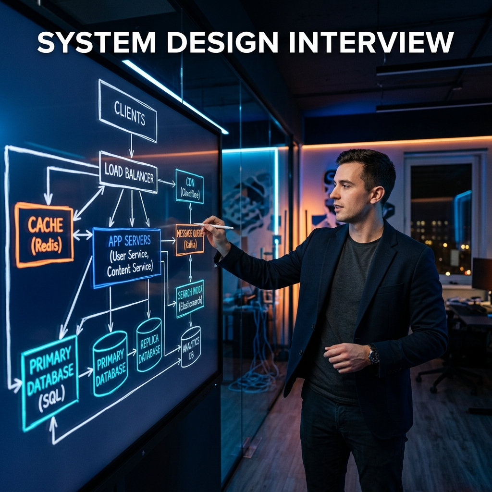
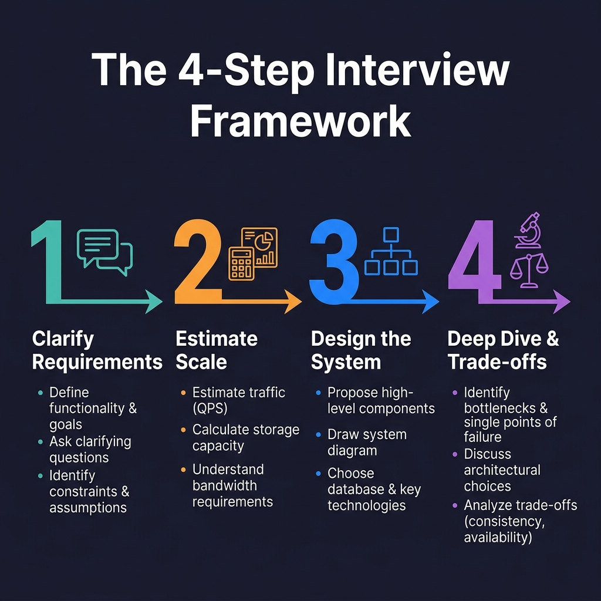
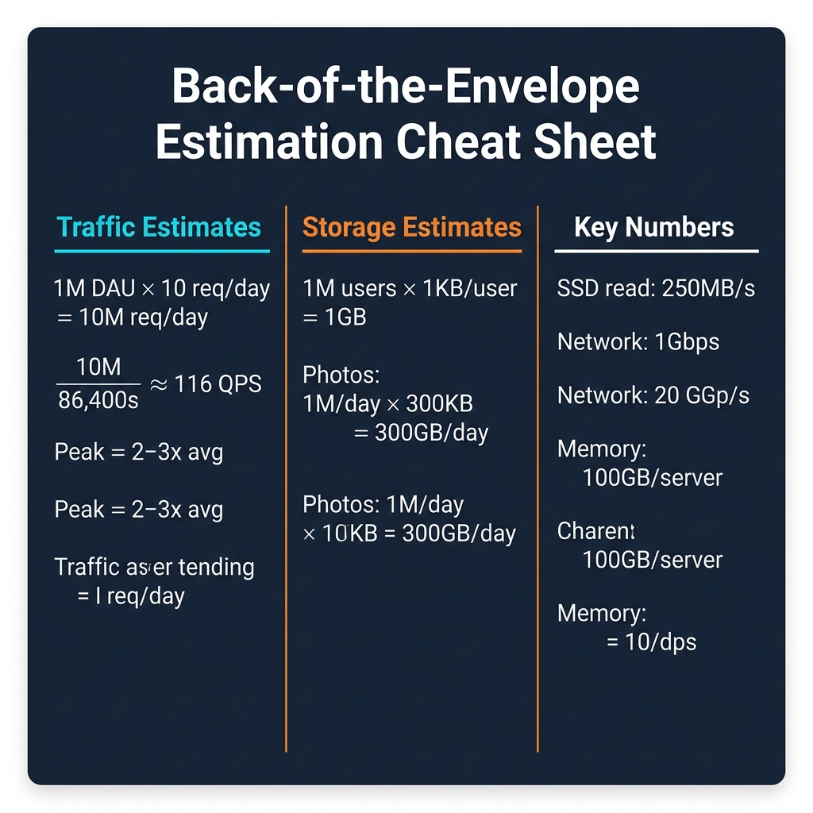
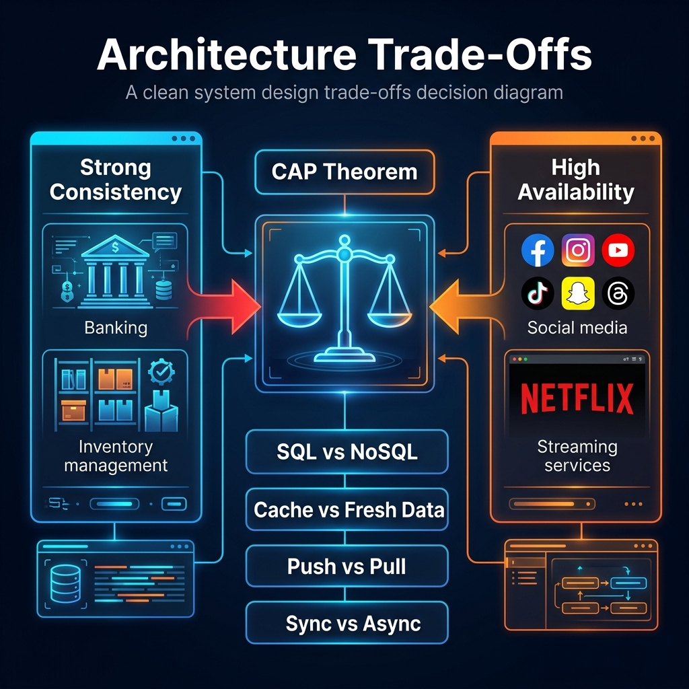

# 32: Tackling System Design Interviews

  

## 🎯 The Big Goal

> **After this chapter, you will understand the exact step-by-step framework to confidently tackle any system design interview, using the "4-Step Framework" popularized by Alex Xu.**

A System Design interview is not about finding the "perfect" architecture. It is an open-ended conversation designed to evaluate your ability to navigate ambiguity, ask the right questions, estimate constraints, and systematically construct a scalable solution while discussing trade-offs.

---

## 1. 🗺️ The 4-Step Interview Framework

The key to success is structure. Never jump straight into drawing boxes. Follow this proven 4-step framework based on *System Design Interview – An Insider's Guide* (Alex Xu).

  

### Step 1: Understand the Problem and Establish Design Scope (3-10 minutes)
Start by clarifying exactly what you are building. Do not make assumptions.
*   **Identify core features:** "Is this API for internal users or public?" "Do we need an activity feed or just direct messaging?"
*   **Identify non-functional requirements:** "Does the system need to be highly available (Netflix) or strongly consistent (Banking)?"
*   **Establish boundaries:** "Are we designing the mobile client logic or just the backend architecture?"

### Step 2: Propose High-Level Design and Get Buy-In (10-15 minutes)
Present a macroscopic view of the system before diving into deep technical weeds.
*   **Draw the core components:** Clients, Load Balancer, API Gateway, Web Servers, and Databases.
*   **Walk through a core flow:** Trace a request from the user to the database and back.
*   **Seek agreement:** "Does this high-level architecture align with your expectations before we scale it?"

### Step 3: Design Deep Dive (10-25 minutes)
Once the interviewer agrees with the high-level design, focus on the most difficult scaling challenges.
*   **Identify bottlenecks:** "Our database will choke on 10,000 writes per second."
*   **Solve the bottlenecks:** "Let's introduce Redis for caching reads, and Kafka to asynchronously buffer our writes."
*   **Discuss specific technologies:** Why Cassandra over MySQL? Why gRPC over REST?

### Step 4: Wrap Up (3-5 minutes)
Summarize your architecture and proactively discuss its limitations.
*   **Acknowledge flaws:** "This system handles our current scale, but if traffic spikes 10x, our single-region database will become a bottleneck."
*   **Discuss future scaling:** "In the future, we could implement multi-region active-active replication."

---

## 2. 🧮 Back-of-the-Envelope Estimation

Interviewers often ask for quick math to justify your design decisions. You must know these baseline numbers by heart.

  

### The Golden Numbers to Memorize
*   **Memory (RAM) is fast but limited:** ~100ns to read. Servers typically have 64GB - 256GB.
*   **SSD Storage is cheap but slower than RAM:** ~150us to read. Servers can easily hold terabytes.
*   **Network is the slowest:** Reading 1MB sequentially from memory takes ~250us, from network takes ~10ms.

### Quick Traffic Math
Always assume a **10:1 Read-to-Write ratio** for most consumer applications unless told otherwise.
*   If you have **1 Million Daily Active Users (DAU)** making 10 requests a day:
    `10,000,000 requests / 86,400 seconds in a day ≈ 115 Queries Per Second (QPS)`
*   **Peak QPS** is usually double or triple the average QPS.

---

## 3. ⚖️ Navigating Architecture Trade-Offs

The most important part of the interview is acknowledging that every choice has a cost. There is no right answer, only appropriate compromises.

  

When discussing your design, proactively bring up these exact trade-offs:

1.  **Consistency vs. Availability (CAP Theorem):** Are you building a bank (Consistency: No double spending, but the ATM might go offline) or Instagram (Availability: The feed always loads, even if a new photo is delayed by 5 seconds)?
2.  **Latency vs. Throughout:** Are you optimizing for the fastest single response time (Caching, avoiding full table scans) or the massive processing of big data (Kafka, MapReduce)?
3.  **SQL vs. NoSQL:** Structured tabular data with strict ACID guarantees (MySQL/Postgres) versus massive scale unstructured flexible data models (Cassandra/DynamoDB).

---

## 🤔 Reflection Questions

1. **You are asked to design a globally distributed highly available system. The interviewer asks: If a network partition occurs between your US and EU data centers, how do you handle incoming user writes?**

💡 View Answer

This is a direct application of the **CAP Theorem** (Consistency, Availability, Partition Tolerance) (See Chapter [05: CAP Theorem & Consistency](./05_CAP_Theorem_Consistency.md)). Because you asserted the system must be "globally distributed" and "highly available" (AP), you must sacrifice immediate Strong Consistency during a split. You would continue to accept writes in both the US and EU data centers to maintain Availability. When the network partition resolves, the system must perform **Conflict Resolution** (e.g., using Last-Write-Wins timestamps, or Vector Clocks, or letting the client resolve the merge as DynamoDB does). 

2. **Your high-level design shows an API generating short URLs and storing them in a database. The interviewer asks: As traffic hits 100,000 requests per second, your database CPU hits 100% utilization. How do you scale this specifically?**

💡 View Answer

This requires breaking down the bottleneck into Read vs Write paths (See Chapter [17: Design a URL Shortener](./17_Design_URL_Shortener.md)).
First, identify the read/write ratio. URL shorteners are incredibly heavily read-biased (e.g., 100:1). 
**To scale reads:** Introduce a **Cache layer (Redis)** in front of the database to absorb 90%+ of the traffic, completely relieving database CPU.
**To scale writes:** Shard the database horizontally by the URL short-code to distribute the write load across multiple hardware instances.

3. **You are designing a system like Netflix. You calculate that you need to store 10 Petabytes of video data. The interviewer asks: Should we use an RDBMS (Like MySQL) or a NoSQL database (Like Cassandra) to store these video files?**

💡 View Answer

**Neither.** This is a trick question regarding object storage. Databases (whether SQL or NoSQL) are built for structured data and high-speed queries, not for hosting massive binary blobs. Large video files should be stored in an **Object Storage system (like Amazon S3 or Google Cloud Storage)**, which is designed explicitly for infinite scaling of flat binary files. The database (SQL or NoSQL) should merely store the *metadata* (Video Name, Description, and the URL pointing to the S3 bucket) (See Chapter [20: Design a Video Platform](./20_Design_Video_Platform.md)).

---

## 📝 Key Interview Talking Points

*   **Structure:** "Before diving into the architecture, I'd like to spend a few minutes clarifying the functional constraints and scale."
*   **Bottlenecks:** "Looking at this high-level design, the clear bottleneck at 10M DAU will be database I/O on the write path."
*   **Mitigation:** "To mitigate this, I propose introducing a message queue (Kafka) to decouple the ingestion from the slow database writes."

---

[<< Previous: Apache Kafka Deep Dive](./31_Apache_Kafka_Deep_Dive.md) | [Home: System Design Curriculum](./README.md)
