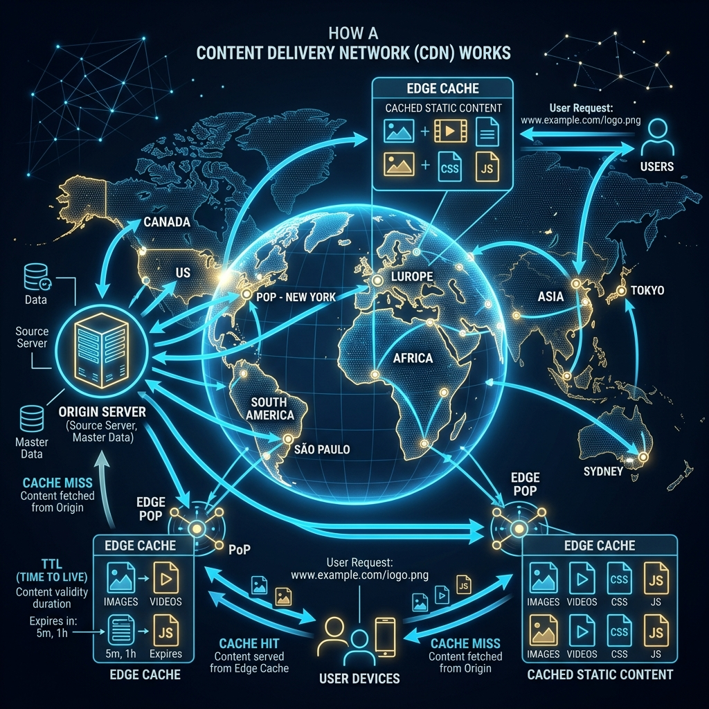
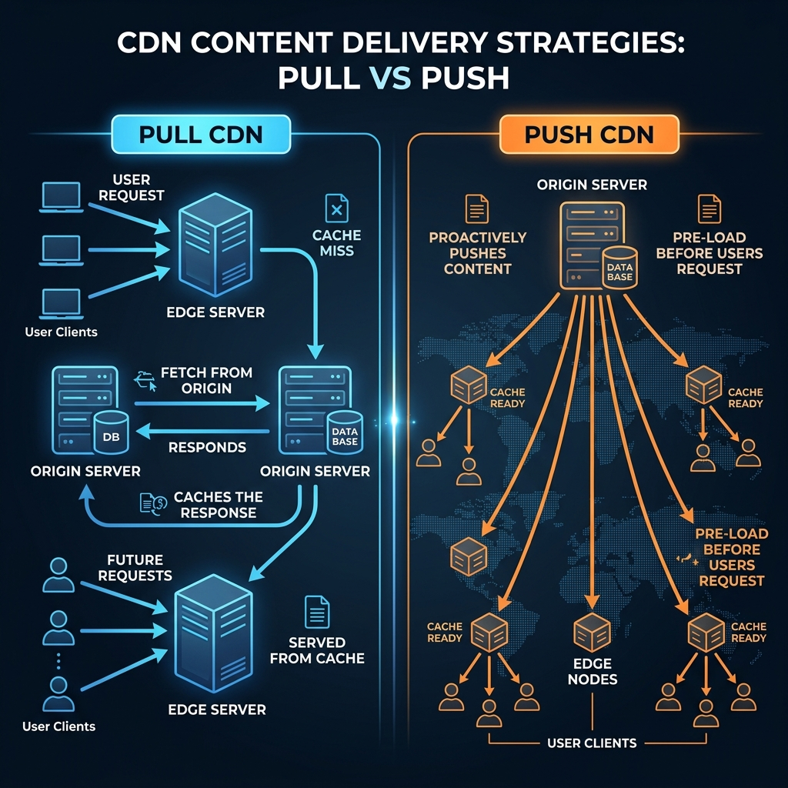
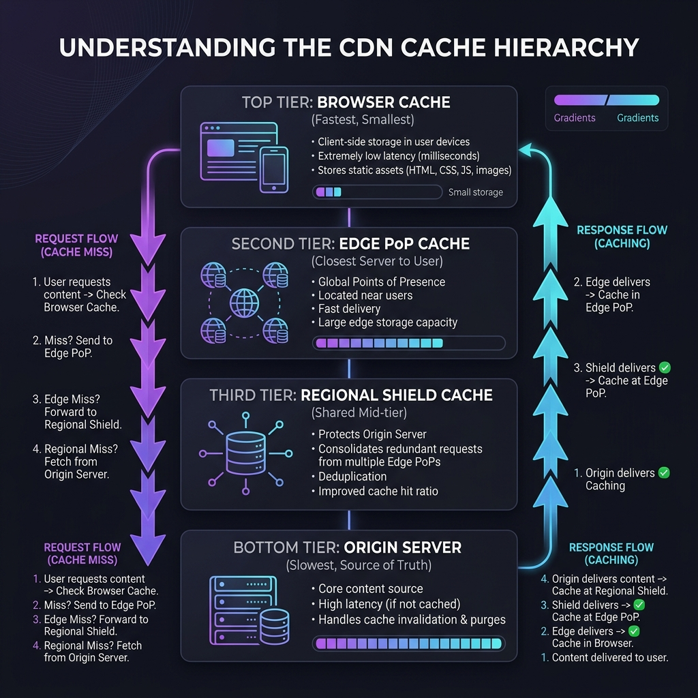
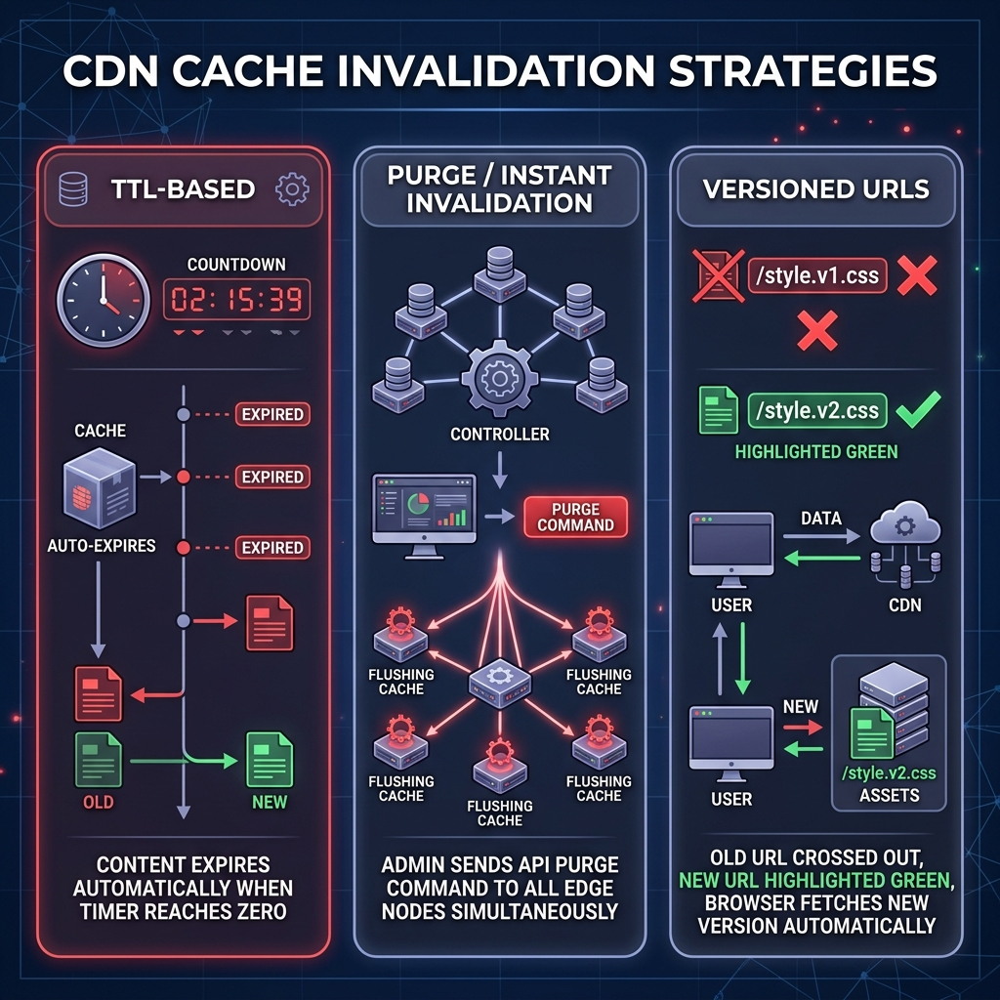

# 33: Content Delivery Networks (CDN) Deep Dive

  

## 🎯 The Big Goal

> **After this chapter, you will understand the critical role Content Delivery Networks (CDNs) play in serving massive global traffic. You will master the differences between Pull vs Push strategies, understand the Cache Hierarchy, and learn how edge networks invalidate stale data to ensure users always receive the fastest, most up-to-date web experience possible.**

If your servers are physically located in New York, a user in Tokyo will experience high latency due to the simple laws of physics—light and fiber optics take time to cross oceans. 

A **Content Delivery Network (CDN)** solves this physics problem. It is a geographically distributed network of proxy edge servers placed in data centers all over the world (Points of Presence, or PoPs). When a user in Tokyo requests an image, they do not download it from New York; they download a cached copy from a server located right in Tokyo, reducing latency from 200ms down to 10ms.

---

## 1. How CDNs Work: Pull vs Push Strategies

When a user requests a file, how does the CDN actually get that file from your Origin Server? There are two primary deployment models.

  

### The Pull CDN Strategy (The Standard)
In a Pull model, the Edge Server does absolutely nothing until a user specifically requests a file. 
1. The user requests `/logo.png`.
2. The Edge Server checks its cache. It isn't there (a **Cache Miss**).
3. The Edge Server "pulls" the file from your Origin Server.
4. The Edge Server stores a copy locally and serves it to the user.
5. All future requests for `/logo.png` return a fast **Cache Hit**.

**Best For:** Vast majority of use cases. Blogs, ecommerce sites, dynamic Web Apps.

### The Push CDN Strategy (Proactive)
In a Push model, you (the engineer) write a script that proactively uploads data to the CDN's servers *before* any user requests it. The CDN acts almost like a secondary hard drive syncing data globally.
1. Your Origin Server pushes a massive 50GB video file to all global Edge Nodes.
2. The user requests the video and instantly gets a Cache Hit, skipping the massive initial Cache Miss penalty.

**Best For:** Massive static media files, Software Installers (like iOS updates or video games), VOD streaming platforms.

---

## 2. Understanding the Cache Hierarchy

Caching is not just a single layer. Modern CDN architectures employ a deeply layered hierarchy to maximize **Cache Hit Ratios** and protect the Origin Server from collapsing under heavy load.

  

### The 4 Tiers of Delivery
1. **Browser Cache (Top Tier):** The fastest cache is the one that never touches the network. Browsers store CSS, JS, and images locally on the user's SSD based on HTTP `Cache-Control` headers.
2. **Edge PoP Cache:** The CDN server physically closest to the user (e.g., in a local ISP data center). If thousands of neighbors request the same viral video, the Edge PoP serves it to all of them.
3. **Regional Shield Cache:** If a file is missing from the local Edge PoP, instead of hammering the fragile Origin Server, the Edge PoP asks a massive "Regional Shield" server. This shield deduplicates requests from hundreds of downstream Edge PoPs, further protecting your Origin.
4. **Origin Server (Bottom Tier):** The absolute source of truth (e.g., your AWS S3 bucket or your NGINX server). It is the slowest to respond but contains the master data.

---

## 3. The Hardest Problem: Cache Invalidation

As the famous engineering quote goes: *"There are only two hard things in Computer Science: cache invalidation and naming things."*

When you deploy a new version of your `style.css` file, you don't want millions of users seeing the broken, old, cached CSS. You must invalidate the cache.

  

### Strategy A: TTL-Based (Time-To-Live)
Every file sent by your origin server includes an HTTP header dictating how long the Edge Server is allowed to keep it.
*   `Cache-Control: max-age=3600` tells the Edge Server to auto-expire the file after 1 hour. This is completely hands-off but means users might see stale data for up to 59 minutes if you update the file unexpectedly.

### Strategy B: Instant Invalidation / API Purge
If you make an emergency fix to a static HTML file, you can log into your CDN console (e.g., Cloudflare or AWS CloudFront) and trigger an **API Purge**. 
*   The CDN instantly broadcasts a command to all global edge nodes to delete the file. The next request will force a fresh fetch from the origin.

### Strategy C: Versioned URLs (The Best Practice)
Never name a file `style.css`. If you change the file contents, use a build tool (like Webpack or Vite) to inject a hash into the filename: `style.2f8d4.css`. 
*   By changing the filename itself, the browser and CDN treat it as a totally brand new resource. 
*   This completely bypasses the caching problem, guaranteeing instant updates for all users without running manual purges.

---

## 🤔 Reflection Questions

1. **If your website is entirely dynamic (e.g., a live stock-trading dashboard), does a CDN provide any value to you?**

💡 View Answer

Yes! While they can't cache the dynamic stock prices, modern CDNs provide massive value through **DDoS Protection** (absorbing attacks before they hit your servers), **TLS/SSL Offloading** (handling encryption handshakes faster at the edge), and **Network Optimization** (routing dynamic traffic over the CDN's private, non-congested fiber backbone instead of the public internet).

2. **You are building Netflix. Should you use a CDN to cache your video files? Why is this slightly different from normal web caching?**

💡 View Answer

Absolutely, Netflix could not exist without CDNs (in fact, they built their own called Open Connect). However, unlike a 50KB image, you don't want a 10GB 4K movie to trigger a "Cache Miss Pull" that takes minutes. Video streaming relies heavily on **Push CDN** strategies, pre-positioning the most popular movies on ISP Edge Nodes globally between 2 AM and 5 AM when network traffic is cheap. 

3. **A user in London requests an image. The London Edge PoP experiences a Cache Miss. Instead of fetching directly from your Origin Server in California, it fetches from a CDN "Shield" server in New York. Why?**

💡 View Answer

This is **Cache Tiering**. If your London, Paris, and Berlin Edge PoPs all experience Cache Misses simultaneously, they would send 3 separate requests to your Californian Origin Server. A Regional Shield in New York intercepts these requests. The Shield fetches it *once* from California, caches it, and serves it to all 3 European PoPs, drastically reducing CPU and outbound bandwidth load on your fragile Origin Server.

---

[<< Previous: Load Balancers Deep Dive](./32_Load_Balancers.md) | [Home: System Design Curriculum](./README.md) | [Next: Tackling System Design Interviews >>](./34_Tackling_System_Design_Interviews.md)

