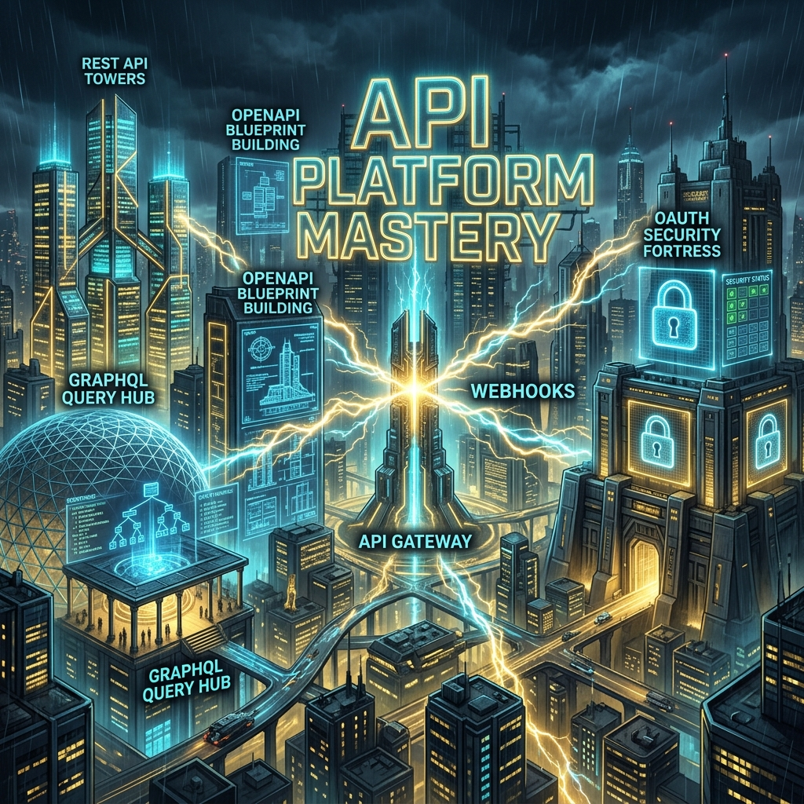
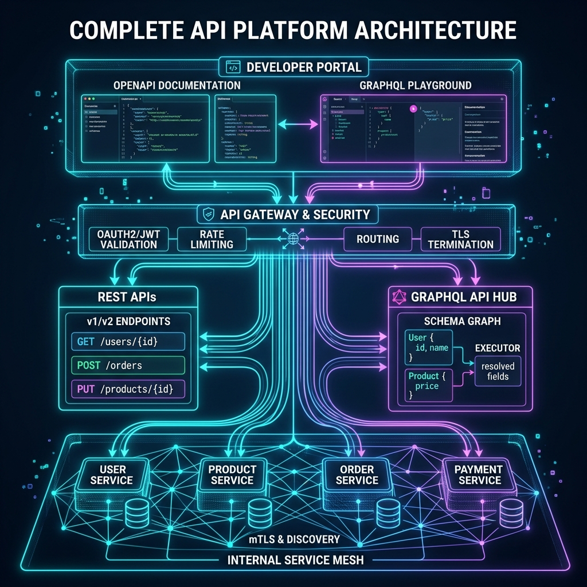

# 34: API Platform Design — The Complete Picture

<p align="center">
  
</p>

> 🧠 **The Feynman Hook:** Imagine you're the architect of a whole city. Not just one building — the ENTIRE city. You need roads (REST endpoints), a common blueprint standard (OpenAPI), a special district that answers any question in one shot (GraphQL), a security fortress at every gate (OAuth2/JWT), a city planning department that manages how the city grows over time (API Lifecycle), and emergency protocols for when any part of the city breaks (Circuit Breakers, Webhooks). This chapter is about designing that city — a complete API platform — from scratch.

## 🎯 What You'll Learn

> **After this chapter, you'll be able to design a complete, production-grade API platform that combines REST, GraphQL, OpenAPI contracts, OAuth2 security, versioning strategy, and integration patterns into a unified, evolving system.**

---

## 1. The Complete API Platform Architecture

<p align="center">
  
</p>

> **Son, a professional API platform is like a well-run airport.** There's one main terminal (API Gateway) where everyone enters. Different airlines (REST, GraphQL) have their own gates. Security checks (OAuth2, JWT) happen once at the entrance. The control tower (monitoring) watches everything. And there's a schedule board (developer portal) so passengers (developers) know exactly what flights (APIs) are available.


---

## 2. Design Exercise: Build the "ShopFast" API Platform

**Scenario:** You're designing the API platform for ShopFast — an e-commerce company with 50M users, 200K products, and 2M orders/day. Three types of consumers: mobile apps, single-page web app, and third-party seller integrations.

### Step 1: Define Consumer Personas & API Goals

| Consumer | Needs | API Style |
| :--- | :--- | :--- |
| **Mobile App** | Minimal payload, home feed in 1 call | REST via Mobile BFF |
| **Web SPA** | Rich product search, flexible queries | GraphQL |
| **Seller Partners** | Batch product uploads, webhook events | REST + Webhooks |

### Step 2: Design the Resource Model (REST)

```
/v1/users/{userId}
/v1/users/{userId}/orders
/v1/users/{userId}/addresses

/v1/products/{productId}
/v1/products/{productId}/reviews
/v1/categories/{categoryId}/products

/v1/orders/{orderId}
/v1/orders/{orderId}/items
/v1/orders/{orderId}/shipments
```

### Step 3: Define the GraphQL Schema

```graphql
type Query {
  product(id: ID!): Product
  searchProducts(query: String!, filters: ProductFilters): ProductConnection!
  user(id: ID!): User
  order(id: ID!): Order
}

type Product {
  id: ID!
  name: String!
  price: Float!
  category: Category!
  reviews(limit: Int = 5): [Review!]!
  relatedProducts: [Product!]!
  inventory: InventoryStatus!
}

type ProductConnection {
  items: [Product!]!
  pageInfo: PageInfo!
  totalCount: Int!
}

type Mutation {
  createOrder(input: CreateOrderInput!): Order!
  addToCart(productId: ID!, quantity: Int!): Cart!
}

type Subscription {
  orderStatusChanged(orderId: ID!): Order!
  priceDropped(productId: ID!): Product!
}
```

### Step 4: OpenAPI Spec for REST Endpoints

```yaml
openapi: 3.0.3
info:
  title: ShopFast API
  version: 1.0.0

servers:
  - url: https://api.shopfast.com/v1
    description: Production v1
  - url: https://api.shopfast.com/v2
    description: Production v2 (beta)

paths:
  /products/{productId}:
    get:
      operationId: getProduct
      summary: Get a product by ID
      parameters:
        - name: productId
          in: path
          required: true
          schema:
            type: string
      responses:
        '200':
          content:
            application/json:
              schema:
                $ref: '#/components/schemas/Product'
        '404':
          content:
            application/problem+json:
              schema:
                $ref: '#/components/schemas/ProblemDetails'

components:
  schemas:
    Product:
      type: object
      properties:
        id:
          type: string
        name:
          type: string
        price:
          type: number
        currency:
          type: string
          default: USD

  securitySchemes:
    BearerAuth:
      type: http
      scheme: bearer
      bearerFormat: JWT

security:
  - BearerAuth: []
```

---

## 3. Versioning Strategy for ShopFast

> **Remember, a shop that keeps changing its layout confuses customers. But a shop that never updates gets stuck in the past.** ShopFast uses a deliberate versioning strategy to evolve safely.

### Version Routing at the API Gateway

```
NGINX/API Gateway routing rules:

/v1/* → User Service (v1 handler, stable)
/v2/* → User Service (v2 handler, new features)

# v1 gets Sunset header automatically:
add_header Sunset "Sat, 01 Jan 2026 00:00:00 GMT";
add_header Deprecation "true";
```

### ShopFast Versioning Timeline

```
Q1 2024: Launch v1 REST APIs + GraphQL schema
Q2 2024: Add non-breaking fields to v1 (inventory, ratings)
Q3 2024: Design v2 with breaking changes (currency as object)
Q4 2024: Launch v2 alongside v1. Announce v1 sunset: Q4 2025
Q1 2025: Migrate seller integrations to v2 (high-touch support)
Q3 2025: v1 traffic < 5%. Final deprecation warning emails.
Q4 2025: v1 returns 410 Gone. Decommission v1 infrastructure.
```

### The Breaking Change: Currency Field

```json
// v1 response (old flat structure):
{ "price": 29.99, "currency": "USD" }

// Expand-Contract migration:
// Phase 1 - Both fields present:
{ "price": 29.99, "currency": "USD", "amount": { "value": 29.99, "currency": "USD" } }

// v2 response (new nested structure):
{ "amount": { "value": 29.99, "currency": "USD", "formatted": "$29.99" } }
```

---

## 4. Security Architecture

> **Every gate into ShopFast has the same security guard, but different VIP passes.** Customers use Authorization Code + PKCE (from their mobile app). Internal services use Client Credentials (machine-to-machine). Seller partners use API Keys with scoped permissions.

```
┌─────────────────┐     ┌──────────────────┐     ┌────────────────┐
│  Mobile App     │     │  Auth Server      │     │  API Gateway   │
│  (customer)     │     │  (OAuth2 + OIDC)  │     │                │
└────────┬────────┘     └────────┬─────────┘     └───────┬────────┘
         │                       │                        │
         │  Auth Code + PKCE     │                        │
         │──────────────────────►│                        │
         │                       │                        │
         │  JWT Access Token     │                        │
         │◄──────────────────────│                        │
         │                       │                        │
         │  GET /products + JWT  │                        │
         │───────────────────────────────────────────────►│
         │                       │                        │
         │                       │  Verify JWT signature  │
         │                       │  (public key, no DB)   │
         │                       │◄──────────────────────►│
         │                       │                        │
         │  Product data         │                        │
         │◄────────────────────────────────────────────── │
```

**JWT Claims for ShopFast:**
```json
{
  "sub": "user-123",
  "email": "alice@example.com",
  "scope": "read:products write:orders",
  "role": "customer",
  "seller_id": null,
  "exp": 1700000000,
  "iss": "https://auth.shopfast.com",
  "aud": "https://api.shopfast.com"
}
```

---

## 5. Webhook Integration for Sellers

> **Sellers need to know when their products sell.** Instead of polling our API every minute (which is like calling a friend every minute to ask "Did anything happen?"), sellers register a webhook URL and we call THEM when something happens.

```
Seller registers webhook:
POST /v1/webhooks
{
  "url": "https://seller-system.com/shopfast-events",
  "events": ["order.created", "order.cancelled", "inventory.low"],
  "secret": "sha256-hmac-secret-key"
}

ShopFast fires webhook when order placed:
POST https://seller-system.com/shopfast-events
X-ShopFast-Signature: sha256=abc123...
X-ShopFast-Timestamp: 1700000000
{
  "event": "order.created",
  "orderId": "ord-456",
  "productId": "prod-789",
  "quantity": 2,
  "buyerRegion": "EU"
}
```

---

## 6. Reliability Patterns

| Pattern | Where Applied | Benefit |
| :--- | :--- | :--- |
| **Circuit Breaker** | API Gateway → Payment Service | Stop cascading failures |
| **Retry + Backoff** | Webhook delivery | Guaranteed delivery |
| **Idempotency Keys** | POST /orders | No duplicate orders |
| **BFF Pattern** | Mobile API | Reduced round trips |
| **DataLoader** | GraphQL resolvers | No N+1 queries |
| **Rate Limiting** | Per API key / per user | Protect from abuse |

---

## 📝 Key Interview Talking Points

- Consumer-first design: define WHO uses the API BEFORE designing endpoints
- REST for CRUD resources; GraphQL for complex nested queries; webhooks for events
- **OpenAPI contract = single source of truth** for docs, SDKs, mocks, and tests
- OAuth2 + JWT: auth server issues tokens, API gateway validates with public key
- Versioning: URL path (`/v1/`) for REST, schema evolution for GraphQL
- **Expand-Contract pattern** for safe breaking changes without downtime
- Monitor version adoption to know when it's safe to sunset old versions

---

[<< Previous: Content Delivery Networks](./33_Content_Delivery_Networks.md) | [Home: Curriculum Map](./README.md) | [Next: REST API Design >>](./35_REST_API_Design.md)
