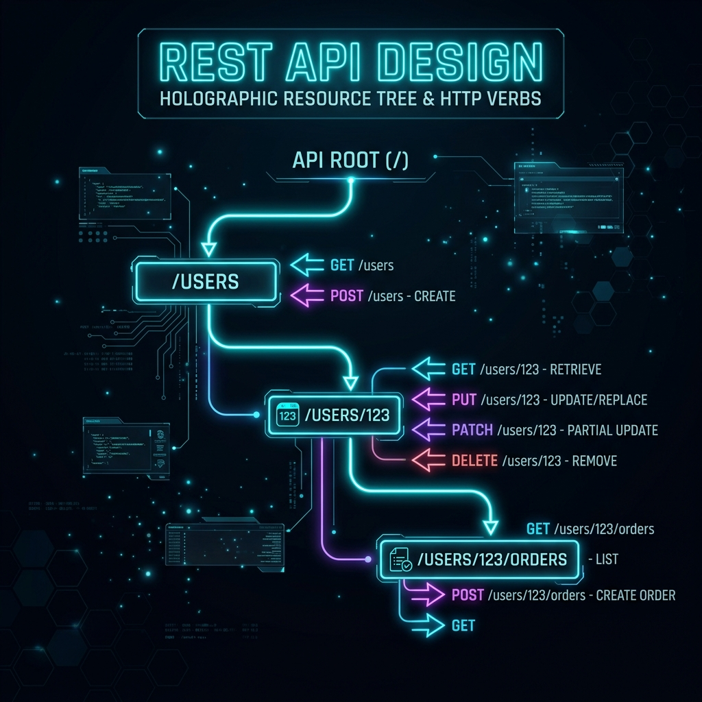

# 35: REST API Design Principles

<p align="center">
  
</p>

> **Imagine you have a giant toy box.** Each toy has a name tag on it. When your friend wants to play with a specific toy, they don't dig through the whole box — they just read the name tag and grab it. A REST API works the same way: every piece of data (a user, an order, a photo) gets its own unique name tag called a **URL**, and your friend (the client) uses simple action words like "GET" (look at it), "POST" (add a new one), "PUT" (replace it), or "DELETE" (throw it away) to interact with it.

## What You'll Learn

> **After this chapter, you'll understand how to design clean, predictable REST APIs using resources, HTTP verbs, status codes, and HATEOAS — the principles from the REST API Design Rulebook, RESTful Web APIs, and The Design of Web APIs.**

---

## 1. Resources: Everything is a Noun

> **Think of it like this, son:** In a library, you don't ask for "the action of reading" — you ask for "the book." In REST, everything is a **thing** (noun), not an action (verb). You ask for `/users`, not `/getUsers`.

The foundation of REST is that your API exposes **resources** — things, not actions.

```
GOOD (Nouns - Resources):
  GET    /users           → List all users
  GET    /users/123       → Get user 123
  POST   /users           → Create a new user
  PUT    /users/123       → Replace user 123
  PATCH  /users/123       → Partially update user 123
  DELETE /users/123       → Delete user 123

BAD (Verbs - RPC-style):
  GET    /getUsers
  POST   /createUser
  POST   /deleteUser?id=123
```

### Resource Hierarchy

Resources form a natural tree, just like folders on a computer:

```
/users
/users/{userId}
/users/{userId}/orders
/users/{userId}/orders/{orderId}
/users/{userId}/orders/{orderId}/items
```

> **Son, it's like your address:** Country → City → Street → House Number. Each level gets more specific. `/users/123/orders/456` means "Order 456 belonging to User 123."

---

## 2. HTTP Verbs: The Five Magic Words

> **Imagine a restaurant.** GET = "Show me the menu." POST = "I'd like to order something new." PUT = "Replace my entire order with this new one." PATCH = "Just change my drink to lemonade." DELETE = "Cancel my order." Five simple words that cover everything you'd ever need to do.

| Verb | Action | Idempotent? | Safe? |
| :--- | :--- | :--- | :--- |
| **GET** | Read a resource | Yes | Yes |
| **POST** | Create a new resource | No | No |
| **PUT** | Replace a resource entirely | Yes | No |
| **PATCH** | Partially update a resource | No | No |
| **DELETE** | Remove a resource | Yes | No |

**Idempotent** means doing it 10 times gives the same result as doing it once. If you DELETE user 123, deleting them again doesn't delete them "more" — they're already gone.

---

## 3. Status Codes: The Traffic Lights of APIs

> **Son, imagine traffic lights for computers.** Green (2xx) = "Everything went great!" Yellow (3xx) = "Go look somewhere else." Red-ish (4xx) = "You made a mistake." Flashing red (5xx) = "I broke, sorry!"

| Code | Meaning | When to Use |
| :--- | :--- | :--- |
| **200 OK** | Success | GET, PUT, PATCH succeeded |
| **201 Created** | New resource created | POST succeeded |
| **204 No Content** | Success, nothing to return | DELETE succeeded |
| **301 Moved Permanently** | Resource moved forever | URL changed permanently |
| **400 Bad Request** | Client sent garbage | Validation errors |
| **401 Unauthorized** | Who are you? | Missing/invalid auth token |
| **403 Forbidden** | I know you, but no | Insufficient permissions |
| **404 Not Found** | Doesn't exist | Resource not found |
| **409 Conflict** | Clash | Duplicate resource |
| **429 Too Many Requests** | Slow down! | Rate limit exceeded |
| **500 Internal Server Error** | Server broke | Unhandled exception |

---

## 4. HATEOAS: The Self-Driving API

> **Think of a choose-your-own-adventure book.** At the end of each page, the book tells you "Turn to page 15 to fight the dragon" or "Turn to page 22 to run away." You don't need to memorize all page numbers — the book tells you what you can do next. HATEOAS does this for APIs: every response includes links telling the client what actions are available next.

```json
{
  "id": 123,
  "name": "Alice",
  "email": "alice@example.com",
  "_links": {
    "self":   { "href": "/users/123" },
    "orders": { "href": "/users/123/orders" },
    "update": { "href": "/users/123", "method": "PUT" },
    "delete": { "href": "/users/123", "method": "DELETE" }
  }
}
```

As *RESTful Web APIs* (Richardson & Amundsen) explains: most APIs claim to be RESTful but skip HATEOAS entirely. True REST means the client never hardcodes URLs — it discovers them dynamically from the responses.

---

## 5. API Versioning: Publishing New Editions

> **Son, imagine you write a book. Later you want to change Chapter 3. But people already bought the first edition!** You can't just change their book. So you publish a Second Edition *alongside* the first one, and let people choose which one to read. API versioning works the same way — you keep the old version alive while building the new one.

| Strategy | Example | Pros | Cons |
| :--- | :--- | :--- | :--- |
| **URL Path** | `/api/v1/users` | Simple, visible, easy to test | URLs change per version |
| **Query Param** | `/api/users?version=1` | Flexible | Easy to forget |
| **Header** | `Accept: application/vnd.api.v1+json` | Clean URLs | Hidden, harder to test |
| **Content Negotiation** | `Accept: application/vnd.company.v2+json` | RESTful purist approach | Complex |

### Semantic Versioning for APIs

```
v1.0.0  →  MAJOR.MINOR.PATCH

MAJOR (v1 → v2): Breaking changes. Old clients WILL break.
MINOR (v1.1):    New features added. Old clients still work.
PATCH (v1.0.1):  Bug fix. Nothing changes for clients.
```

### The Deprecation Timeline

```
Phase 1: Launch v2 alongside v1
Phase 2: Add "Sunset" header to v1 responses
         Sunset: Sat, 01 Jan 2025 00:00:00 GMT
Phase 3: Return 410 Gone for v1 after sunset date
```

---

## 6. Error Response Design

> **When something goes wrong, don't just say "Error." Imagine calling a plumber and they say "Something's broken." WHERE? WHAT? HOW DO I FIX IT?** Good API errors tell the client exactly what went wrong and how to fix it.

```json
{
  "error": {
    "code": "VALIDATION_ERROR",
    "message": "The request body contains invalid fields.",
    "details": [
      {
        "field": "email",
        "issue": "Must be a valid email address",
        "value": "not-an-email"
      }
    ],
    "documentation": "https://api.example.com/docs/errors#VALIDATION_ERROR"
  }
}
```

---

## Reflection Questions

1. **Your team designs an endpoint `POST /users/123/activate`.** Is this RESTful? What would be a better approach?
<details>
<summary>Show Answer</summary>

No — `activate` is a verb, violating REST's noun-only rule. Better: `PATCH /users/123` with body `{"status": "active"}`. The resource is the user; the action is an update to their state. As *REST API Design Rulebook* emphasizes, if you find yourself adding verbs to URLs, you're doing RPC, not REST.
</details>

2. **A mobile client hardcodes the URL `/api/v1/users/123/orders` to fetch orders.** What happens when you restructure the API in v2? How does HATEOAS prevent this problem?
<details>
<summary>Show Answer</summary>

The mobile client breaks because the URL changed. With HATEOAS, the client would have discovered the orders URL dynamically from the user response's `_links.orders.href` field. When the URL structure changes in v2, the server simply returns the new URL in the links — the client never hardcoded it, so nothing breaks.
</details>

---

## Key Interview Talking Points

- REST = resources (nouns) + HTTP verbs (GET/POST/PUT/DELETE) + status codes
- Use plural nouns for collections: `/users`, not `/user`
- HATEOAS makes APIs self-discoverable — clients follow links, not hardcoded URLs
- Version via URL path (`/v1/`) for simplicity, or headers for purity
- Always return structured error responses with field-level details

---

[<< Previous: Tackling System Design Interviews](./34_Tackling_System_Design_Interviews.md) | [Home: Curriculum Map](./README.md) | [Next: OpenAPI & Contracts >>](./36_OpenAPI_and_API_Contracts.md)
