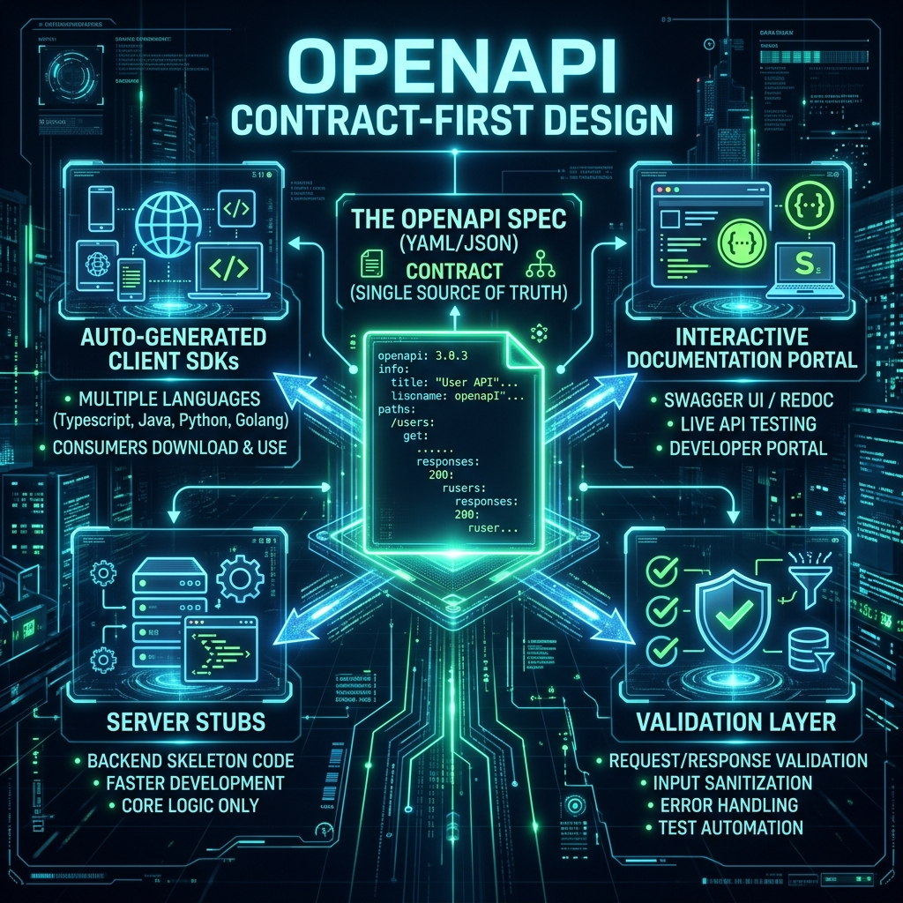

# 36: OpenAPI & API Contracts

<p align="center">
  
</p>

> **Imagine you and your friend want to build a treehouse together.** Before you start hammering nails, you draw a blueprint on paper. The blueprint shows exactly where the door goes, how big the windows are, and where the ladder connects. An **OpenAPI spec** is that blueprint — but for APIs. You write it down BEFORE writing any code. Then both the frontend team and the backend team can build their parts at the same time because they both agreed on the blueprint.

## What You'll Learn

> **After this chapter, you'll understand contract-first API design using OpenAPI 3.x (Swagger), how to auto-generate code and docs from a spec, and how API contracts prevent integration disasters — drawn from Designing APIs with Swagger and OpenAPI, The Design of Web APIs, and Mastering API Architecture.**

---

## 1. Contract-First vs Code-First

> **Son, imagine two ways to build a LEGO spaceship.** Way 1: Just start sticking pieces together and hope it looks good (code-first). Way 2: Look at the picture on the box first, then follow the instructions (contract-first). Contract-first means you agree on what the finished product looks like BEFORE anyone starts building.

| Approach | How It Works | Pros | Cons |
| :--- | :--- | :--- | :--- |
| **Code-First** | Write code, then generate the API spec from annotations | Fast to start | Spec drifts from reality |
| **Contract-First** | Write the OpenAPI spec first, then generate code | Teams work in parallel | Upfront design time |

**Why Contract-First wins at scale (from *Mastering API Architecture*):**
- Frontend and backend teams develop simultaneously against the shared contract
- API changes are reviewed as spec diffs in pull requests BEFORE any code changes
- Automated validation catches contract violations in CI/CD

---

## 2. The OpenAPI Specification (OAS 3.x)

> **The blueprint has sections.** The cover page tells you WHAT you're building (info). The site plan shows WHERE things are (paths). The materials list shows WHAT shapes things can be (schemas). OpenAPI is organized the exact same way.

```yaml
openapi: 3.0.3
info:
  title: Bookstore API
  version: 1.0.0
  description: A simple API to manage books

servers:
  - url: https://api.bookstore.com/v1

paths:
  /books:
    get:
      summary: List all books
      operationId: listBooks
      parameters:
        - name: limit
          in: query
          schema:
            type: integer
            default: 20
      responses:
        '200':
          description: A list of books
          content:
            application/json:
              schema:
                type: array
                items:
                  $ref: '#/components/schemas/Book'

    post:
      summary: Create a new book
      operationId: createBook
      requestBody:
        required: true
        content:
          application/json:
            schema:
              $ref: '#/components/schemas/BookInput'
      responses:
        '201':
          description: Book created
          content:
            application/json:
              schema:
                $ref: '#/components/schemas/Book'

components:
  schemas:
    Book:
      type: object
      properties:
        id:
          type: integer
        title:
          type: string
        author:
          type: string
        isbn:
          type: string
        price:
          type: number
          format: float

    BookInput:
      type: object
      required: [title, author]
      properties:
        title:
          type: string
        author:
          type: string
        isbn:
          type: string
        price:
          type: number
          format: float
```

---

## 3. The Four Superpowers of an OpenAPI Spec

> **Son, that one blueprint document gives you FOUR magical things for free — like getting four toys for the price of one.**

```
                    ┌─────────────────────┐
                    │   OpenAPI Spec       │
                    │   (YAML/JSON)        │
                    │   Single Source      │
                    │   of Truth           │
                    └──────────┬──────────┘
           ┌───────────┬──────┴──────┬───────────┐
           ▼           ▼             ▼           ▼
    ┌────────────┐ ┌────────────┐ ┌──────────┐ ┌──────────┐
    │ Client SDK │ │ Server     │ │ Docs     │ │ Tests    │
    │ Generation │ │ Stubs      │ │ Portal   │ │ & Mocks  │
    └────────────┘ └────────────┘ └──────────┘ └──────────┘
    TypeScript,     Express,       Swagger UI,  Prism,
    Python,         Spring Boot,   ReDoc        Postman
    Go clients      Flask stubs                 collections
```

| Superpower | Tool | What It Does |
| :--- | :--- | :--- |
| **Client SDKs** | `openapi-generator` | Auto-generates typed HTTP clients in 40+ languages |
| **Server Stubs** | `openapi-generator` | Generates route handlers — you just fill in the logic |
| **Documentation** | Swagger UI / ReDoc | Beautiful, interactive API docs with "Try It" buttons |
| **Mock Servers** | Prism / Stoplight | Returns fake responses matching the schema — frontend can develop without waiting for backend |

---

## 4. Versioning Your API Contract

> **Remember the book editions? Your OpenAPI spec is the blueprint for each edition.** When you make a new version, you create a new spec file. You keep both alive so old readers (clients) aren't abandoned.

### Strategy: Separate Spec Files Per Version

```
specs/
  ├── openapi-v1.yaml    ← v1 contract (stable, frozen)
  ├── openapi-v2.yaml    ← v2 contract (active development)
  └── openapi-v3.yaml    ← v3 contract (future)
```

### Detecting Breaking Changes Automatically

```bash
# Use oasdiff to compare v1 and v2 specs
oasdiff breaking openapi-v1.yaml openapi-v2.yaml

# Output:
# BREAKING: GET /users response removed field 'legacy_id'
# BREAKING: POST /orders request added required field 'currency'
# WARNING: GET /books parameter 'limit' default changed 20 → 50
```

> **Son, it's like a spell-checker but for your API blueprint.** Before you publish v2, this tool checks "will any of my changes break things for people still using v1?" If yes, it screams at you.

### Adding Sunset Headers to Deprecated Versions

```yaml
# In your v1 responses, add this header:
headers:
  Sunset:
    description: When this API version will be turned off
    schema:
      type: string
      example: "Sat, 01 Jun 2025 00:00:00 GMT"
  Deprecation:
    description: This version is deprecated
    schema:
      type: string
      example: "true"
```

---

## 5. Schema Reuse with $ref

> **Imagine you have a LEGO mini-figure that appears in 10 different sets.** Instead of creating a new mini-figure for each set, you just say "use the same one from Set #1." The `$ref` keyword does this — it points to a reusable definition so you never repeat yourself.

```yaml
# Define once in components:
components:
  schemas:
    Address:
      type: object
      properties:
        street:
          type: string
        city:
          type: string
        zip:
          type: string

# Reuse everywhere with $ref:
paths:
  /users/{id}:
    get:
      responses:
        '200':
          content:
            application/json:
              schema:
                type: object
                properties:
                  name:
                    type: string
                  home_address:
                    $ref: '#/components/schemas/Address'
                  work_address:
                    $ref: '#/components/schemas/Address'
```

---

## Reflection Questions

1. **Your team uses code-first API development.** A frontend developer discovers the real API response has different field names than what the backend developer told them in Slack. How does contract-first prevent this?
<details>
<summary>Show Answer</summary>

With contract-first, both teams work from the same OpenAPI spec file checked into version control. The frontend generates their client SDK from the spec; the backend generates server stubs. If the backend changes a field name, the spec changes too, triggering a PR review. The single source of truth eliminates "he said, she said" miscommunication entirely.
</details>

2. **You want to add a required field `currency` to the `POST /orders` request in v2.** How do you handle existing v1 clients that don't send this field?
<details>
<summary>Show Answer</summary>

Adding a required field to a request is a **breaking change**. Options: (1) Make it optional with a default value (`"currency": "USD"`) — non-breaking. (2) Keep v1 unchanged and only require it in v2, running both versions in parallel behind the API gateway with route-based versioning. (3) Use the Expand-Contract pattern: first deploy code that accepts the field optionally, migrate clients, then make it required.
</details>

---

## Key Interview Talking Points

- **Contract-first** = write the OpenAPI spec before code; enables parallel development
- OpenAPI specs auto-generate client SDKs, server stubs, docs, and mock servers
- Use `$ref` for schema reuse — DRY principle applied to API contracts
- Detect breaking changes with `oasdiff` before deploying new versions
- Sunset headers warn consumers about upcoming version deprecations

---

[<< Previous: REST API Design](./35_REST_API_Design.md) | [Home: Curriculum Map](./README.md) | [Next: GraphQL Architecture >>](./37_GraphQL_Architecture.md)
