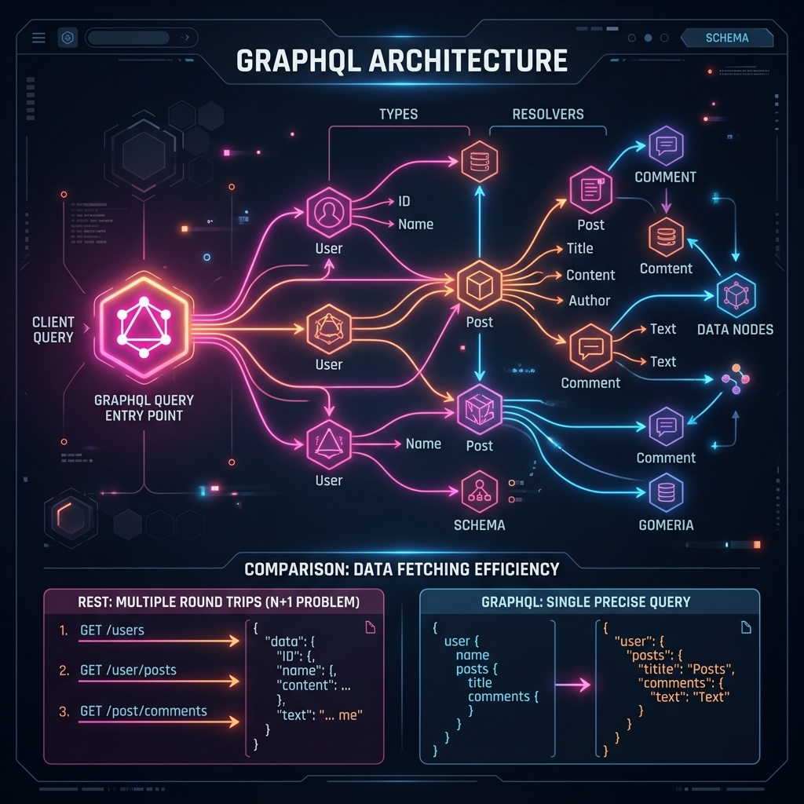

# 37: GraphQL Architecture

<p align="center">
  
</p>

> **Imagine ordering food at a buffet vs. a restaurant.** REST is like a restaurant with a fixed menu — you order "Combo #3" and get burger, fries, and a drink, even if you only wanted the burger. GraphQL is like a buffet where you grab exactly what you want — just the burger and salad, nothing more, nothing less. You tell the server precisely what data you need, and it gives you exactly that in one trip.

## What You'll Learn

> **After this chapter, you'll understand GraphQL's schema-first architecture, how resolvers fetch data, the N+1 problem and DataLoader solution, subscriptions for real-time data, and when to choose GraphQL over REST — drawn from Learning GraphQL, API Design Patterns, and Mastering API Architecture.**

---

## 1. The Problem GraphQL Solves

> **Son, imagine you want to see your friend's name, their pet's name, and their pet's favorite toy.** With REST, you'd need THREE separate trips: one to `/friends/1`, one to `/friends/1/pets`, and one to `/pets/5/toys`. With GraphQL, you make ONE trip and get everything at once.

### REST: Multiple Round Trips (Over-fetching & Under-fetching)

```
Client                         Server
  │                              │
  ├── GET /users/123 ───────────►│  (gets name, email, address, phone, ...)
  │◄──── {full user object} ─────┤  ← Over-fetching: you only needed name!
  │                              │
  ├── GET /users/123/posts ─────►│  (separate request for posts)
  │◄──── {array of posts} ──────┤  ← Under-fetching: needed posts too!
  │                              │
  ├── GET /posts/456/comments ──►│  (another request per post!)
  │◄──── {array of comments} ───┤  ← N+1 problem: 1 user + N posts
```

### GraphQL: Single Precise Query

```graphql
query {
  user(id: 123) {
    name
    posts {
      title
      comments {
        text
        author { name }
      }
    }
  }
}
```

**One request. Exactly the data you need. Nothing more.**

---

## 2. The Schema: Your API's Type System

> **Think of the schema as a LEGO instruction booklet.** It tells everyone what kinds of pieces exist (types), what they look like (fields), and how they connect to each other (relationships). Everyone building with these LEGOs must follow the same instructions.

```graphql
type User {
  id: ID!
  name: String!
  email: String!
  posts: [Post!]!
}

type Post {
  id: ID!
  title: String!
  content: String!
  author: User!
  comments: [Comment!]!
  createdAt: String!
}

type Comment {
  id: ID!
  text: String!
  author: User!
}

type Query {
  user(id: ID!): User
  users(limit: Int = 10): [User!]!
  post(id: ID!): Post
}

type Mutation {
  createPost(title: String!, content: String!): Post!
  deletePost(id: ID!): Boolean!
}

type Subscription {
  postCreated: Post!
  commentAdded(postId: ID!): Comment!
}
```

**Three root types:**

| Root Type | Purpose | Analogy |
| :--- | :--- | :--- |
| **Query** | Read data | "Show me..." |
| **Mutation** | Write/change data | "Please change..." |
| **Subscription** | Real-time updates | "Tell me whenever..." |

---

## 3. Resolvers: The Workers Behind the Schema

> **The schema is the menu. Resolvers are the cooks.** When someone orders "user with posts," the schema says what the response shape should look like, and the resolvers actually go to the database, fetch the data, and cook it into the right shape.

```javascript
const resolvers = {
  Query: {
    // Resolver for "user(id)" query
    user: async (parent, { id }, context) => {
      return context.db.users.findById(id);
    },
    users: async (parent, { limit }, context) => {
      return context.db.users.findAll({ limit });
    },
  },

  User: {
    // Resolver for the "posts" field on User type
    posts: async (user, args, context) => {
      return context.db.posts.findByUserId(user.id);
    },
  },

  Post: {
    // Resolver for the "author" field on Post type
    author: async (post, args, context) => {
      return context.db.users.findById(post.authorId);
    },
    comments: async (post, args, context) => {
      return context.db.comments.findByPostId(post.id);
    },
  },
};
```

---

## 4. The N+1 Problem and DataLoader

> **Son, imagine you need to deliver birthday invitations to 50 classmates.** The silly way: drive to each house one at a time — 50 trips. The smart way: collect all the addresses first, then deliver them all in one trip. That's what DataLoader does — it batches individual database queries into ONE efficient query.

### The Problem:

```
Query: { users { posts { author { name } } } }

Database calls:
  1. SELECT * FROM users                    ← 1 query (gets 50 users)
  2. SELECT * FROM posts WHERE user_id = 1  ← 1 query per user
  3. SELECT * FROM posts WHERE user_id = 2  ← another query
  ... (50 more queries!)                    ← N+1 = 51 total queries!
```

### The Solution: DataLoader Batching

```javascript
const DataLoader = require('dataloader');

// Instead of 50 individual queries, batch them into 1:
const postLoader = new DataLoader(async (userIds) => {
  // ONE query with all 50 user IDs:
  // SELECT * FROM posts WHERE user_id IN (1, 2, 3, ..., 50)
  const posts = await db.posts.findByUserIds(userIds);

  // Group results by user ID to return in correct order
  return userIds.map(id => posts.filter(p => p.userId === id));
});

// In the resolver:
User: {
  posts: (user) => postLoader.load(user.id)
  // DataLoader collects all .load() calls in one tick,
  // then fires ONE batched query
}
```

**Result: 51 queries → 2 queries.**

---

## 5. Subscriptions: Real-Time Data

> **Instead of constantly asking "Are we there yet? Are we there yet?", subscriptions let the server tap you on the shoulder and say "We're here!" when something happens.** This uses WebSockets under the hood.

```graphql
# Client subscribes to new comments on Post 456:
subscription {
  commentAdded(postId: "456") {
    text
    author { name }
    createdAt
  }
}

# Server pushes automatically whenever a new comment is created:
# → { "commentAdded": { "text": "Great post!", "author": { "name": "Bob" } } }
# → { "commentAdded": { "text": "I agree!", "author": { "name": "Carol" } } }
```

---

## 6. GraphQL vs REST: When to Use What

| Factor | REST | GraphQL |
| :--- | :--- | :--- |
| **Data shape** | Fixed by server | Chosen by client |
| **Round trips** | Multiple endpoints | Single endpoint |
| **Caching** | HTTP caching (easy) | Complex (no URL-based caching) |
| **File uploads** | Built-in (multipart) | Requires extra libraries |
| **Learning curve** | Low | Medium-high |
| **Best for** | Simple CRUD, public APIs | Complex nested data, mobile apps |
| **Versioning** | URL/header versioning | Schema evolution (no versions needed) |

### GraphQL Versioning: Schema Evolution

> **GraphQL doesn't use v1/v2 like REST.** Instead, you evolve the schema: add new fields anytime (non-breaking), and mark old fields as `@deprecated` with a reason. Clients that use old fields still work — they just see a warning.

```graphql
type User {
  id: ID!
  name: String!
  fullName: String!                      # ← New field added
  username: String @deprecated(reason: "Use 'name' instead")  # ← Old field marked
}
```

---

## Reflection Questions

1. **Your mobile app shows a user profile with their 5 latest posts and each post's comment count.** Compare how REST and GraphQL would serve this data. Which requires fewer network round trips?
<details>
<summary>Show Answer</summary>

REST: 1 call to GET /users/123, 1 call to GET /users/123/posts?limit=5, then 5 calls to GET /posts/{id}/comments/count = 7 round trips. GraphQL: 1 query asking for user { name, posts(limit:5) { title, commentCount } } = 1 round trip. GraphQL eliminates over-fetching and under-fetching simultaneously.
</details>

2. **Your GraphQL API serves 100 users, each with 10 posts. Without DataLoader, how many database queries fire? With DataLoader?**
<details>
<summary>Show Answer</summary>

Without DataLoader: 1 (users) + 100 (posts per user) = 101 queries (N+1 problem). With DataLoader: 1 (users) + 1 (batched posts query with 100 IDs in an IN clause) = 2 queries. DataLoader reduces query count by 98%.
</details>

---

## Key Interview Talking Points

- GraphQL solves over-fetching and under-fetching with client-specified queries
- Schema = type system; Resolvers = data fetching logic
- **DataLoader** batches N+1 queries into single batched queries
- Subscriptions use WebSockets for real-time push
- GraphQL evolves via schema deprecation, not URL versioning
- Choose REST for simple CRUD/public APIs; GraphQL for complex nested data

---

[<< Previous: OpenAPI & Contracts](./36_OpenAPI_and_API_Contracts.md) | [Home: Curriculum Map](./README.md) | [Next: API Security in Depth >>](./38_API_Security_in_Depth.md)
