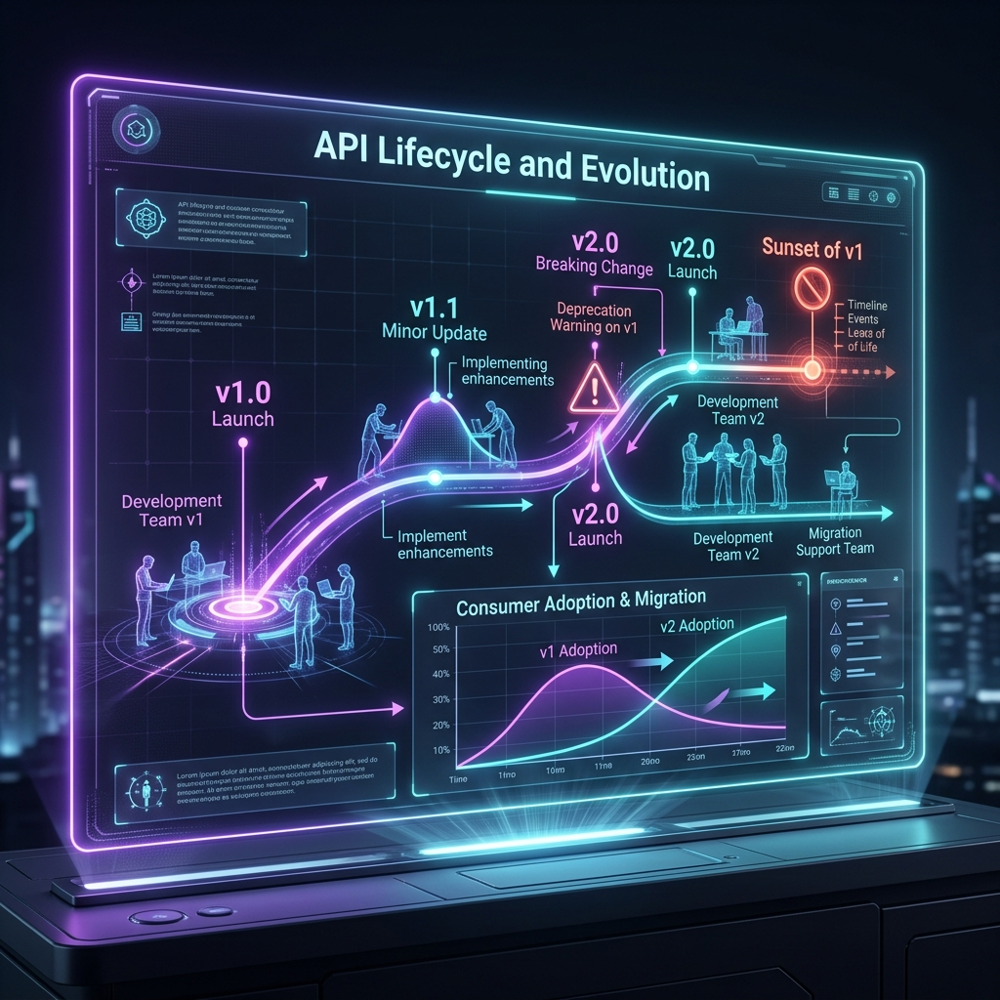

# 39: API Lifecycle & Evolution

<p align="center">
  
</p>

> **Imagine a road through a city.** First you build a small dirt road (v1). As the city grows, you pave it (v1.1). Eventually you need a highway (v2), but you can't blow up the old road while people are still driving on it! You build the highway alongside the old road, put up signs saying "Old road closing December 2025", and gradually everyone moves to the highway. THEN you close the old road. That's API lifecycle management.

## What You'll Learn

> **After this chapter, you'll understand how to evolve APIs without breaking existing clients, manage multiple versions simultaneously, deprecate gracefully, and govern API quality at scale — drawn from API Design Patterns (Geewax), Mastering API Architecture, The Design of Web APIs, and Patterns for API Design.**

---

## 1. The API Lifecycle Stages

> **Son, an API is like a pet.** You plan for it, bring it home (launch), take care of it (maintain), and eventually it gets old and retires. Each stage needs different attention.

```
  ┌──────────┐    ┌──────────┐    ┌──────────┐    ┌──────────┐    ┌──────────┐
  │  DESIGN  │───►│  BUILD   │───►│ PUBLISH  │───►│ MAINTAIN │───►│  SUNSET  │
  │          │    │          │    │          │    │          │    │          │
  │ API Goals│    │ Contract │    │ Portal   │    │ Monitor  │    │ Deprecate│
  │ Canvas   │    │ First    │    │ Dev Docs │    │ Versions │    │ Migrate  │
  │ Consumer │    │ OpenAPI  │    │ API Keys │    │ Analytics│    │ 410 Gone │
  │ Personas │    │ Spec     │    │ Sandbox  │    │ SLAs     │    │          │
  └──────────┘    └──────────┘    └──────────┘    └──────────┘    └──────────┘
```

### The API Goals Canvas (from *The Design of Web APIs*)

Before writing ANY code, answer these questions:

| Question | Example Answer |
| :--- | :--- |
| **WHO** is the consumer? | Mobile app developers |
| **WHAT** can they do? | Search products, place orders |
| **HOW** will they use it? | Browse → Search → Add to Cart → Checkout |
| **WHAT** inputs do they provide? | Search query, product ID, payment info |
| **WHAT** outputs do they expect? | Product list, order confirmation, tracking |

---

## 2. Breaking vs Non-Breaking Changes

> **Son, imagine your friend's code depends on your API like a plug depends on a socket.** If you change the socket shape (breaking change), their plug won't fit anymore. But if you add a NEW socket next to the old one (non-breaking), everyone's plugs still work.

### Non-Breaking Changes (Safe — deploy anytime)

| Change | Why It's Safe |
| :--- | :--- |
| Add a new endpoint | Existing clients don't use it |
| Add an optional field to a request | Old clients just don't send it |
| Add a new field to a response | Old clients ignore it |
| Add a new enum value to responses | Old clients should handle unknowns |
| Widen a validation (e.g., max length 50 → 100) | Old values still valid |

### Breaking Changes (Dangerous — MUST version)

| Change | Why It Breaks |
| :--- | :--- |
| Remove or rename a field | Clients parsing that field crash |
| Make an optional field required | Old clients don't send it |
| Change a field's type (string → integer) | Client deserializers break |
| Remove an endpoint | Clients calling it get 404 |
| Narrow validation (max length 100 → 50) | Old values rejected |

---

## 3. Version Management Strategies

> **Remember the road analogy? Here are three ways to manage old and new roads at the same time.**

### Strategy A: URL Versioning

```
https://api.example.com/v1/users    ← v1 still alive
https://api.example.com/v2/users    ← v2 new behavior

# API Gateway routes:
/v1/* → User Service (v1 handler)
/v2/* → User Service (v2 handler)
```

**Best for:** Public APIs where visibility matters.

### Strategy B: Header Versioning

```http
GET /users HTTP/1.1
Host: api.example.com
Accept: application/vnd.example.v2+json

# API Gateway reads the Accept header and routes accordingly
```

**Best for:** Internal APIs where clean URLs matter.

### Strategy C: GraphQL Schema Evolution (No Versions!)

```graphql
type User {
  name: String!
  fullName: String!                                       # Added in 2024
  username: String @deprecated(reason: "Use name field")  # Marked deprecated
}
```

**Best for:** GraphQL APIs — evolve the schema, don't create versions.

---

## 4. The Expand-Contract Pattern

> **This is the safest way to make a breaking change without actually breaking anything.** It's like slowly moving furniture: first you put the new couch in, THEN you let people sit on both couches, THEN you remove the old one.

```
Phase 1: EXPAND — Add the new alongside the old
──────────────────────────────────────────────
  Response: { "name": "Alice", "full_name": "Alice Smith" }
  Both old field ("name") and new field ("full_name") present.
  Old clients use "name". New clients use "full_name".

Phase 2: MIGRATE — Move consumers to the new field
──────────────────────────────────────────────
  Log which clients still read "name".
  Contact them. Help them migrate to "full_name".

Phase 3: CONTRACT — Remove the old field
──────────────────────────────────────────────
  Response: { "full_name": "Alice Smith" }
  "name" is gone. Only possible after ALL consumers migrated.
```

---

## 5. Deprecation & Sunset Protocol

> **You don't just switch off a light without warning — you yell "Lights going off in 5 minutes!" first.** The Sunset HTTP header does exactly this for APIs.

```http
HTTP/1.1 200 OK
Sunset: Sat, 01 Jun 2025 00:00:00 GMT
Deprecation: true
Link: <https://api.example.com/v2/docs>; rel="successor-version"

{
  "data": { ... },
  "_warnings": [
    "This endpoint is deprecated. Migrate to v2 before June 2025. See: https://api.example.com/migration-guide"
  ]
}
```

### The Deprecation Timeline

```
Month 1:  Launch v2. Add Sunset header to all v1 responses.
Month 2:  Email all v1 API key holders with migration guide.
Month 3:  Dashboard shows v1 vs v2 traffic ratio.
Month 6:  v1 traffic < 5%. Send final warning emails.
Month 9:  v1 returns 410 Gone with migration link.
Month 12: v1 infrastructure torn down.
```

---

## 6. API Governance at Scale

> **When your company has 200 APIs built by 50 teams, chaos reigns unless you have rules.** API governance is like traffic laws — everyone agrees to drive on the same side of the road.

### API Style Guide (from *Mastering API Architecture*)

| Rule | Standard |
| :--- | :--- |
| URL format | Lowercase, hyphens: `/user-profiles` |
| Naming | Plural nouns: `/users`, not `/user` |
| Date format | ISO 8601: `2025-01-15T10:30:00Z` |
| Pagination | Cursor-based with `limit` and `cursor` params |
| Error format | RFC 7807 Problem Details JSON |
| Auth | OAuth 2.0 + JWT for all APIs |
| Versioning | URL path versioning: `/v1/`, `/v2/` |

### Automated Governance in CI/CD

```yaml
# .github/workflows/api-lint.yml
- name: Lint OpenAPI Spec
  run: |
    spectral lint openapi.yaml --ruleset .spectral.yml

# .spectral.yml rules:
rules:
  paths-must-be-kebab-case: true
  must-have-description: true
  no-$ref-siblings: true
  response-must-have-error-schema: true
```

---

## Reflection Questions

1. **Your PM says "Just rename the `username` field to `handle` — it's a simple change."** Walk through why this is a breaking change and how you'd use the Expand-Contract pattern to do it safely.
<details>
<summary>Show Answer</summary>

Renaming is a breaking change because every client parsing `username` will crash when it disappears. Expand-Contract: (1) EXPAND — add `handle` field alongside `username`, both containing the same value. (2) MIGRATE — notify all consumers to switch from `username` to `handle`. Track usage in API analytics. (3) CONTRACT — once zero clients read `username`, remove it. This entire process might take 3-6 months for a public API.
</details>

2. **Your company has 50 microservices, each with its own API.** Some use camelCase, some use snake_case, some use PUT for partial updates, others use PATCH. How do you bring order to this chaos?
<details>
<summary>Show Answer</summary>

Establish an API Style Guide document defining naming conventions, date formats, error schemas, pagination, and auth standards. Enforce it via automated linting (Spectral) in every CI/CD pipeline — PRs fail if the OpenAPI spec violates the style guide. Create an API Design Review Board that approves new API designs before implementation. As *Mastering API Architecture* recommends, governance must be automated, not manual.
</details>

---

## Key Interview Talking Points

- Non-breaking: add fields. Breaking: remove/rename/retype fields
- **Expand-Contract** is the safest pattern for breaking changes
- Sunset headers warn consumers before deprecation
- API governance = style guide + automated linting (Spectral) in CI/CD
- Use API analytics to track version adoption before sunsetting
- GraphQL avoids versioning entirely via schema evolution with `@deprecated`

---

[<< Previous: API Security in Depth](./38_API_Security_in_Depth.md) | [Home: Curriculum Map](./README.md) | [Next: API Patterns & Integration >>](./40_API_Patterns_and_Integration.md)
