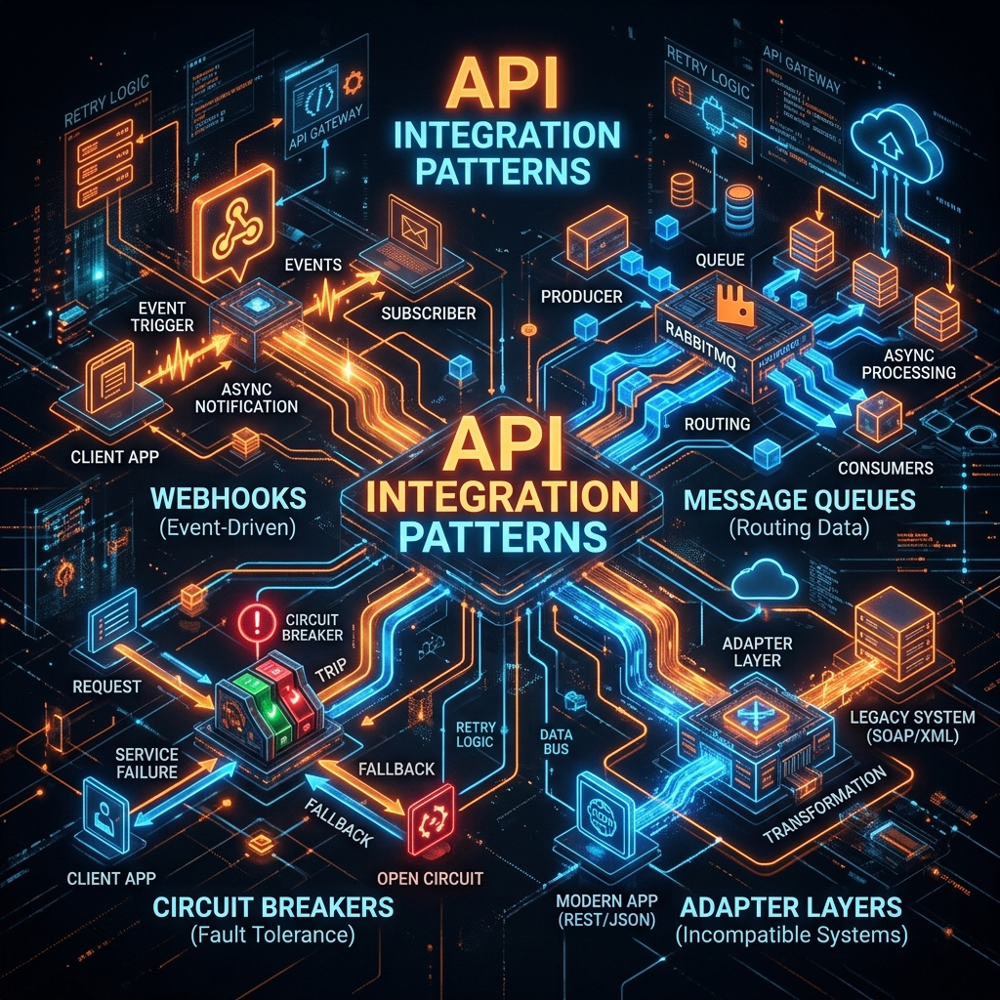

# 40: API Patterns & Integration

<p align="center">
  
</p>

> **Imagine a city with different neighborhoods.** Some neighborhoods communicate by sending letters (request-response). Others ring a bell that everyone nearby can hear (events). Some have a messenger who runs between houses (message queue). And some have a special phone line that rings YOUR phone when something happens at THEIR house (webhooks). API integration patterns are these different ways software systems talk to each other.

## What You'll Learn

> **After this chapter, you'll understand webhooks, long-running operations, the Backend-for-Frontend pattern, circuit breakers, and loose coupling patterns — drawn from Patterns for API Design, API Design Patterns, and Mastering API Architecture.**

---

## 1. Synchronous vs Asynchronous APIs

> **Son, synchronous is like a phone call — you ask a question and WAIT on the line until you get an answer. Asynchronous is like sending a text message — you send it, go play, and check for the reply later.**

```
SYNCHRONOUS (Request-Response):
Client ──── GET /users/123 ────► Server
Client ◄─── { user data } ─────  Server
(Client waits the entire time)

ASYNCHRONOUS (Fire and Forget):
Client ──── POST /reports ──────► Server
Client ◄─── 202 Accepted ───────  Server  (instant reply: "I got it")
             { "statusUrl": "/reports/abc/status" }
(Client checks back later)
Client ──── GET /reports/abc/status ──► Server
Client ◄─── { "status": "completed", "downloadUrl": "..." }
```

---

## 2. Webhooks: Don't Call Us, We'll Call You

> **Imagine you order a pizza. The bad way: call the restaurant every 2 minutes asking "Is it ready?" (polling). The good way: give them your phone number and they call YOU when it's ready (webhook).**

```
POLLING (wasteful):
Client ── GET /order/status ──► Server  "Not ready"
Client ── GET /order/status ──► Server  "Not ready"
Client ── GET /order/status ──► Server  "Not ready"
Client ── GET /order/status ──► Server  "Ready!"
(4 requests, 3 wasted)

WEBHOOK (efficient):
Client ── POST /orders ──────► Server
           { "callbackUrl": "https://myapp.com/webhook" }
Client ◄── 202 Accepted ────── Server

... time passes, client does other things ...

Server ── POST https://myapp.com/webhook ──► Client
           { "event": "order.ready", "orderId": 456 }
(1 request when it matters)
```

### Webhook Security

| Concern | Solution |
| :--- | :--- |
| **Is this really from the server?** | HMAC signature in header: `X-Signature: sha256=abc123` |
| **What if my endpoint is down?** | Retry with exponential backoff (1s, 2s, 4s, 8s...) |
| **What if it's a replay attack?** | Include timestamp; reject if older than 5 minutes |
| **What if delivery fails permanently?** | Dead letter queue + admin dashboard |

```python
# Verifying a webhook signature:
import hmac, hashlib

def verify_webhook(payload, signature, secret):
    expected = hmac.new(
        secret.encode(),
        payload.encode(),
        hashlib.sha256
    ).hexdigest()
    return hmac.compare_digest(f"sha256={expected}", signature)
```

---

## 3. Long-Running Operations

> **Some tasks take minutes or hours — generating a report, processing a video, training a model. You can't keep the HTTP connection open that long.** The pattern: accept the job immediately, return a status URL, let the client poll or subscribe.

```
Client ── POST /video/transcode ──► Server
           { "sourceUrl": "movie.mp4", "format": "hls" }

Server ◄── 202 Accepted
           {
             "operationId": "op-789",
             "status": "RUNNING",
             "percentComplete": 0,
             "statusUrl": "/operations/op-789"
           }

... client polls periodically ...

Client ── GET /operations/op-789 ──► Server
Server ◄── {
             "status": "RUNNING",
             "percentComplete": 65
           }

Client ── GET /operations/op-789 ──► Server
Server ◄── {
             "status": "COMPLETED",
             "percentComplete": 100,
             "result": { "url": "https://cdn.example.com/movie.m3u8" }
           }
```

### From *API Design Patterns* (Geewax): The Operation Resource

```
Operation {
  id: string
  status: PENDING | RUNNING | COMPLETED | FAILED
  percentComplete: integer
  createdAt: timestamp
  completedAt: timestamp
  result: any        // present when COMPLETED
  error: ErrorInfo   // present when FAILED
}
```

---

## 4. Backend for Frontend (BFF)

> **Imagine a translator at the United Nations.** The French delegate speaks French, the Japanese delegate speaks Japanese, but they need to communicate. The translator sits between them and converts. A BFF is a translator between your specific frontend (mobile, web, TV) and your backend microservices.

```
                    ┌─────────────┐
                    │   Mobile    │
                    │    App      │
                    └──────┬──────┘
                           │
                    ┌──────▼──────┐
                    │  Mobile BFF │  ← Optimized for mobile:
                    │  /api/m/    │     small payloads, fewer fields
                    └──────┬──────┘
                           │
          ┌────────────────┼────────────────┐
          ▼                ▼                ▼
   ┌────────────┐  ┌────────────┐  ┌────────────┐
   │   User     │  │  Product   │  │   Order    │
   │  Service   │  │  Service   │  │  Service   │
   └────────────┘  └────────────┘  └────────────┘
          ▲                ▲                ▲
          │                │                │
                    ┌──────┴──────┐
                    │   Web BFF   │  ← Optimized for web:
                    │  /api/w/    │     richer data, more fields
                    └──────┬──────┘
                           │
                    ┌──────▼──────┐
                    │    Web      │
                    │   Browser   │
                    └─────────────┘
```

**Why not one API for all clients?** Because mobile needs tiny payloads (slow networks), web needs rich data (fast networks), and TV needs a completely different layout. One-size-fits-all APIs lead to over-fetching for mobile and under-fetching for web.

---

## 5. Circuit Breaker Pattern

> **Your house has a circuit breaker box. If too much electricity flows through a wire, the breaker trips and cuts the power — protecting your house from catching fire.** In APIs, if a downstream service starts failing, the circuit breaker stops sending requests to it — protecting your system from cascading failures.

```
States:
  ┌──────────┐     failures > threshold     ┌──────────┐
  │  CLOSED  │ ──────────────────────────► │   OPEN   │
  │ (normal) │                              │ (reject  │
  │          │ ◄──────────────────────────  │  all)    │
  └──────────┘     test request succeeds    └────┬─────┘
                                                 │
                                          timeout expires
                                                 │
                                            ┌────▼─────┐
                                            │HALF-OPEN │
                                            │(test one)│
                                            └──────────┘

CLOSED:    Everything normal. Requests flow through.
OPEN:      Service is down. Return fallback immediately. Don't even try.
HALF-OPEN: After a timeout, try ONE request. If it works → CLOSED.
           If it fails → back to OPEN.
```

```python
class CircuitBreaker:
    def __init__(self, failure_threshold=5, timeout=30):
        self.failures = 0
        self.threshold = failure_threshold
        self.timeout = timeout
        self.state = "CLOSED"
        self.last_failure_time = None

    def call(self, func):
        if self.state == "OPEN":
            if time.time() - self.last_failure_time > self.timeout:
                self.state = "HALF_OPEN"
            else:
                raise CircuitOpenError("Service unavailable, using fallback")

        try:
            result = func()
            self.failures = 0
            self.state = "CLOSED"
            return result
        except Exception:
            self.failures += 1
            self.last_failure_time = time.time()
            if self.failures >= self.threshold:
                self.state = "OPEN"
            raise
```

---

## 6. API Composition Patterns

> **When one API request needs data from multiple microservices, who combines the data?**

| Pattern | How | Best For |
| :--- | :--- | :--- |
| **API Gateway Composition** | Gateway calls 3 services, merges responses | Simple aggregation |
| **BFF Composition** | Frontend-specific backend calls services | Client-optimized responses |
| **GraphQL Stitching** | GraphQL server federates across service schemas | Complex nested queries |
| **Choreography** | Services emit events; each reacts independently | Loose coupling |
| **Orchestration** | Central coordinator calls services in sequence | Complex workflows |

---

## Reflection Questions

1. **Your webhook endpoint goes down for 2 hours.** How do you ensure no events are lost? Design the retry mechanism.
<details>
<summary>Show Answer</summary>

Use exponential backoff with jitter: retry at 1s, 2s, 4s, 8s, 16s... up to a max of 1 hour. After 24 hours of failures, move the event to a Dead Letter Queue (DLQ). Store all events in an append-only log so consumers can replay missed events. Provide a "replay" API endpoint: `POST /webhooks/replay?since=2025-01-15T10:00:00Z` that re-sends all events after the given timestamp.
</details>

2. **Your mobile app calls 5 microservices to render the home screen, causing 5 sequential network round trips over a slow cellular connection.** How does the BFF pattern solve this?
<details>
<summary>Show Answer</summary>

Create a Mobile BFF that exposes a single endpoint `GET /api/m/home-feed`. The BFF calls all 5 microservices in PARALLEL on the fast internal network, merges the results, strips unnecessary fields (reducing payload size by 60%), and returns a single optimized response. The mobile app makes 1 round trip instead of 5, over the slow cellular connection only once.
</details>

---

## Key Interview Talking Points

- **Webhooks** eliminate polling — server pushes events to the client's URL
- Secure webhooks with HMAC signatures and timestamp validation
- **Long-running operations** return 202 Accepted + status polling URL
- **BFF pattern** gives each frontend (mobile/web/TV) its own optimized API
- **Circuit breaker** prevents cascading failures: CLOSED → OPEN → HALF-OPEN
- Choose choreography for loose coupling; orchestration for complex workflows

---

[<< Previous: API Lifecycle & Evolution](./39_API_Lifecycle_and_Evolution.md) | [Home: Curriculum Map](./README.md) | [Next: Serverless Fundamentals >>](./42_Serverless_Fundamentals.md)
