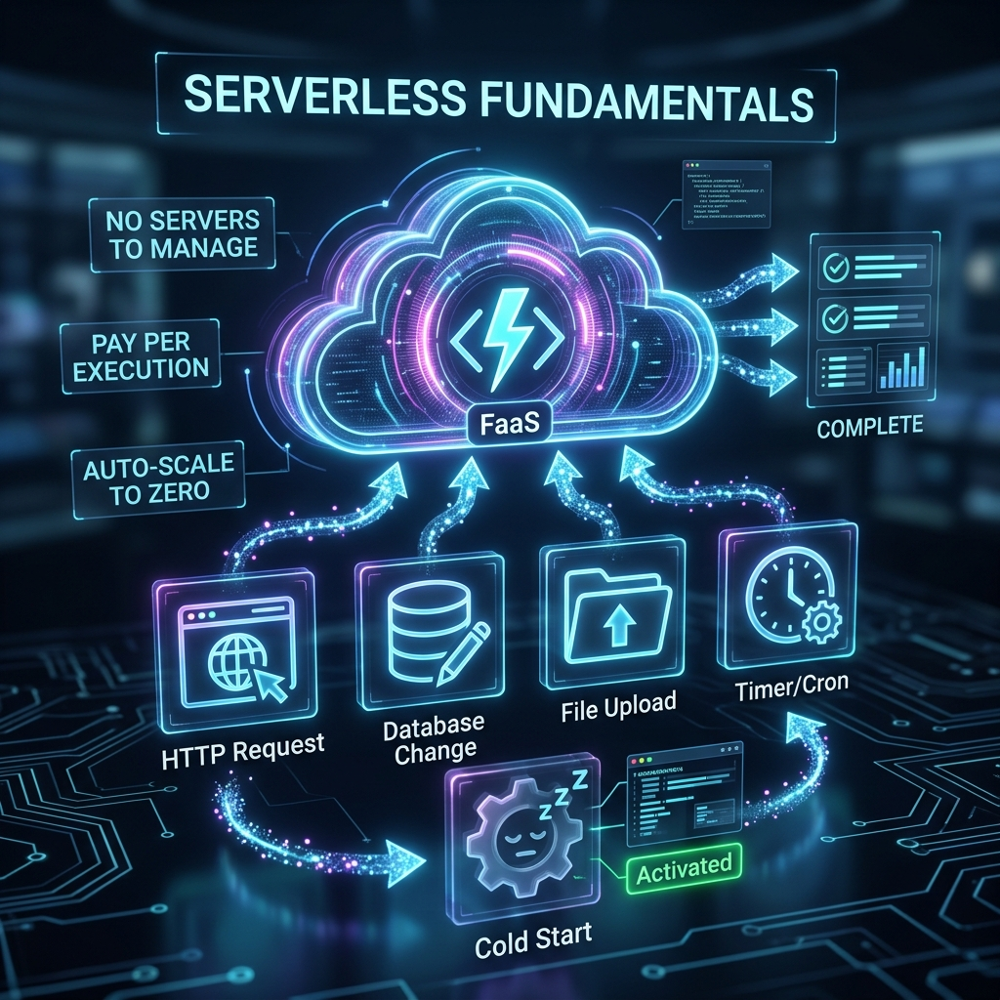

# 42: Serverless Fundamentals

  

> 🧠 **The Feynman Hook:** Imagine running a restaurant where you don't have to rent the building, hire the cooks full-time, or pay for electricity when the restaurant is empty. Instead, a magical kitchen appears the millisecond a customer orders a burger, cooks exactly one burger, charges you three cents for that exact cooking time, and then disappears completely. That magical kitchen is Serverless. You bring the recipe (code); the cloud provider handles the kitchen (servers, scaling, maintenance). 

## 🎯 What You'll Learn

> **After this chapter, you will understand the core philosophy behind Serverless computing, the difference between FaaS and BaaS, the execution model, and the tradeoffs involved in going serverless.**

---

## 1. What "Serverless" Actually Means

"Serverless" is a terrible name. There are definitely servers involved. But *you* don't manage them. It is an operational model where cloud providers dynamically manage the allocation and provisioning of servers.

In *Serverless Handbook*, Swizec Teller breaks it down simply: **Serverless means your code runs in ephemeral containers.**

### The Three Tenets of Serverless
1. **No Infrastructure Management:** No provisioning, no OS patching, no SSHing into boxes.
2. **Auto-scaling:** Scales from zero to ten thousand concurrent requests instantly, and back to zero automatically.
3. **Pay-for-Value Billing:** You do not pay for idle time. You pay per 100ms of execution time and per request. If nobody uses your app, your bill is $0.00.

---

## 2. FaaS vs BaaS

Serverless architectures are typically constructed using two primary components:

*   **FaaS (Function as a Service):** This is the compute layer. You write a small, specific piece of code (a function), upload it (like AWS Lambda or Google Cloud Functions), and it executes in response to an event. 
*   **BaaS (Backend as a Service):** These are managed third-party services that provide complex backend features so you don't have to write them. Examples: AWS Cognito (authentication), DynamoDB (database), Auth0, or Firebase.

> **Feynman Insight:** If an architecture is just FaaS talking to a traditional relational database (which is billed hourly and requires connection pooling), it is *not* a fully Serverless architecture. True Serverless architectures pair FaaS with BaaS so the entire stack scales to zero.

---

## 3. The Execution Model & "Cold Starts"

Because serverless relies on ephemeral containers, the execution lifecycle is fundamentally different from a long-running web server.

### The Lifecycle of a Serverless Request
1. **Event Occurs:** A user HTTP request hits the API Gateway.
2. **Container Provisioning:** The cloud provider finds an available server, downloads your code, and starts a container environment. **(This is the "Cold Start").**
3. **Initialization:** Your code's global variables and dependencies are loaded into memory.
4. **Execution:** Your specific function handler method is invoked with the event data.
5. **Freeze:** The container is "frozen" and kept warm for a few minutes in case another request comes in quickly.

### Demystifying the Cold Start
> **Feynman Insight:** The cold start is like waiting for your car's engine to warm up on a cold winter morning. The first drive of the day is sluggish. But if you stop at a shop for five minutes, the engine is still warm when you get back in, so it starts instantly (Warm Start).

Cold starts usually add 500ms to 2-3 seconds of latency to an invocation. They happen when a container is spun up for the first time, or when a sudden spike in traffic requires *concurrent* containers to spin up simultaneously.

---

## 4. Visualizing the Compute Trade-off

Why move away from traditional servers?

| Property | Traditional VM/EC2 | Docker/Kubernetes | Serverless (Lambda) |
| :--- | :--- | :--- | :--- |
| **Unit of Scale** | Virtual Machine | Container | Function |
| **Overhead** | OS, Runtime, App | Runtime, App | Just your Code |
| **Scaling Speed** | Minutes | Seconds | Milliseconds |
| **Maintenance** | High (Patches) | Medium | Zero |
| **State** | Stateful | Can be Stateful | **Strictly Stateless** |

---

## 🤔 Reflection Questions

1. **If Serverless functions are ephemeral, where do you store user session data or cache data?**

💡 View Answer

Because the container can be destroyed after any request, **Serverless functions must be 100% stateless.** You cannot save files to local disk and expect them to be there on the next request. You must store all state externally in a BaaS: a database (DynamoDB), an external cache (Redis), or an object store (S3).

2. **Your startup is building a low-latency high-frequency trading algorithm where absolute predictable millisecond latency is required. Is Serverless a good fit?**

💡 View Answer

**No.** Because of the unpredictable nature of "Cold Starts" and the lack of control over the underlying network infrastructure, Serverless is generally not suited for ultra-low-latency, real-time trading applications. Dedicated VMs or bare metal servers would be required to guarantee predictable latency.

---

## 📝 Key Interview Talking Points

*   **Definition:** Serverless abstraction means shifting operational responsibilities (provisioning, scaling, patching) to the cloud provider.
*   **Financial Advantage:** Shifts costs from CapEx to strictly OpEx; you pay explicitly for what you consume. Great for bursty workloads.
*   **The Big Trade-off:** You trade operational control and predictable latency (due to cold starts) for developer velocity and zero-maintenance infrastructure.
*   **Statelessness:** Serverless compute forces distributed system best practices; state must be externalized.

---

[<< Previous: API Patterns & Integration](./40_API_Patterns_and_Integration.md) | [Home: Curriculum Map](./README.md) | [Next: AWS Lambda Deep Dive >>](./43_AWS_Lambda_Deep_Dive.md)
