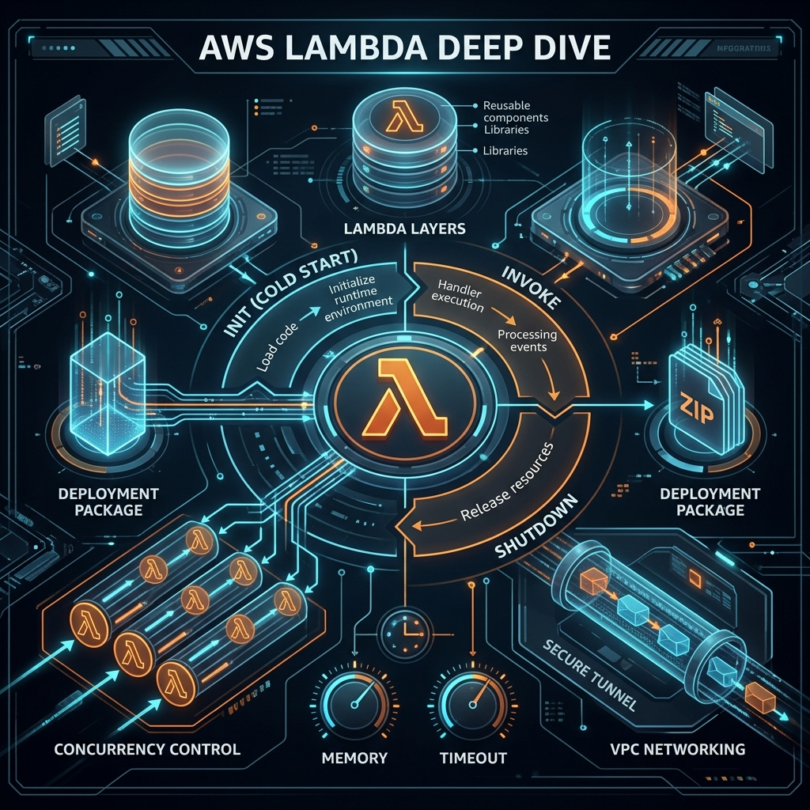

# 43: AWS Lambda Deep Dive

<p align="center">
  
</p>

> 🧠 **The Feynman Hook:** When you deploy code to AWS Lambda, you're not just uploading a script. You're defining a hyper-optimized reaction machine. Imagine a race car in the pit over the winter—that's your code stored in an S3 bucket (at rest). When the race starts, the car must be instantly fueled, started, and on the track in milliseconds. This chapter peers under the hood to see exactly how AWS builds that track dynamically, how the engine starts (the INIT phase), and how you can tune the memory dials to win the race.

## 🎯 What You'll Learn

> **After this chapter you will deeply understand the Lambda lifecycle, execution environments, how memory allocation affects CPU power, the difference between different concurrency models, and how to structure your handler code to minimize cold starts.**

---

## 1. The Execution Environment Lifecycle

To build high-performance serverless applications, you must understand what happens the millisecond a Lambda is triggered. As *Serverless Development on AWS* details, the lifecycle consists of three distinct phases:

### Phase 1: INIT (The Cold Start)
When a request arrives and no warm containers exist:
1.  **Extension Init:** AWS starts any external monitoring extensions.
2.  **Runtime Init:** AWS boots the runtime (Node.js, Python, Java).
3.  **Function Init:** AWS loads your code and runs anything *outside* your main handler function.

> **Crucial Optimization:** Anything you do in the global scope (e.g., establishing a database connection) only happens once during the INIT phase. *Do not put database connection logic inside your handler, or it will reconnect on every single request.*

### Phase 2: INVOKE (The Warm Start)
The runtime executes your `handler` function. This is the code that processes the specific event payload. When it finishes, the container is frozen. If another request arrives while the container is warm, it skips Phase 1 entirely and goes straight to INVOKE.

### Phase 3: SHUTDOWN
If the container sits idle for too long (usually 5-15 minutes), AWS shuts it down, killing any background processes. You generally have no control over exactly when this happens.

---

## 2. Tuning: Memory vs. CPU

> **Feynman Insight:** In AWS Lambda, there is no "CPU dial." There is only a "Memory dial." But here's the secret: **Memory and CPU are physically linked.** If you double the memory, AWS secretly doubles your CPU power and network bandwidth.

Many developers try to save money by setting memory to the absolute minimum (128MB). However, because the CPU is heavily throttled, the function takes much longer to execute. Since Lambda bills by *Execution Time × Memory*, **increasing memory often reduces your bill.** A 1024MB function executes 8x faster than a 128MB function, thus costing roughly the same but providing a vastly superior user experience.

---

## 3. Concurrency Patterns

Concurrency is how many requests your Lambda can handle simultaneously. Lambda handles this differently than a traditional Node.js or threaded web server.

*   **Traditional Web Server:** One server handles 50 concurrent requests by context-switching or threading.
*   **AWS Lambda:** One Lambda execution environment handles exactly ONE request at a time. If 50 requests arrive at exactly the same time, AWS provisions 50 separate execution environments.

### Unreserved vs. Reserved vs. Provisioned
To control scale and costs, you manage concurrency through three models:
1.  **Unreserved (Default):** Draws from your AWS account pool (usually 1,000 concurrent executions per region).
2.  **Reserved Concurrency:** Guarantees a specific number of instances for a critical function (e.g., reserving 100 for payment processing so a noisy neighbor function doesn't steal them all). It also acts as an upper limit (throttle).
3.  **Provisioned Concurrency:** You pay AWS to keep a specified number of environments fully initialized and perpetually warm. This completely eliminates cold starts for expected traffic spikes (e.g., Black Friday sales).

---

## 4. Lambda Layers

Sometimes you have large dependencies (like NumPy in Python or FFmpeg for video processing) or shared proprietary code that multiple functions need. 

Instead of bundling this 50MB library into every single deployment package (making deployments slow), you extract it into a **Lambda Layer**. A Layer is a ZIP archive that contains libraries. When the Lambda boots, AWS mounts the layer into the container's `/opt` directory seamlessly.

---

## 🤔 Reflection Questions

1. **You write a Lambda function connecting to Amazon RDS (Relational Database). At 10:00 AM, a sudden spike of 3,000 concurrent users hits the API. What happens to the database?**
<details>
<summary>💡 View Answer</summary>

The database will crash. Because Lambda provisions a separate execution environment for every concurrent request, it will attempt to open 3,000 simultaneous TCP connections to the RDS instance. Traditional relational databases cannot handle this many concurrent connections. You must use a database proxy (like AWS RDS Proxy) to pool connections between Lambda and the database.
</details>

2. **Look at this code snippet. Where should the database connection (`db.connect()`) go to optimize for cold starts: Position A or Position B?**
```javascript
// Position A

exports.handler = async (event) => {
    // Position B
    return "Done";
};
```
<details>
<summary>💡 View Answer</summary>

**Position A.** Code placed outside the handler runs during the INIT phase (the Cold Start). It is preserved in memory while the container is warm. If you placed it at Position B, the Lambda would needlessly open a new database connection on every single invocation.
</details>

---

## 📝 Key Interview Talking Points

*   **State:** Emphasize that Lambda execution environments are frozen between requests. Background threads are paused. You cannot rely on background processing finishing after the response is returned.
*   **The Execution Lifecycle:** Always distinguish between the INIT phase (global scope) and INVOKE phase (handler scope).
*   **Financial Tuning:** Explain that raising memory often lowers costs by decreasing total execution duration.
*   **Concurrency limits:** Mention the danger of uncontrolled serverless scale causing downstream failures (e.g., accidentally DDOSing your own database).

---

[<< Previous: Serverless Fundamentals](./42_Serverless_Fundamentals.md) | [Home: Curriculum Map](./README.md) | [Next: Serverless API & Event Patterns >>](./44_Serverless_API_Events.md)
