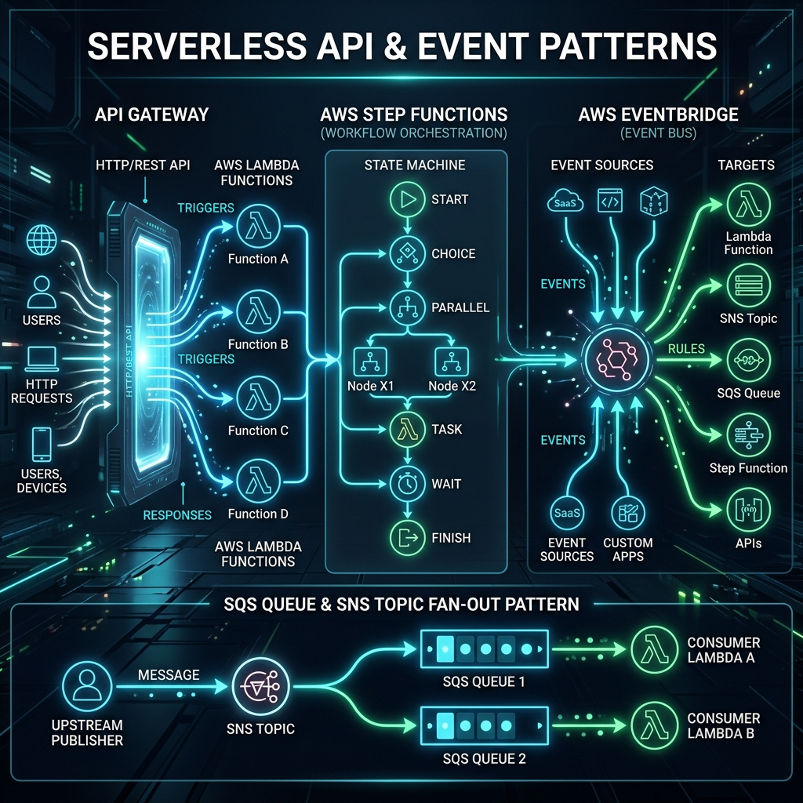

# 44: Serverless API & Event Patterns

  

> 🧠 **The Feynman Hook:** Imagine trying to coordinate a massive wedding. The bad way (Synchronous) is standing in the middle of the room, yelling instructions at every single vendor one by one, waiting for them to finish before talking to the next. If the caterer is late, everything stops. The good way (Asynchronous Event-Driven) is giving everyone a walkie-talkie. When the photographer says "Pictures done!" over the radio (an Event), the caterer hears it and automatically starts serving food. You don't manage them; they react to events. That is how serverless architectures scale perfectly.

## 🎯 What You'll Learn

> **After this chapter, you will understand how to connect serverless components together using API Gateway for synchronous flows, EventBridge for loose coupling, SQS/SNS for fan-out messaging, and Step Functions for complex state orchestration.**

---

## 1. The Synchronous Front Door: API Gateway

While serverless architectures sing when they are asynchronous, users interacting with a website or mobile app expect an immediate, synchronous response. 

**AWS API Gateway** is the fully managed front door. It handles:
*   **Routing:** Directing `GET /users` to `UserLambda` and `POST /orders` to `OrderLambda`.
*   **Authentication:** Validating JWTs via Cognito before the Lambda even spins up.
*   **Rate Limiting:** Stopping DDoS attacks and abusive users at the edge.

> **Anti-Pattern Warning:** Never have an API Gateway trigger a Lambda, which then synchronously triggers another Lambda, which waits for a database update. You are paying for the execution time of *both* Lambdas while they idle. Instead, the first Lambda should place a message on a queue and return a `202 Accepted` to the gateway immediately.

---

## 2. Event-Driven Architecture (EDA) & EventBridge

In serverless, state changes are broadcasted as **Events**. 

If a user places an order, the `OrderService` does not directly call the `ShippingService`. Instead, it fires an event: `"OrderCreated"`.

**Amazon EventBridge** is the central nervous system (the walkie-talkie channel). It is a serverless event bus.
*   Services publish events to the bus.
*   The bus evaluates **Rules** to figure out who cares about the event.
*   It pushes the event to the targets (a Lambda, an SQS queue, a 3rd party SaaS).

*Advantage:* Strict decoupling. You can add a new `LoyaltyPointsService` that listens to the `"OrderCreated"` event tomorrow without ever touching the `OrderService` code.

---

## 3. The Fan-Out Pattern (SNS to SQS)

When multiple systems need to process the exact same message reliably at their own pace, we use the **SNS-to-SQS Fan-Out Pattern**.

*   **SNS (Simple Notification Service):** The megaphone. A publisher sends a message once to a Topic. SNS pushes it to all subscribers blindly. It does not guarantee delivery if the subscriber down.
*   **SQS (Simple Queue Service):** The shock absorber. A durable queue that holds messages safely until a worker (like a Lambda) pulls them off and processes them.

**The Pattern:** You publish the message to an SNS Topic. That topic pushes the message to three different SQS Queues. Three different Lambda functions process their respective queues securely at their own pace.

---

## 4. Orchestration: AWS Step Functions

What happens when a business process has multiple steps that must happen in a specific order, and might take hours or days to complete? For example, an e-commerce checkout:
1. Charge Credit Card
2. If successful, Reserve Inventory
3. If inventory fails, Refund Credit Card (Compensating Transaction)

You cannot use a Lambda for this because Lambdas timeout after 15 minutes. 

Enter **AWS Step Functions**. It is a serverless state machine orchestrator. You define the flow using a JSON-like language (ASL). It visually monitors the state of execution, handles retries, delays, visualizes parallel executions, and coordinates distributed sagas effortlessly.

---

## 🤔 Reflection Questions

1. **You need to process 10,000 image uploads per minute. Should the upload API trigger the Lambda processing function synchronously, or put the image path in an SQS queue for processing?**

💡 View Answer

It must be asynchronous using an **SQS Queue**. If it is synchronous, a surge of traffic could hit API Gateway and cause 10,000 massive Lambdas to execute simultaneously, quickly exhausting your database connections or third-party API rate limits downstream. SQS buffers the load and allows you to process the images at a controlled concurrency limit.

2. **You need to coordinate a 3-step saga pattern where failure at step 3 requires rolling back step 1. Do you use EventBridge (Choreography) or Step Functions (Orchestration)?**

💡 View Answer

You should use **Step Functions (Orchestration)**. While EventBridge allows for loosely coupled choreography, handling complex rollback logic across distributed systems via pub/sub events creates a tangled mess (often called "pinball architecture"). Step functions are specifically designed for centralized saga management.

---

## 📝 Key Interview Talking Points

*   **API Gateway:** Pushes concerns like authorization and throttling to the edge, keeping Lambdas pure.
*   **Asynchronous Processing:** Emphasize that "Serverless at scale is Event-Driven." Shift heavy work off the synchronous path by utilizing SQS. 
*   **Choreography vs Orchestration:** EventBridge enables choreography (decoupled implicit flows). Step Functions enable orchestration (centralized explicit flows).
*   **Fan-out Pattern:** Use SNS to copy a message to multiple SQS queues to allow independent microservices to process the same event at custom throughputs.

---

[<< Previous: AWS Lambda Deep Dive](./43_AWS_Lambda_Deep_Dive.md) | [Home: Curriculum Map](./README.md) | [Next: Serverless Data & Storage >>](./45_Serverless_Data_Storage.md)
