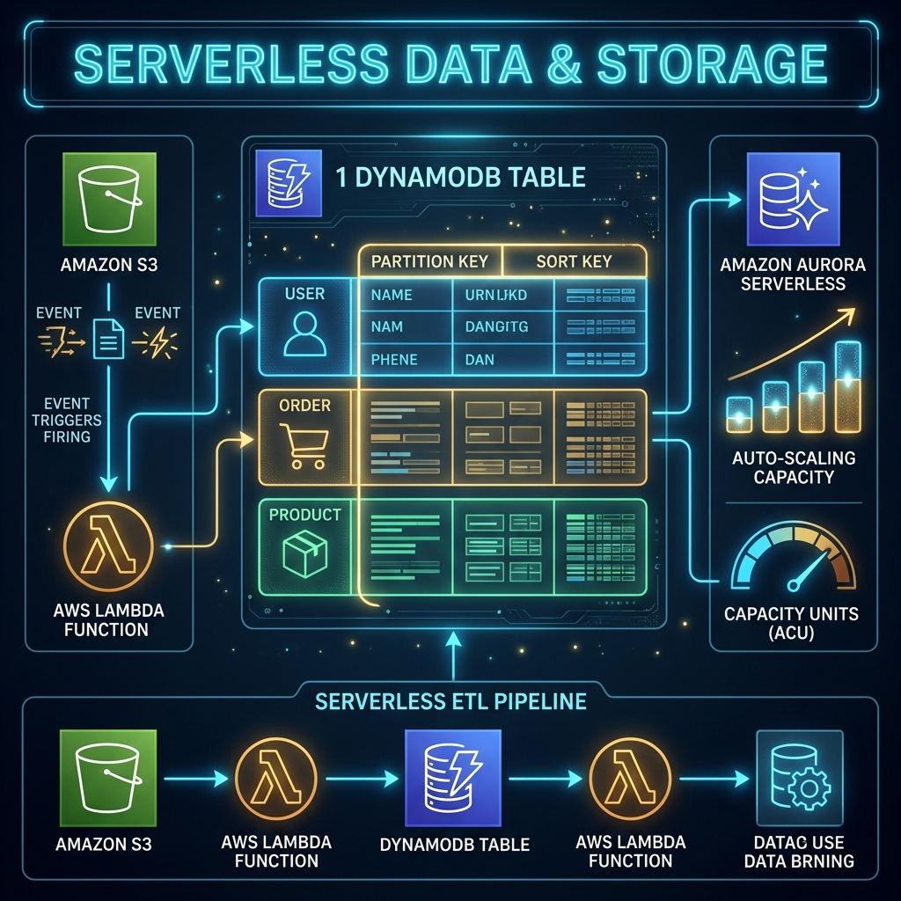

# 45: Serverless Data & Storage

<p align="center">
  
</p>

> 🧠 **The Feynman Hook:** Imagine trying to host a massive water balloon fight. Traditional databases are like hooking up a single rigid garden hose to a faucet—if a thousand kids try to fill their balloons at once, the water pressure drops to a trickle, and the pipes might burst. Serverless databases like DynamoDB are like having a massive, magical reservoir where every single kid gets their own dedicated, high-pressure spigot instantly, no matter if there are 10 kids or 10 million. The catch? You have to design the plumbing perfectly *before* the fight starts.

## 🎯 What You'll Learn

> **After this chapter, you will understand the fundamentals of serverless data storage, the principles of Single-Table Design in Amazon DynamoDB, event-driven storage using Amazon S3, and the architecture of serverless ETL pipelines.**

---

## 1. The Serverless Database Paradox

As we learned in Chapter 43, Lambda functions rapidly scale horizontally. A sudden traffic spike can spawn 5,000 Lambda execution environments. 

If those 5,000 Lambdas all attempt to open a TCP connection to a traditional Relational Database (MySQL/PostgreSQL), the database will immediately run out of connection limits and crash. To do "Serverless Data" correctly, you must use data stores designed for massive HTTP-based concurrency.

### Serverless Storage Options
1.  **Amazon DynamoDB:** A managed NoSQL key-value/document store built for single-digit millisecond latency at any scale. Billed via read/write request units.
2.  **Amazon Aurora Serverless:** A relational database that automatically scales compute capacity up and down (even to zero) based on CPU load.
3.  **Amazon S3 (Simple Storage Service):** The ultimate serverless object store. Perfect for holding massive unstructured files (images, JSON blobs, videos).

---

## 2. DynamoDB and "Single-Table Design"

Because relational JOIN operations are CPU-heavy and slow down at massive scale, NoSQL databases like DynamoDB eliminate JOINs entirely. 

To model complex, relational data in DynamoDB, Advanced Serverless architects use **Single-Table Design**. Instead of having a `Users` table, an `Orders` table, and a `Products` table, you put *all* entity types into one massive table.

### The Mechanism: Overloaded Keys
You define generic `PartitionKey (PK)` and `SortKey (SK)` columns.

| PK (Partition Key) | SK (Sort Key) | Data Payload Attributes |
| :--- | :--- | :--- |
| `USER#123` | `PROFILE#123` | { name: "Alice", email: "alice@e.com" } |
| `USER#123` | `ORDER#999` | { date: "2024", total: 45.00 } |
| `USER#123` | `ORDER#988` | { date: "2023", total: 12.00 } |

When the frontend asks: *"Get me Alice's profile and all her recent orders."*
Instead of a slow SQL `JOIN`, the query is simply: `SELECT fields WHERE PK="USER#123"`. 
DynamoDB instantly retrieves the contiguous block of data holding both the profile and the orders in single-digit milliseconds.

---

## 3. Event-Driven Storage (S3 & DynamoDB Streams)

In a Serverless architecture, data stores are not just passive filing cabinets; they are active event emitters.

### DynamoDB Streams
When a record is inserted, updated, or deleted, DynamoDB can instantly emit a stream record containing the `OldImage` and `NewImage` of the item. You can configure a Lambda to automatically consume this stream. 
*Example:* User updates their profile photo → DynamoDB Stream triggers → Lambda fires to update the search index in OpenSearch.

### S3 Event Notifications
When a massive file is uploaded to an S3 bucket, S3 can fire an event to an SQS queue or directly to a Lambda.
*Example:* User uploads `video_raw.mp4` → S3 triggers a Step Function → Kicks off an asynchronous media transcoding workflow.

---

## 4. Serverless ETL Pipelines

Extract, Transform, Load (ETL) processes traditionally required heavy, expensive Hadoop clusters. Serverless architectures can build highly resilient, infinitely scaling ETL pipelines purely out of managed services.

```
┌─────────┐      ┌─────────┐      ┌─────────┐      ┌─────────┐
│ Raw S3  │ ──►  │ Event   │ ──►  │ Lambda  │ ──►  │ Clean   │
│ Bucket  │      │ Trigger │      │ (ETL)   │      │ Dynamo  │
└─────────┘      └─────────┘      └─────────┘      └─────────┘
```
1.  **Extract:** A 10GB CSV file lands in S3.
2.  **Transform:** S3 triggers a massive fan-out map-reduce process across 1,000 parallel Lambda functions.
3.  **Load:** The cleaned data is dumped into DynamoDB and AWS Athena for immediate analytics parsing.

---

## 🤔 Reflection Questions

1. **You are building an application with highly unpredictable database access patterns, where analysts will run complex ad-hoc queries spanning 14 different entity types. Is DynamoDB Single-Table design a good fit?**
<details>
<summary>💡 View Answer</summary>

**Absolutely Not.** Single-Table Design requires you to know your exact access patterns *before* you design the schema. If you require ad-hoc queries and complex unmapped JOINs, you should use a relational database like Aurora Serverless. DynamoDB is optimized for OLTP (Online Transaction Processing) with known, repetitive access patterns, not ad-hoc OLAP (Analytics).
</details>

2. **Why is it dangerous for a Lambda function to do an unbounded generic "Scan" operation over an entire DynamoDB table?**
<details>
<summary>💡 View Answer</summary>

DynamoDB charges based on the amount of data *read*, not the amount returned. A `Scan` operation reads every single item in the entire database. If the table holds 1TB of data, you will consume massive amounts of Read Capacity Units (RCUs), potentially causing your database bill to spike astronomically and throttling other legitimate queries.
</details>

---

## 📝 Key Interview Talking Points

*   **Database Connections:** Traditional RDBMS connection pooling breaks under Lambda concurrency. Prefer DynamoDB or Data API proxies.
*   **Single-Table Design:** Solves NoSQL join limitations by co-locating heavily accessed relational entities under the same Partition Key for O(1) level read performance.
*   **Event-Driven Data:** Databases and Object Stores in Serverless are active participants. Mention DynamoDB Streams and S3 Events for orchestrating decoupled workflows.
*   **Capacity Models:** DynamoDB scales seamlessly by partitioning data across SSDs behind the scenes based on your Partition Key hash. Avoid "Hot Partitions."

---

[<< Previous: Serverless API & Event Patterns](./44_Serverless_API_Events.md) | [Home: Curriculum Map](./README.md) | [Next: Serverless Security & Observability >>](./46_Serverless_Security_Observability.md)
