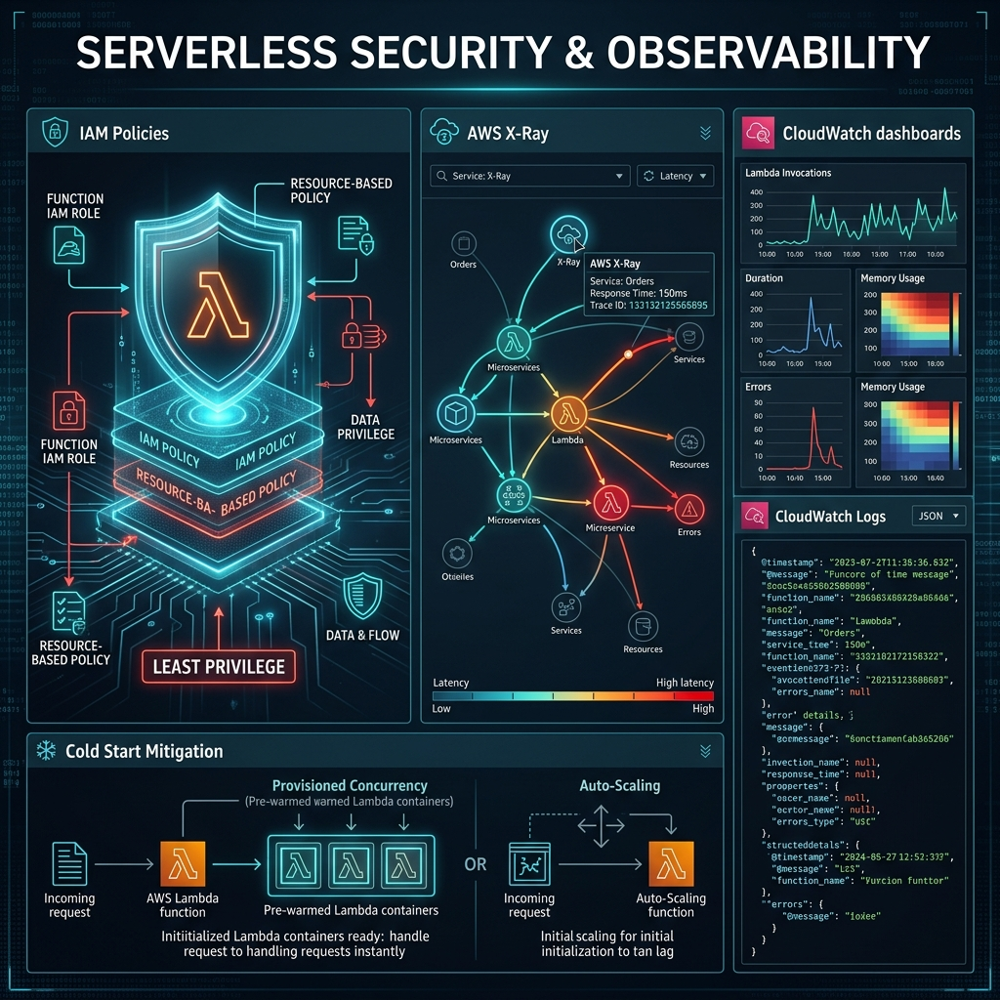

# 46: Serverless Security & Observability

  

> 🧠 **The Feynman Hook:** Imagine managing security for a massive hotel. In the old days (monoliths), you put one giant lock on the front door. Once inside, someone could wander anywhere. In a serverless application, there are no hallways—only hundreds of individual rooms floating in space. Every single room has its own lock, its own keycard reader, and a security camera watching exactly what happens inside. To secure this, you don't build a bigger wall; you manage the keycards meticulously (IAM Policies) and wire all the cameras back to a central monitoring room (Observability).

## 🎯 What You'll Learn

> **After this chapter, you will understand how to secure Serverless architectures using IAM Least Privilege, protect APIs with Lambda Authorizers, and debug highly distributed systems using structured logging and AWS X-Ray tracing.**

---

## 1. Identity over Perimeter (IAM)

Traditional security relies heavily on the "Perimeter" (VPCs, firewalls, and subnets). Because serverless functions often execute outside your private network, the security boundary shifts from the *Network* to *Identity*.

**AWS IAM (Identity and Access Management)** is the ultimate security layer in serverless.

### The Principle of Least Privilege
Every individual Lambda function receives its own specific IAM Execution Role. 
*   **Anti-Pattern:** Giving `ProcessOrderLambda` global `DynamoDB:FullAccess` across all tables.
*   **Best Practice:** The IAM policy explicitly states: "You can `DynamoDB:PutItem` ONLY on the `Orders#Prod` table, and you can only `SNS:Publish` to the `ReceiptsTopic`."

If an attacker manages to exploit a vulnerability in `ProcessOrderLambda` (e.g., via a malicious dependency), the blast radius is strictly contained to that function's explicitly granted permissions.

---

## 2. API Gateway Security & Validations

The API Gateway is your shield. It should reject bad actors *before* you pay for a Lambda invocation.

*   **Lambda Authorizers:** Before your main business logic runs, API Gateway invokes a tiny, caching Lambda function solely responsible for validating the JWT token or API Key.
*   **Schema Validation:** You can upload a JSON schema to API Gateway. If a user posts an HTTP request missing a required payload field, API Gateway rejects it instantly (returning a 400 Bad Request) without ever spinning up your backend compute.

---

## 3. The Observability Triad in Serverless

A distributed serverless architecture can consist of hundreds of lambda functions and queues. If an order fails, where did it fail? You cannot SSH into a box to read a local log file.

### A. Structured Logging (CloudWatch)
`console.log("Error processing order")` is useless at scale. 
Logs must be structured as JSON objects containing context: `OrderId`, `UserId`, `Latency`, `ColdStart: true/false`. This allows AWS CloudWatch Insights to aggregate and search millions of logs instantly like a database query.

### B. Distributed Tracing (AWS X-Ray)
How do you track a request that hits API Gateway → Lambda A → SQS → Lambda B → DynamoDB?
1. API Gateway generates a unique `Trace-ID`.
2. This `Trace-ID` is passed inside the HTTP headers/event payload to every downstream service.
3. Every service reports how long it took back to **AWS X-Ray**.
4. X-Ray weaves this together into a visual service map showing exactly which hop caused the latency spike.

### C. Metrics and Alarms
Metrics are aggregated numbers: `Invocations`, `Errors`, `Duration`, `Throttles`. You rely on CloudWatch Alarms to trigger an alert if `Errors > 1%` over a 5-minute window.

---

## 4. Cold Start Mitigation Strategies

While cold starts are an operational reality (as discussed in Chapter 42), advanced architectures employ specific techniques to mitigate their impact on user experience:

*   **Provisioned Concurrency:** As mentioned in Chapter 43, you pay AWS to keep a pool of Lambda execution environments fully initialized. Zero cold starts at exactly that scale.
*   **Warming Pings (The Hacky Way):** Using EventBridge to trigger your Lambda every 4 minutes to prevent the container from freezing. (Frowned upon by AWS, but historically popular).
*   **Language Choice:** Go, Rust, and Python boot significantly faster than Java or C# (.NET). If cold starts represent unacceptable latency, prefer compiled native binaries.

---

## 🤔 Reflection Questions

1. **You notice that one specific step of a massive Step Function workflow keeps randomly failing due to a timeout, but only once every few thousand executions. How do you find the root cause if you cannot SSH into the server?**

💡 View Answer

You must rely on **Distributed Tracing (X-Ray)**. By looking at the Service Map, you locate the specific trace ID for the failed execution. You drill down into the Gantt chart and realize that for this specific trace, the upstream 3rd-party Payment API took 4.5 seconds to respond instead of its usual 100ms, exceeding the Lambda function's strict 3-second hard timeout.

2. **If a Lambda function is isolated and ephemeral, how does it securely retrieve sensitive database passwords without hardcoding them in the source code?**

💡 View Answer

Environment variables are often used for configuration, but **Secrets Manager or Parameter Store** must be used for sensitive passwords. During the INIT phase (Cold Start), the Lambda fetches the secret from AWS Secrets Manager using its IAM role authorization, caches it in global memory, and uses it for subsequent warm invocations.

---

## 📝 Key Interview Talking Points

*   **Least Privilege:** Do not share IAM roles across functions. Granular permissions shrink the blast radius of a compromised dependency.
*   **Distributed Tracing:** X-Ray and correlation IDs are absolutely mandatory in serverless to follow the request path across decoupled hops.
*   **Gateway Defenses:** Stop bad traffic as early as possible using Gateway Validation and Authorizer caching to save compute costs.

---

[<< Previous: Serverless Data & Storage](./45_Serverless_Data_Storage.md) | [Home: Curriculum Map](./README.md) | [Next: Serverless at Scale >>](./47_Serverless_At_Scale.md)
