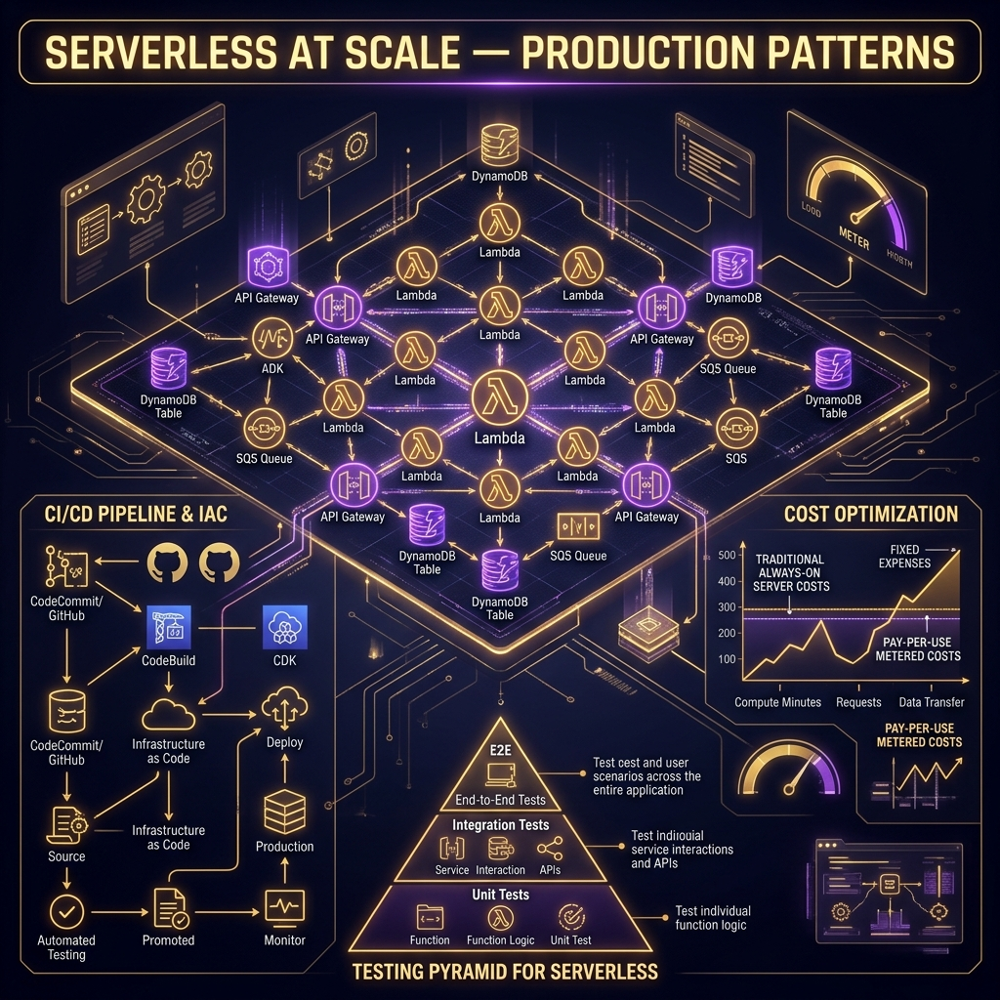

# 47: Serverless at Scale — Production Patterns

  

> 🧠 **The Feynman Hook:** Building a prototype serverless app is like building a Lego castle by yourself—it's fast, fun, and easy. Operating serverless in production at a massive enterprise scale is like directing an entire construction firm to build a real city. Suddenly, you need blueprints (Infrastructure as Code), safety inspections (Automated Testing), financial tracking (Cost Optimization), and standardized roads (CI/CD Pipelines). Production isn't just about the code; it's about the scaffolding that keeps the codebase from collapsing under its own weight.

## 🎯 What You'll Learn

> **After this chapter you will understand the operational requirements for running Serverless architectures in production: Infrastructure as Code (IaC), CI/CD pipelines, modern testing pyramids, and the financial reality of pay-per-use economics.**

---

## 1. Infrastructure as Code (IaC)

In the serverless world, the infrastructure *is* the application. You cannot just upload a `.zip` file of code; you must deploy the API Gateway configuration, the IAM roles, the SQS queues, and the DynamoDB tables alongside it.

Clicking around the AWS Web Console is an anti-pattern. You must use **Infrastructure as Code (IaC)**.

### Frameworks of Choice
*   **AWS SAM (Serverless Application Model):** An extension of CloudFormation specifically optimized for serverless. YAML-based.
*   **AWS CDK (Cloud Development Kit):** Allows you to write infrastructure using familiar programming languages (TypeScript, Python, Java) rather than YAML. Extremely popular for complex, enterprise-scale deployments.
*   **Serverless Framework:** A powerful, vendor-agnostic tool (though predominantly used for AWS) that simplifies packaging and deployment.

---

## 2. CI/CD Pipelines for Serverless

Because serverless relies entirely on cloud resources, your CD (Continuous Deployment) pipeline is more critical than ever.

A standard Serverless CI/CD flow:
1. **Developer pushes code** to GitHub.
2. **CI Server (CodeBuild/Actions):** Runs unit tests locally.
3. **Synthesis:** The CDK code is synthesized into a CloudFormation template.
4. **Deploy to Staging:** Tests integration with actual cloud resources (e.g., real DynamoDB tables).
5. **E2E Testing:** Runs automated synthetic tests against the Staging API endpoints.
6. **Deploy to Production (Canary):** AWS CodeDeploy gradually shifts 10% of traffic to the new Lambda version. If CloudWatch error alarms trigger, it automatically rolls back.

---

## 3. The Serverless Testing Honeycomb

The traditional "Testing Pyramid" (lots of unit tests, few integration tests, very few UI tests) is outdated for serverless. 

Serverless architectures are highly coupled to managed cloud services (DynamoDB, SQS, EventBridge). A unit test mocking out AWS often gives false confidence. You might confidently deploy passing code, only to realize your IAM permissions are wrong in production.

Modern Serverless testing looks more like a **Honeycomb**:
*   **Fewer Unit Tests:** Only used for complex, isolated business logic (e.g., calculating tax rates).
*   **Heavy Integration Tests:** The bulk of your testing. Deploy the code to an actual ephemeral AWS cloud environment and run tests against *real* queues and *real* databases.
*   **End-to-End (E2E):** Black-box testing against the deployed API Gateway URLs.

---

## 4. Cost Optimization & The Pricing Trap

Serverless pricing is beautiful when you have unpredictable, bursty traffic. You don't pay for idle time. However, **serverless is significantly more expensive at a predictable, high-volume baseline.**

> **Feynman Insight:** If you rent a car by the minute (Serverless), it's incredibly cheap if you only drive for 10 minutes a day. But if you decide to drive for 24 hours straight, renting by the minute will bankrupt you compared to just taking out a monthly lease (EC2/Containers).

### The Financial Inflection Point
At extremely high, constant scale (billions of requests), traditional containers (ECS/EKS) on reserved instances become drastically cheaper than Lambda. 

**Cost Optimization Strategies:**
1.  **Reduce Memory/Duration:** Faster code = cheaper invocations.
2.  **Avoid API Gateway:** API Gateway is notoriously expensive at multi-billion request scale. Consider using Application Load Balancers (ALB) to trigger Lambdas for heavy traffic.
3.  **Batching:** Configure SQS triggers to process 10 messages in a single Lambda invocation rather than 10 separate invocations.

---

## 🤔 Reflection Questions

1. **Why is it dangerous to solely rely on local mocks (like `moto` or LocalStack) to test Serverless applications?**

💡 View Answer

Local emulators can never perfectly replicate the nuanced behavior, latency, and exact IAM permission enforcement of the actual AWS cloud. A test might pass in LocalStack but immediately crash in production because of a missing specific IAM resource policy. The industry best practice is to test against short-lived, dedicated AWS cloud environments.

2. **Your application processes 5 million IoT sensor data points per second, 24/7 constantly. Is an API Gateway to Lambda architecture optimal?**

💡 View Answer

**No.** For massive, constant, predictable throughput, the per-request pricing of API Gateway and Lambda will be astronomically expensive. For stable baseline massive throughput, deploying containerized applications on Kubernetes (EKS/ECS) or dedicated EC2 clusters is vastly cheaper and avoids concurrency/connection-pooling limits.

---

## 📝 Key Interview Talking Points

*   **Infrastructure as Code:** Always emphasize that CDK or SAM deployments ensure repeatability and reliable rollback mechanisms over manual provisioning.
*   **The Testing Shift:** Explain why the focus must shift from local unit testing to cloud-native integration testing due to heavy reliance on managed BaaS resources.
*   **Cost Reality:** Acknowledge the trade-off: Serverless trades reduced DevOps staffing costs and low burst costs for higher per-compute costs at a massive, constant operational baseline.

---

[<< Previous: Serverless Security & Observability](./46_Serverless_Security_Observability.md) | [Home: Curriculum Map](./README.md) | [Next: System Design Interview Mastery >>](./48_System_Design_Interview_Mastery.md)
