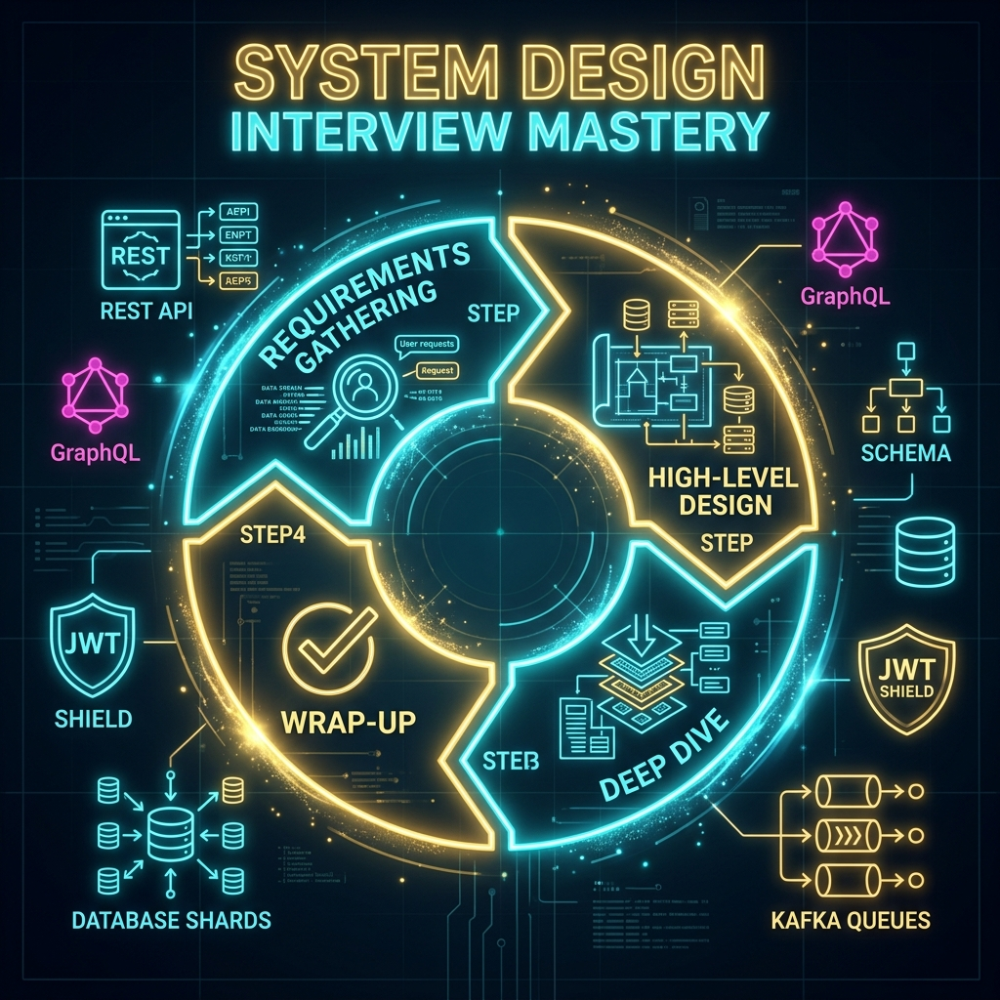

# 48: System Design Interview Mastery

  

> 🧠 **The Feynman Hook:** A system design interview is like a chess match where your opponent wants to see how you think, not just if you win. A random player makes moves impulsively — no structure, no strategy. A master follows a systematic opening, evaluates positions methodically, and communicates their plan clearly. The 4-step framework is your chess opening: Requirements (understand the board), High-Level Design (place your major pieces), Deep Dive (tactical maneuvers), and Wrap-Up (assess the position honestly). The interviewer is not looking for the perfect system. They're watching how you navigate the complexity.

## 🎯 What You'll Learn

> **After this chapter, you will understand the exact step-by-step framework to confidently tackle any system design interview, using the "4-Step Framework," and how to apply your deep knowledge of APIs, Serverless, architecture, and scaling to ace the deep-dive phase.**

A System Design interview is not about finding the "perfect" architecture. It is an open-ended conversation designed to evaluate your ability to navigate ambiguity, ask the right questions, estimate constraints, and systematically construct a scalable solution while discussing trade-offs.

---

## 1. 🗺️ The 4-Step Interview Framework

The key to success is structure. Never jump straight into drawing boxes. Follow this proven 4-step framework based on *System Design Interview – An Insider's Guide* (Alex Xu).

### Step 1: Understand the Problem and Establish Design Scope (3-10 minutes)
Start by clarifying exactly what you are building. Do not make assumptions.
*   **Identify core features:** "Is this API for internal users or public?" "Do we need an activity feed or just direct messaging?"
*   **Identify non-functional requirements:** "Does the system need to be highly available (Netflix) or strongly consistent (Banking)?"
*   **Establish boundaries:** "Are we designing the mobile client logic or just the backend architecture?"

### Step 2: Propose High-Level Design and Get Buy-In (10-15 minutes)
Present a macroscopic view of the system before diving into deep technical weeds.
*   **Draw the core components:** Clients, Load Balancer, API Gateway, Web Servers, and Databases.
*   **Walk through a core flow:** Trace a request from the user to the database and back.
*   **Seek agreement:** "Does this high-level architecture align with your expectations before we scale it?"

### Step 3: Design Deep Dive (10-25 minutes)
Once the interviewer agrees with the high-level design, focus on the most difficult scaling challenges.
*   **Identify bottlenecks:** "Our database will choke on 10,000 writes per second."
*   **Solve the bottlenecks:** "Let's introduce Redis for caching reads, and Kafka to asynchronously buffer our writes."
*   **Discuss specific technologies:** Why Cassandra over MySQL? Why GraphQL over REST?

### Step 4: Wrap Up (3-5 minutes)
Summarize your architecture and proactively discuss its limitations.
*   **Acknowledge flaws:** "This system handles our current scale, but if traffic spikes 10x, our single-region database will become a bottleneck."
*   **Discuss future scaling:** "In the future, we could implement multi-region active-active replication."

---

## 2. 🧮 Back-of-the-Envelope Estimation

> **Feynman Insight:** Back-of-envelope estimation is pub quiz mental arithmetic: you don't know the exact population of Brazil, but you can estimate "South American country, probably 150-250 million". In system design, knowing that RAM access takes ~100ns and disk access takes ~10ms (100,000x slower) lets you instantly justify a caching layer without any formal data. These numbers are the "mental constants" that senior engineers store in their heads and use instantly to evaluate design options.

Interviewers often ask for quick math to justify your design decisions. You must know these baseline numbers by heart.

### The Golden Numbers to Memorize
*   **Memory (RAM) is fast but limited:** ~100ns to read. Servers typically have 64GB - 256GB.
*   **SSD Storage is cheap but slower than RAM:** ~150us to read. Servers can easily hold terabytes.
*   **Network is the slowest:** Reading 1MB sequentially from memory takes ~250us, from network takes ~10ms.

### Quick Traffic Math
Always assume a **10:1 Read-to-Write ratio** for most consumer applications unless told otherwise.
*   If you have **1 Million Daily Active Users (DAU)** making 10 requests a day:
    `10,000,000 requests / 86,400 seconds in a day ≈ 115 Queries Per Second (QPS)`
*   **Peak QPS** is usually double or triple the average QPS.

---

## 3. ⚖️ Navigating Architecture Trade-Offs

> **Feynman Insight:** Architecture trade-offs are like choosing between two imperfect medicines. Consistency (SQL, synchronous) is like a precise antibiotic: it kills the infection exactly, but you must wait for lab results (higher latency). Availability (NoSQL, eventual consistency) is like a broad-spectrum antibiotic: starts working immediately without waiting, but might not be perfectly targeted. The doctor (architect) chooses based on the patient's condition (system requirements) — not based on which medicine is "better."

The most important part of the interview is acknowledging that every choice has a cost. There is no right answer, only appropriate compromises.

When discussing your design, proactively bring up these exact trade-offs:

1.  **Consistency vs. Availability (CAP Theorem):** Are you building a bank (Consistency: No double spending, but the ATM might go offline) or Instagram (Availability: The feed always loads, even if a new photo is delayed by 5 seconds)?
2.  **Latency vs. Throughout:** Are you optimizing for the fastest single response time (Caching, avoiding full table scans) or the massive processing of big data (Kafka, MapReduce)?
3.  **SQL vs. NoSQL:** Structured tabular data with strict ACID guarantees (MySQL/Postgres) versus massive scale unstructured flexible data models (Cassandra/DynamoDB).

---

## 4. 🧰 The Ultimate System Design Toolkit

When you reach Step 3 (Deep Dive) in an interview, you must identify bottlenecks and propose solutions. Pick the exact right tool for the job.

### Data Storage & Ingestion Bottlenecks
*   **"Our database is overwhelmed by reads!"** 
    👉 **Solution:** Introduce a distributed cache like Redis and implement read-replicas.
*   **"Our database is overwhelmed by writes!"** 
    👉 **Solution:** Shard the database or buffer the writes using a durable message queue like Kafka.
*   **"We need to store massive flat files (Videos/Images)."** 
    👉 **Solution:** Object Storage (Amazon S3) with a CDN. Never store blobs in a database.

### Networking & Routing Bottlenecks
*   **"One node is taking all the traffic!"** 
    👉 **Solution:** Add a Layer 4 or Layer 7 Load Balancer with a smart algorithm like Least Connections or IP Hashing.
*   **"Users in Asia are experiencing high latency to our US servers when fetching images."** 
    👉 **Solution:** Implement a Content Delivery Network (CDN) to cache static assets globally at the edge.

### Microservice & Architecture Bottlenecks
*   **"Our monolith is too large for teams to deploy independently."** 
    👉 **Solution:** Transition to Microservices using the Strangler Fig pattern and Domain-Driven Design boundaries.
*   **"A downstream microservice crashed and is cascading failures across the system."** 
    👉 **Solution:** Implement the Circuit Breaker pattern and sensible rate limiting at the API Gateway.

---

## 5. 🔌 Tackling API Design in Interviews

Often, your interview will involve designing the exact API that clients will use to interact with the backend. Drawing upon the knowledge from **Phase 9: API Architecture & Integration Ecosystem**, here is how to impress the interviewer.

### 5.1 Protocol & Paradigm Selection
Demonstrate that you know *when* to use different API paradigms:
*   **REST ($):** Propose this for basic CRUD operations or simple, flat resources. Example: `/api/v1/users/{id}/orders`. Keep it noun-centric and stateless.
*   **GraphQL ($$):** Reach for this when designing a Web SPA or mobile app that needs highly flexible, nested data and wants to avoid over-fetching/under-fetching. Example: "Since our mobile app requires data from Users, Posts, and Comments for the home feed, a single GraphQL query using a DataLoader to prevent N+1 queries will minimize round trips over cellular networks."
*   **Webhooks ($):** Propose this when dealing with long-running operations or third-party integrations (e.g., payment gateways). "Rather than having the client poll our servers every minute, we'll expose a webhook endpoint that our platform will call asynchronously once the payment is processed."

### 5.2 API Gateway & Security
An architecture is incomplete without a gateway.
*   **The Gateway Pattern:** Place an API Gateway (like Kong or NGINX) in front of your services. Mention that the gateway will handle TLS termination, rate limiting (using token bucket), and request routing.
*   **Authentication/Authorization:** Propose **OAuth 2.0 with JWTs**. Tell the interviewer: "The client will obtain a short-lived access token via an authorization code flow. The API Gateway will cryptographically verify the JWT's signature and claims without making a database lookup, then forward the unencrypted user ID to the downstream microservices."

### 5.3 Designing for Evolution & Reliability
Show the interviewer you think about Day-2 operations:
*   **Versioning:** Always state that you will version your API from day one. Mention URL-based versioning (`/v1/`) for REST or schema evolution via deprecation for GraphQL.
*   **Breaking Changes:** Introduce the **Expand-Contract Pattern**. "To make a breaking change without downtime, I would first expand the response to include the new field alongside the old, migrate consumers, and later contract by removing the old field."
*   **The BFF Pattern (Backend for Frontend):** If designing for both mobile and web, propose separate BFFs to aggregate downstream service calls specifically tailored to each client's network constraints.

---

## 6. 🌩️ Tackling Serverless in Interviews

When proposing Serverless in an interview, you must navigate the tradeoffs. Interviewers will push back on cold starts and connection limits. Use knowledge from **Phase 10: Serverless Architecture** to address them flawlessly.

### 6.1 Defending Serverless Selection
If you propose AWS Lambda, the interviewer will ask: *"Why Serverless instead of Kubernetes/Containers?"*

**The Strong Answer:** "Serverless is optimal for our usecase because the traffic is highly unpredictable and bursty. Instead of paying for a fleet of containers that idle at 5% utilization at night, Serverless scales from zero to 10,000 instantaneously and scales costs identically. It also offloads all OS patching and infrastructure maintenance to AWS, increasing our developer velocity."

### 6.2 Managing Cold Starts and Traffic Spikes
If the interviewer asks: *"What if a cold start adds 2 seconds of latency to our critical payment API?"*

**The Strong Answer:** "To mitigate cold starts, we can use **Provisioned Concurrency** to keep a subset of execution environments pre-warmed for expected baseline traffic. Additionally, we would decouple the architecture. The synchronous payment API should merely validate the payload, drop it into an SQS queue, and return a 202 Accepted. A worker Lambda can cold-start asynchronously in the background reading from the queue without blocking the end user."

### 6.3 The Database Connection Problem
If the interviewer asks: *"If our Lambda scales out to 5,000 concurrent executions, won't it crash our relational database?"*

**The Strong Answer:** "Yes, traditional RDBMS connection pooling breaks under serverless concurrency. To solve this, we would either migrate to a NoSQL serverless store like DynamoDB that relies on HTTP instead of raw TCP connections, OR we would put AWS RDS Proxy in front of our database to actively manage and pool connection limits before traffic hits the database."

---

## 7. 🏋️ Practice Exercises

### Exercise 1: Design a Global Chat System (WhatsApp/Messenger)
**The Scenario:** You need to design a 1-on-1 and group chat system for 50 million daily active users. 
**Practice Focus:** Step 3 (Deep Dive). How do you handle maintaining millions of persistent open connections? How do you ensure messages are sent reliably when users go offline?

💡 View Answer

You should propose **WebSockets** for persistent bi-directional connections, a **Presence Service** relying on periodic heartbeats to track online status, and a **Key-Value Store** (like HBase or Cassandra) to store the massive volume of small, sequential message data.

### Exercise 2: Design an API Rate Limiter
**The Scenario:** Your company exposes an API, and you need to prevent single users from abusing it and bringing down the servers. Limit requests to X per second per user.
**Practice Focus:** Step 1 (Scope) and Step 3 (Deep Dive). Which algorithm should you use? Where should the rate limiter live in the architecture?

💡 View Answer

You should place the rate limiter at the **API Gateway** level (before requests hit internal services). You should discuss algorithms like **Token Bucket** (for bursty traffic) or **Sliding Window Log** (for high accuracy). You would use an in-memory cache like **Redis** to keep track of request counters due to its extreme speed and built-in atomic operations.

---

## 🤔 Reflection Questions

1. **You are asked to design a globally distributed highly available system. The interviewer asks: If a network partition occurs between your US and EU data centers, how do you handle incoming user writes?**

💡 View Answer

This is a direct application of the **CAP Theorem** (Consistency, Availability, Partition Tolerance). Because you asserted the system must be highly available (AP), you must sacrifice immediate Strong Consistency during a split. You would continue to accept writes in both the US and EU data centers to maintain Availability. When the network partition resolves, the system must perform **Conflict Resolution** (e.g., using Last-Write-Wins timestamps, or Vector Clocks).

2. **Your high-level design shows an API generating short URLs and storing them in a database. The interviewer asks: As traffic hits 100,000 requests per second, your database CPU hits 100% utilization. How do you scale this specifically?**

💡 View Answer

This requires breaking down the bottleneck into Read vs Write paths. First, identify the read/write ratio. URL shorteners are incredibly heavily read-biased (e.g., 100:1). 
**To scale reads:** Introduce a **Cache layer (Redis)** in front of the database to absorb 90%+ of the traffic, completely relieving database CPU.
**To scale writes:** Shard the database horizontally by the URL short-code to distribute the write load across multiple hardware instances.

---

## 📝 Key Interview Talking Points

*   **Structure:** "Before diving into the architecture, I'd like to spend a few minutes clarifying the functional constraints and scale."
*   **Bottlenecks:** "Looking at this high-level design, the clear bottleneck at 10M DAU will be database I/O on the write path."
*   **Mitigation:** "To mitigate this, I propose introducing a message queue (Kafka) to decouple the ingestion from the slow database writes."
*   **API Mastery:** "We will use an API Gateway for rate limiting and JWT validation, expose a GraphQL BFF for the mobile SPA to avoid N+1 queries, and utilize Webhooks for internal event notifications to avoid client polling."
*   **Serverless Scaling:** "We will leverage Lambda combined with API Gateway for unpredictable API requests, but route high-throughput continuous traffic to containerized instances to optimize for cost at scale."

---

[<< Previous: Serverless at Scale](./47_Serverless_At_Scale.md) | [Home: System Design Curriculum](./README.md)
