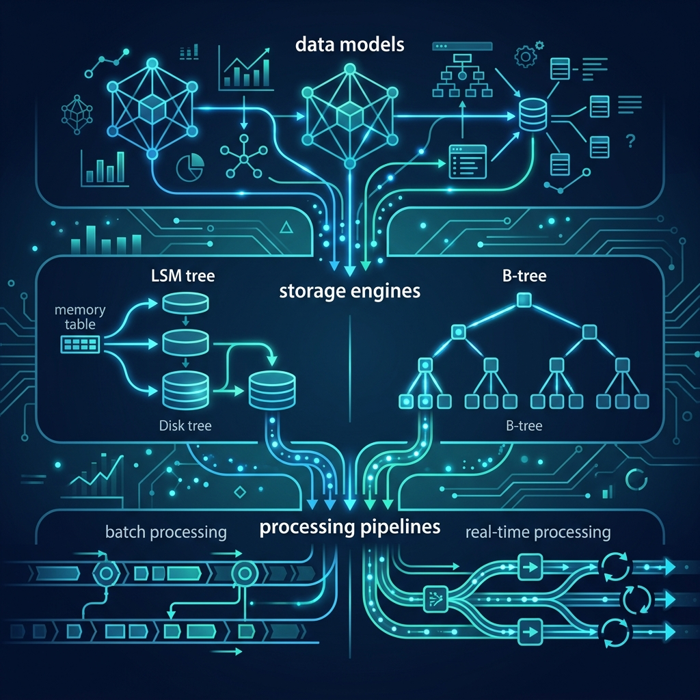
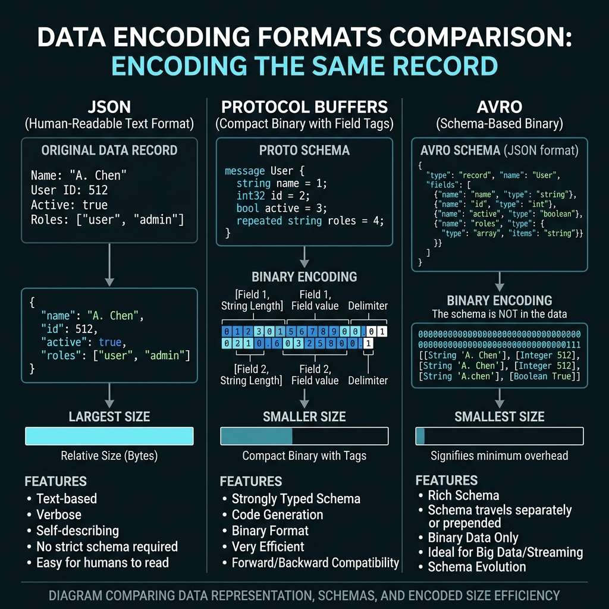
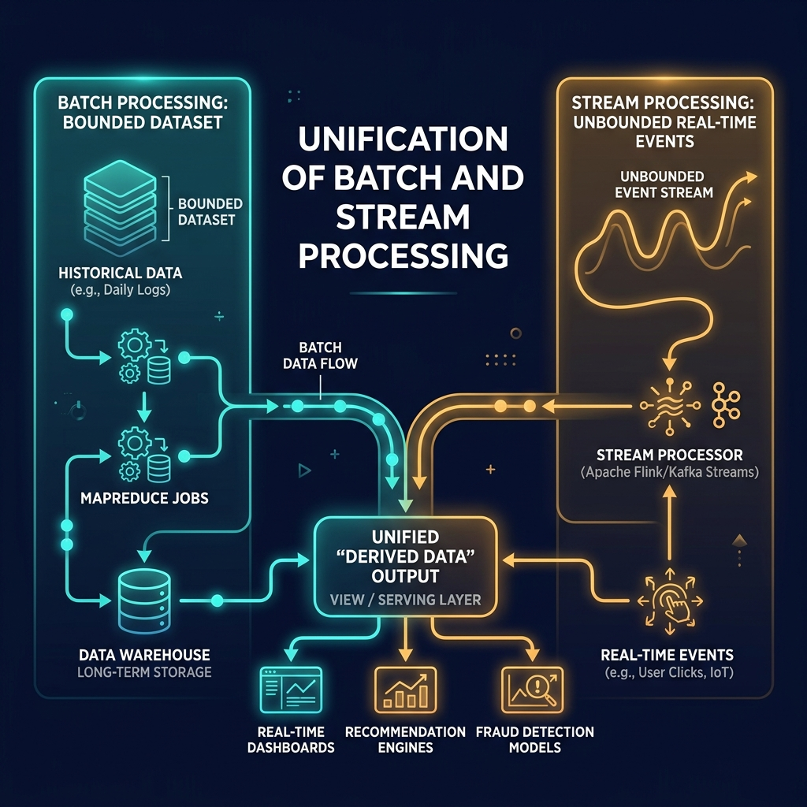
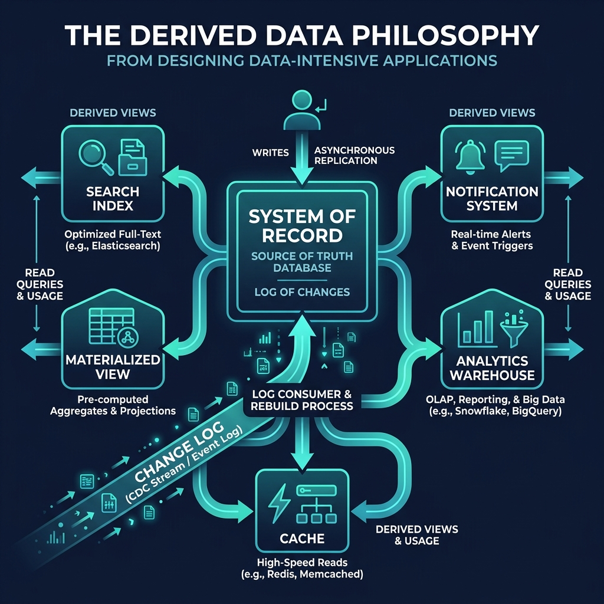

# 49: Designing Data-Intensive Applications Deep Dive

  

> 🧠 **The Feynman Hook:** Think of an application like a massive, constantly updating library. If you just stack books randomly (writing data), it's fast, but finding a specific book takes forever (reading data). If you meticulously organize and index every book as it arrives, finding them is instant, but processing new arrivals is agonizingly slow. This chapter explores the profound engineering choices you make when balancing how you store data against how you intend to read it.

## 🎯 What You'll Learn

> **After this chapter, you will understand the fundamental philosophies from *Designing Data-Intensive Applications* regarding storage engines, data encoding, and why treating the database as a constantly appending "log" (derived data) is the secret to massive scale.**

The book *Designing Data-Intensive Applications* (DDIA) by Martin Kleppmann is the definitive Bible for modern software architecture. It teaches that systems aren't just "databases and web servers"; they are flows of state across different systems.

---

## 1. 🗄️ Storage Engines: B-Trees vs. LSM-Trees

> **Feynman Insight:** Storing data is just a compromise between finding things quickly and writing things quickly. A **B-Tree** is like a well-organized filing cabinet: you find things fast, but inserting a file in the middle requires shifting other folders around. An **LSM-Tree** is like a daily journal: you just write the newest thing at the very end of the page (super fast), but to find something, you have to read backward through the journal.

Under the hood, every database uses a storage engine to persist data to disk. 

### B-Trees (The Filing Cabinet)
- **Used by:** MySQL, PostgreSQL, standard relational databases.
- **How it works:** Data is broken into fixed-size "pages" (usually 4KB). Pages are arranged in a balanced tree. Finding a record takes `O(log N)` operations.
- **Pros:** Excellent for reads. Consistent performance.
- **Cons:** Write amplification. Modifying a small record might require writing a whole 4KB page to disk, plus updating the write-ahead log (WAL).

### Log-Structured Merge (LSM) Trees (The Daily Journal)
- **Used by:** Cassandra, RocksDB, LevelDB.
- **How it works:** Data is written sequentially to an in-memory buffer (MemTable). When full, it is flushed to disk as an immutable Sorted String Table (SSTable). Background processes merge these tables.
- **Pros:** Extremely fast write throughput (appending is the fastest thing a disk can do).
- **Cons:** Reads can be slower (might have to check multiple SSTables). Read amplification.

---

## 2. 📦 Data Encoding and Evolution

> **Feynman Insight:** Imagine sending a letter to a friend in another country. If you write in plain English (JSON), it's easy to read but takes up a lot of paper. If you use a secret shorthand code (Protocol Buffers) that only you and your friend understand, you can fit the whole message on a tiny index card, but nobody else can read it without the decoder ring.

  

As applications evolve, data formats change. You must handle the fact that old code will read new data, and new code will read old data.

1. **JSON/XML (Textual):**
   - Human-readable but verbose. No strict schema enforcement natively. Great for public APIs.
2. **Protocol Buffers & Thrift (Binary):**
   - Requires a strongly typed schema. Very compact because field names (like "username") are replaced with integer tags (like `1`).
   - Enforces **Forward and Backward Compatibility**. You can never change the tag of a field once it's set.
3. **Avro (Binary):**
   - Schema is sent alongside the data. Extremely compact. Excellent for Hadoop/Big Data and Kafka streams.

---

## 3. 🌊 The Unification of Batch and Stream Processing

> **Feynman Insight:** Processing data used to mean waiting until the end of the day, sweeping up all the receipts, and calculating the total (Batch Processing). Today, it's like a running tally on a cash register that updates the exact second a new item is scanned (Stream Processing). The modern goal is to use the exact same logic for both the daily sweep and the live tally.

  

Historically, big data architectures used the **Lambda Architecture**: one codebase for real-time streaming (fast but inaccurate), and a separate codebase for overnight batch processing (slow but accurate).

DDIA champions the unification of these paradigms. A "Stream" is just a batch of events that never ends (unbounded). A "Batch" is just a stream of events that has a finite end (bounded). Tools like Apache Flink allow you to write processing logic once and run it against both historical batches and real-time streams.

---

## 4. 🧠 The "Derived Data" Philosophy

> **Feynman Insight:** Your bank doesn't calculate your balance by looking up a single number in a database. It calculates your balance by replaying every deposit and withdrawal you've ever made. The transactions are the *Truth*; the balance is just a *Derived View* of that truth.

  

This is the most powerful concept in DDIA. There is only one true "System of Record": an immutable, append-only log of events (like Kafka).

Everything else in your architecture—your SQL database, your Elasticsearch cluster, your Redis cache—is simply a **Derived Data System**. They are materialized views constructed by consuming the master event log. 

If your Redis cache crashes, you don't panic; you just replay the log to rebuild it. If you need a new search index, you don't do complex database migrations; you just spin up an Elasticsearch cluster and feed the event log into it from the beginning of time.

---

## 🤔 Reflection Questions

1. **Your application writes massive amounts of IoT telemetry data but rarely reads it. Should you use a database with a B-Tree or an LSM-Tree storage engine?**

💡 View Answer

You should use an **LSM-Tree** based database (like Cassandra). LSM-Trees are optimized for extremely high write throughput because they buffer writes in memory and flush them sequentially to disk, avoiding the costly random disk I/O that B-Trees suffer from during page splits.

2. **You are migrating an internal microservices architecture from JSON over HTTP to gRPC with Protocol Buffers. What is the primary benefit you expect to see regarding the network payload?**

💡 View Answer

You expect the network payload size to drop significantly. Protocol Buffers remove the verbose, repetitive string keys (e.g., `"firstName": "John"`) and replace them with compact binary integer tags. Furthermore, the strict schema definition provides built-in validation and compatibility guarantees.

3. **According to the Derived Data philosophy, if your primary PostgreSQL database goes completely corrupt, how do you restore the system without relying on nightly backups?**

💡 View Answer

If the architecture is truly built on the Derived Data philosophy (Event Sourcing), the PostgreSQL database is merely a materialized view. The "System of Record" is the immutable event log (e.g., Kafka). You would restore the system by provisioning a fresh, empty PostgreSQL instance and replaying the entire event log from offset zero to reconstruct the current state.

---

## 📝 Key Interview Talking Points

- Understand the difference between **B-Trees** (read-optimized, page-oriented) and **LSM-Trees** (write-optimized, append-only).
- **Protocol Buffers** and **Avro** save bandwidth and enforce schema evolution contracts between microservices.
- The **Lambda Architecture** is being replaced by unified Stream/Batch processing engines (like Flink).
- Treat all databases and caches as **Derived Data Views** built from an immutable central event log.

---

[<< Previous: Serverless at Scale](./47_Serverless_At_Scale.md) | [Home: System Design Curriculum](./README.md) | [Next: Foundations of Scalable Systems >>](./50_Foundations_Scalable_Systems.md)
