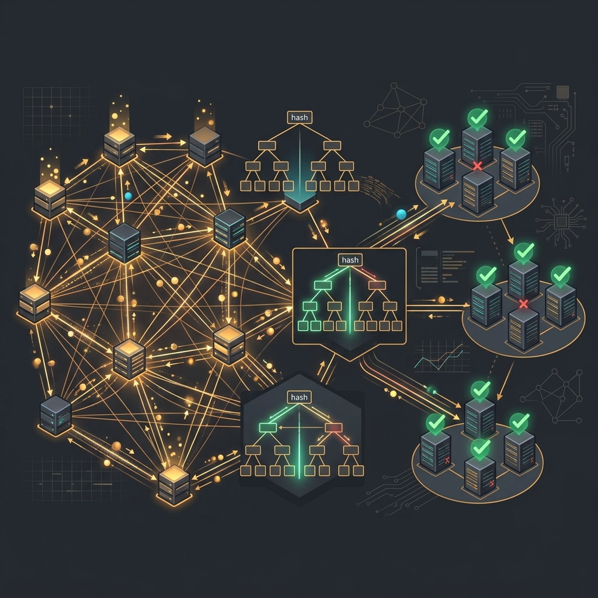
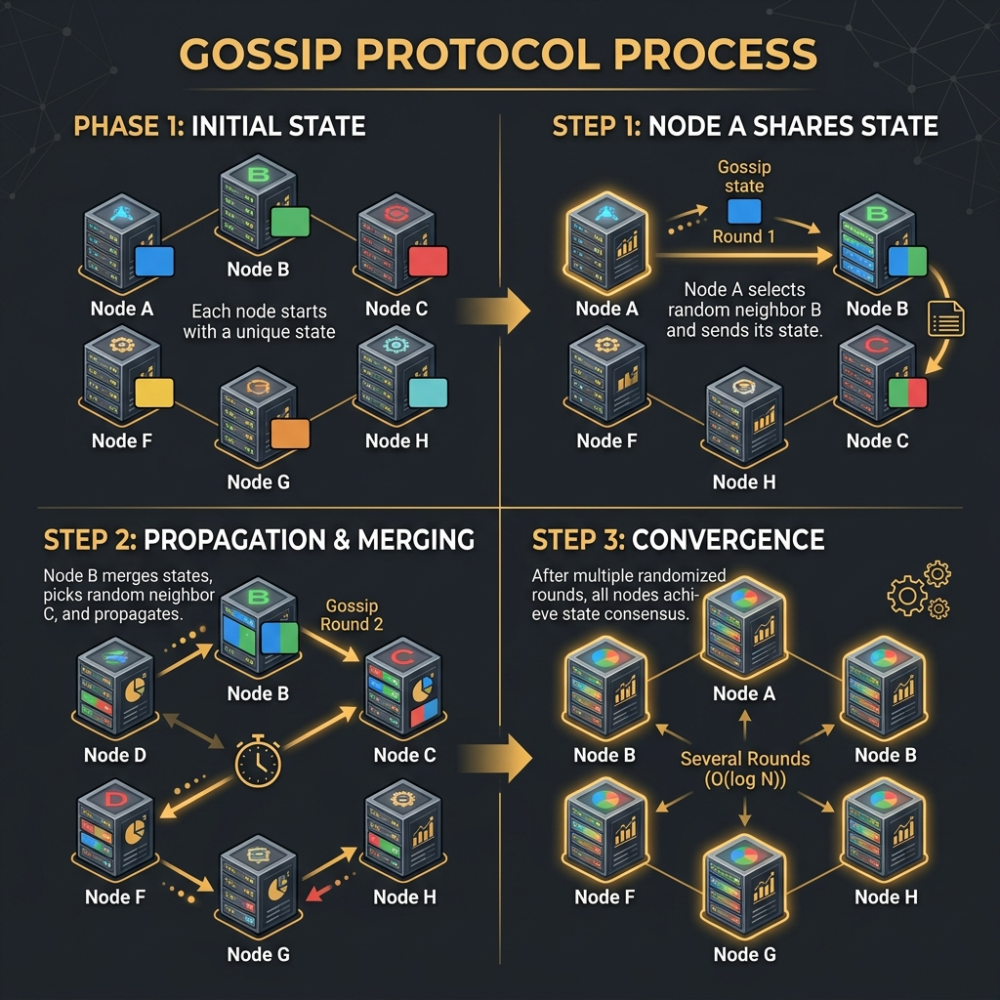

# 50: Foundations of Scalable Systems

  

> 🧠 **The Feynman Hook:** Imagine trying to keep a rumor straight across a high school of 2,000 students. If everyone talks to just one central principal (a monolithic database), the principal gets overwhelmed. If everyone talks to random friends and compares notes (Gossip Protocols), the rumor spreads rapidly and eventually everyone has the same story without any central bottleneck. This chapter explores the foundational math and algorithms that allow thousands of computers to act as one cohesive brain.

## 🎯 What You'll Learn

> **After this chapter, you will understand the deep theoretical primitives from *Foundations of Scalable Systems*, including Gossip Protocols, Anti-Entropy mechanisms, Quorum consensus, and Vector Clocks.**

Scaling a system from 1 server to 10 servers is easy. Scaling from 10 to 10,000 requires abandoning central coordination. Ian Gorton's *Foundations of Scalable Systems* focuses on the low-level distributed algorithms that make massive scale possible.

---

## 1. 🗣️ Gossip Protocols (Epidemic Algorithms)

> **Feynman Insight:** How does a computer cluster know which of its 500 nodes are healthy without a central monitoring server getting overwhelmed? They act like people spreading a virus. Node A tells a random Node B "I'm alive." Node B tells a random Node C. Within seconds, the infection of knowledge has reached the entire cluster exponentially.

  

In massive clusters (like Cassandra or Amazon Dynamo), a centralized "health check" coordinator creates a single point of failure and a massive network bottleneck. 

Instead, they use **Gossip Protocols**:
1. **Periodic Rounds:** Every second, Node A picks a random peer (Node B) and shares its current state and its knowledge of other nodes.
2. **Merge State:** Node B receives the gossip, updates its own local directory with the most recent timestamps, and in the next second, gossips its new combined state to Node C.
3. **Eventual Convergence:** Even in a cluster of 1,000 nodes, it only takes `O(log N)` rounds for information to spread to every single machine. It is decentralized, robust, and highly scalable.

---

## 2. 🧬 Anti-Entropy and Merkle Trees

> **Feynman Insight:** If two librarians are trying to figure out which books they are missing from their identical million-book collections, comparing every single book takes years. Instead, they group books by aisle, then by shelf. If Aisle 4 matches exactly, they ignore it. If Aisle 5 differs, they only check the shelves in Aisle 5. This is a Merkle Tree.

When databases replicate across regions (like US-East to EU-West), network drops will cause them to drift out of sync. To fix this without sending terabytes of data over the wire to check, they run **Anti-Entropy** repairs using **Merkle Trees** (Hash Trees).

- **Leaves:** The hashes of individual data blocks.
- **Branches:** The hashes of their children.
- **Root:** A single hash representing the entire database.

If the Root Hashes of US-East and EU-West match, the databases are identical. If they differ, the systems traverse down the tree branches, instantly isolating the exact 1KB of data that is missing, minimizing network bandwidth drastically.

---

## 3. 🗳️ Quorum Systems and Read/Write Consistency

> **Feynman Insight:** If a committee of 5 people is voting on a decision, you don't need all 5 to agree to pass a rule; you just need a majority (3). In distributed databases, if you write data to 5 nodes, you only need 3 to acknowledge the write to consider it "successful." This means the system can survive 2 servers exploding and still operate perfectly.

In distributed databases (like DynamoDB or Cassandra), you configure **Quorums** to balance consistency against availability.

- `N`: Number of total replicas (e.g., 3)
- `W`: Write quorum (nodes that must acknowledge a write)
- `R`: Read quorum (nodes that must respond to a read)

**The Magic Formula for Strong Consistency:** `W + R > N`
If `N=3`, `W=2`, and `R=2`. Because `2 + 2 = 4`, which is greater than 3, there will always be an overlap. When reading from 2 nodes, you are mathematically guaranteed that at least one of them contains the most recent write.

---

## 4. ⏱️ Time, Order, and Vector Clocks

> **Feynman Insight:** If Alice says "I bought an umbrella" and Bob says "It started raining," how do you know which happened first if Alice's watch is 5 minutes fast? You can't rely on wall clocks. Instead, you rely on causation. Bob replies, "I bought an umbrella *because* it started raining." The causality establishes the order, not the timestamp.

In distributed systems, physical clocks on servers are never perfectly synchronized due to network latency (NTP drift). Relying on timestamps to resolve write conflicts is dangerous.

Instead, systems use **Logical Clocks** or **Vector Clocks**. A vector clock is an array of counters `[NodeA: 2, NodeB: 1, NodeC: 0]`. Every time a node modifies a piece of data, it increments its own counter. 

When two nodes try to update the same record simultaneously, the database compares their vector clocks. If one clock mathematically "dominates" the other, the database knows which event happened first. If they are concurrent, the database flags a conflict and asks the application layer to resolve it.

---

## 🤔 Reflection Questions

1. **You have a Cassandra cluster of 5 nodes. You configure your write quorum to 1 (W=1) to achieve blazing fast writes. What must you set your read quorum (R) to in order to guarantee you always read the most recent data?**

💡 View Answer

To guarantee strong consistency (preventing stale reads), the formula `W + R > N` must be satisfied. 
If `N = 5` and `W = 1`, then `1 + R > 5`. Therefore, `R` must be at least **5**. You must query every single node in the cluster on every read, which completely destroys read performance and availability if a single node goes down.

2. **Why do massive distributed systems prefer Gossip Protocols over a centralized heartbeat monitor (like ZooKeeper) for basic node failure detection?**

💡 View Answer

Centralized monitors form a single point of failure and a massive networking bottleneck. If 10,000 nodes ping a central server every second, the network is saturated. Gossip protocols distribute this load evenly; each node only talks to a few random peers, requiring minimal bandwidth while ensuring exponential propagation of failure states across the entire cluster.

3. **In an active-active multi-region database, two users update the same shopping cart simultaneously in the US and EU. Because physical server clocks are out of sync, how does the database resolve the conflict?**

💡 View Answer

It cannot rely on physical timestamps (Last-Write-Wins) because of NTP drift. It uses **Vector Clocks** to track causal history. If the vector clocks indicate the updates were concurrent (neither dominates the other), the database cannot automatically resolve it. It will return *both* versions of the cart to the client application, forcing the application logic to merge the carts together.

---

## 📝 Key Interview Talking Points

- Understand that **Gossip Protocols** provide scalable, decentralized failure detection and state propagation.
- **Merkle Trees** are used for efficient anti-entropy repairs, isolating out-of-sync data without transferring massive payloads.
- **Quorums** (`W + R > N`) allow you to tune a database on a sliding scale between extreme availability and strict consistency.
- **Vector Clocks** track causality and concurrent events when physical server clocks cannot be trusted.

---

[<< Previous: Designing Data-Intensive Applications](./49_DDIA_Deep_Dive.md) | [Home: System Design Curriculum](./README.md) | [Next: Flow Architectures >>](./51_Flow_Architectures.md)
