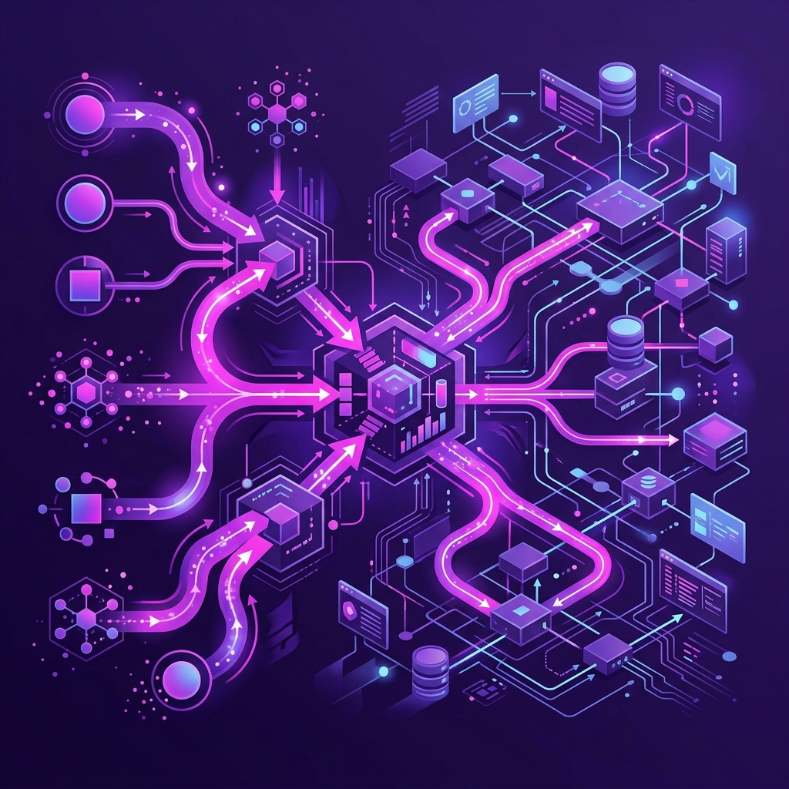
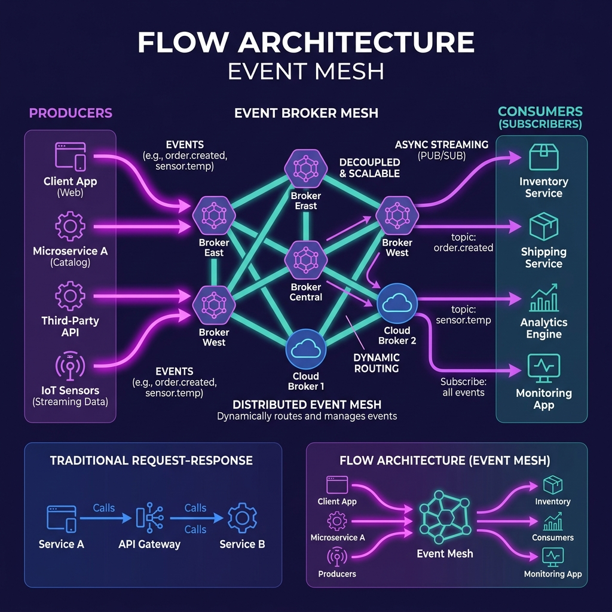

# 51: Flow Architectures & Streaming Integration

  

> 🧠 **The Feynman Hook:** Traditional APIs are like calling a store to ask, "Do you have the shoes yet?" and calling back every 5 minutes (Request-Response Polling). A Flow Architecture is like subscribing to a magazine; the moment the shoes arrive in the warehouse, the system automatically ships a notification to your house without you ever asking. As systems scale, "calling to ask" becomes too expensive. The world is moving to continuous streams of automatic delivery.

## 🎯 What You'll Learn

> **After this chapter, you will understand the paradigm shift toward "Flow Architectures"—moving away from synchronous REST API calls to real-time, asynchronous event meshes and streaming integration.**

Based on James Urquhart's *Flow Architectures*, this chapter explores the future of enterprise integration: treating data in motion as the primary architectural primitive, rather than data at rest.

---

## 1. 🔄 Request-Response vs. Event Flow

> **Feynman Insight:** Request-Response (REST) is like a conversation: "Give me data." "Here is data." Both parties must be awake and listening at the exact same time (synchronous coupling). Flow (Event-Driven) is like a bulletin board: "I did a thing!" and walking away. Anyone interested can read the board whenever they want (asynchronous decoupling).

  

Most modern systems are bogged down by the limitations of synchronous REST APIs.
- **The REST Problem:** Service A calls Service B. If Service B is slow, Service A hangs. If Service B crashes, Service A throws an error. They are temporally coupled.
- **The Flow Solution:** Service A publishes an event (`OrderCreated`) to a central broker and immediately moves on. Service B, Service C, and Service D independently subscribe to that event and process it at their own pace.

Flow architecture shifts the integration burden from the application layer to the infrastructure layer.

---

## 2. 🕸️ The Event Mesh

> **Feynman Insight:** An event mesh is like the global postal system. You don't need a direct pipe connecting your house to your friend's house in Tokyo. You just drop a letter in a local blue box with an address (topic), and the underlying interconnected mesh of postal hubs figures out the optimal route to deliver it.

An **Event Mesh** is the evolution of the single, monolithic message broker. Instead of one giant Kafka cluster that every microservice in the world must connect to, an Event Mesh is a network of interconnected event brokers deployed across different clouds, regions, and data centers.

- **Dynamic Routing:** A microservice in AWS can publish an event, and the mesh will dynamically route it to a consumer sitting in an on-premise data center or in Azure, without the producer knowing where the consumer lives.
- **Standardized Protocols:** Technologies like CloudEvents standardizing the metadata of an event, allowing different broker technologies (Kafka, RabbitMQ, Solace) to seamlessly interoperate across the mesh.

---

## 3. 🌊 Data in Motion (Streaming Integration)

> **Feynman Insight:** Traditional databases (Data at Rest) are like taking a photograph. You capture the state of the world at one exact second, and query the photo. Streaming integration (Data in Motion) is like watching a live movie. You analyze and react to things as they are happening on the screen, before the movie is even finished.

In a Flow Architecture, integration doesn't happen by batching data into a data warehouse overnight. It happens natively on the event stream using Stream Processing engines (like Apache Flink or Kafka Streams).

- **Event Enrichment:** As an `OrderPlaced` event flows through the mesh, a stream processor grabs it, looks up the customer's lifetime value in a fast cache, attaches that data to the event, and puts the enriched event back on the stream.
- **Windowing:** Aggregating data on the fly. For example, emitting an alert if 5 `LoginFailed` events occur *within a sliding 1-minute window*, all calculated in memory before the data ever touches a database.

---

## 4. 🌍 The Global Event Marketplace

Urquhart's ultimate thesis in *Flow Architectures* is that just as APIs created a global API economy (Stripe, Twilio), Event Meshes will create a global **Event Marketplace**.

Instead of polling a weather API for current temperatures, a logistics company will simply subscribe to a global weather event stream. Real-time streams of supply chain movements, financial transactions, and IoT sensor data will be bought and sold dynamically over global event meshes.

---

## 🤔 Reflection Questions

1. **Your architecture consists of an API Gateway routing requests to 5 microservices that synchronously call each other via REST. A traffic spike causes Microservice E at the end of the chain to slow down by 3 seconds. What happens to the system?**

💡 View Answer

Because the system is tightly coupled synchronously, the latency cascades backward. Service D waits 3 seconds, causing Service C to wait, up to the API Gateway. Connections will remain open, thread pools will exhaust, and the entire system will likely collapse under a cascading failure. A Flow (event-driven) architecture decouples these services to prevent this exact scenario.

2. **Why is standardizing on a format like CloudEvents critical for building a global Event Mesh?**

💡 View Answer

An Event Mesh relies on dynamically routing events across different networks, clouds, and broker technologies (Kafka, RabbitMQ, MQTT). If every producer creates a completely custom event payload, the intermediate routers cannot inspect the headers to determine where the event needs to go. CloudEvents provides a standard envelope (like a standard postal envelope address) allowing any broker to route the event without understanding the inner payload.

3. **In streaming integration, what is the difference between a Tumbling Window and a Sliding Window when analyzing events in motion?**

💡 View Answer

A **Tumbling Window** chunks time into distinct, non-overlapping segments (e.g., 1:00-1:05, 1:05-1:10). An event belongs to exactly one tumbling window. A **Sliding Window** continuously moves forward over a duration (e.g., "the last 5 minutes" calculated every single second). Sliding windows are critical for real-time anomaly detection (like 5 failed logins in *any* 5-minute span).

---

## 📝 Key Interview Talking Points

- **Synchronous REST** causes temporal coupling and cascading failures. **Asynchronous Flow** architectures decouple producers and consumers for massive scale.
- An **Event Mesh** abstracts the message broker into a dynamic network, routing events globally across clouds.
- **Stream Processing** allows you to transform, filter, and enrich data *in motion*, rather than waiting for it to land in a database (data at rest).
- Standardized envelopes like **CloudEvents** are the foundation of interoperability in modern streaming architectures.

---

[<< Previous: Foundations of Scalable Systems](./50_Foundations_Scalable_Systems.md) | [Home: System Design Curriculum](./README.md) | [Next: Continuous API Management >>](./52_Continuous_API_Management.md)
