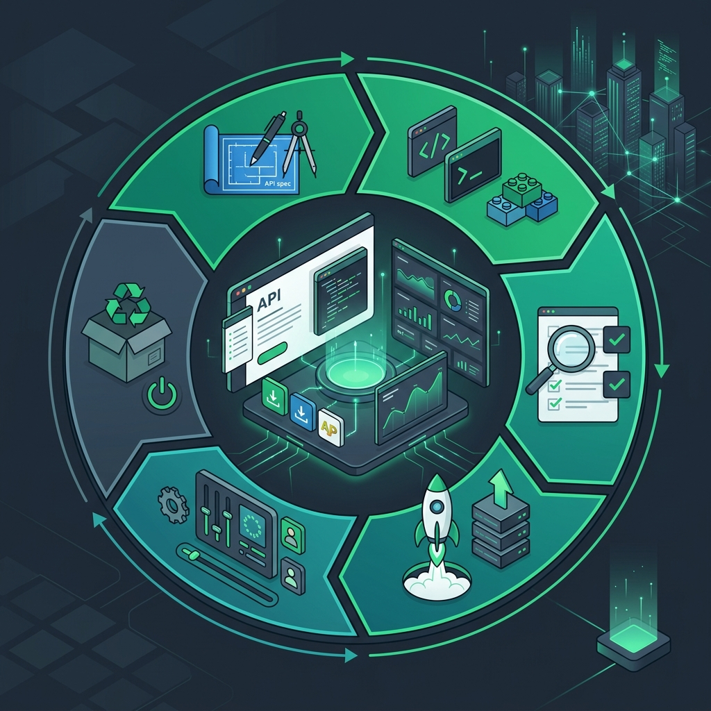
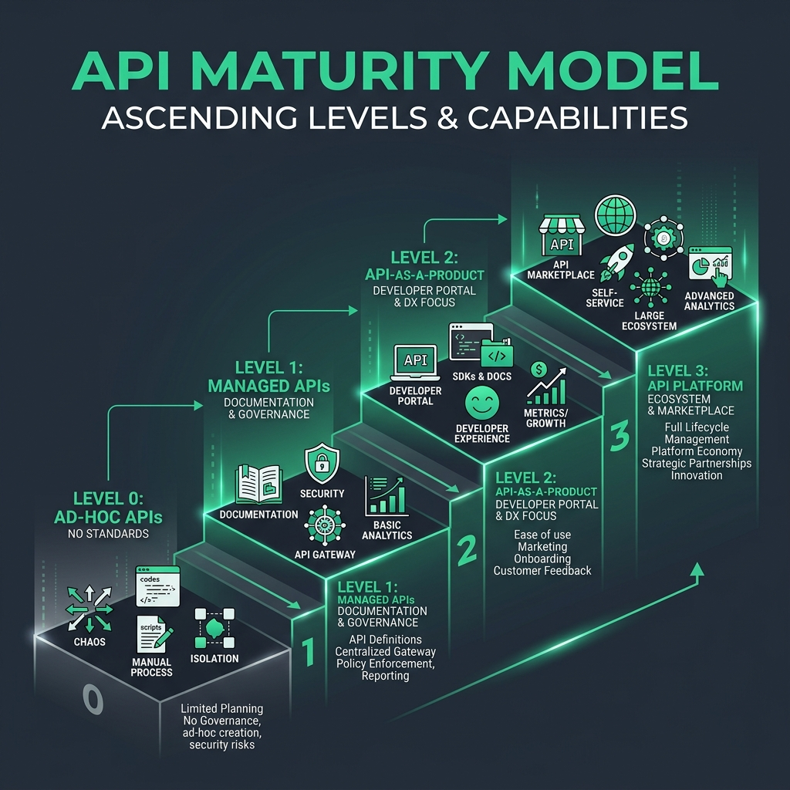

# 52: Continuous API Management

  

> 🧠 **The Feynman Hook:** Building an API is like building a restaurant kitchen. The code is just the stove. If you don't have menus (documentation), waiters (gateways), health inspectors (governance), and a way to phase out old dishes without making regulars angry (versioning), your restaurant will fail. API Management is the business of running the restaurant, not just cooking the food.

## 🎯 What You'll Learn

> **After this chapter, you will understand the principles of *Continuous API Management*, the API Maturity Model, how to treat APIs as first-class products, and the Developer Experience (DX) lifecycle.**

Based on *Continuous API Management* by Medjaoui, Wilde, Mitra, and Amundsen, this chapter shifts focus from *how to code an API* to *how to manage an API ecosystem* at an enterprise scale.

---

## 1. 📈 The API Maturity Model

> **Feynman Insight:** The evolution of APIs is like the evolution of roads. Level 0 is a dirt path you walk on intuitively (ad-hoc). Level 1 has stop signs and speed limits (Managed). Level 2 has gas stations, rest stops, and beautiful maps designed for travelers (API-as-a-Product). Level 3 is an interconnected interstate highway system driving the entire economy (API Platform).

  

Enterprise architectures do not magically become API platforms overnight. They evolve through stages:

- **Level 0: Ad-Hoc APIs.** Microservices communicate through point-to-point connections. No central registry, no consistent security, no standards. "Chaos."
- **Level 1: Managed APIs.** An API Gateway is introduced. Security (OAuth), rate limiting, and basic monitoring are centralized. Basic documentation exists.
- **Level 2: API-as-a-Product.** The paradigm shift. APIs are treated like commercial software. There is a Developer Portal, auto-generated SDKs, dedicated product managers, and a focus on Developer Experience (DX).
- **Level 3: API Platform / Ecosystem.** The APIs become the business model (e.g., Stripe, Twilio). External partners build businesses on top of your APIs in a self-service marketplace.

---

## 2. 📦 API-as-a-Product (API First)

> **Feynman Insight:** If you build a car engine and then try to bolt a steering wheel and seats onto it afterward, it will be a terrible car. You have to design the driver's experience *first*, then build the engine to power it. This is "API-First" design.

Traditionally, backend developers wrote the database logic, built the application, and then auto-generated a REST API on top of it as an afterthought.

**API-First Design** reverses this:
1. **Design the Contract:** You write the OpenAPI (Swagger) specification first, entirely focused on how the consumer will experience it.
2. **Mock and Test:** You generate a mock server from the spec. Frontend developers start building against the mock immediately.
3. **Build the Engine:** Backend developers implement the code to satisfy the exact contract designed in step 1.

The API is not a technical interface; it is a product, and the Developer is the Customer.

---

## 3. 🧑‍💻 Developer Experience (DX) and Portals

If your API is a product, the **Developer Portal** is your storefront. A world-class API management strategy requires:

- **Interactive Documentation:** Not just static PDFs. Developers must be able to paste a token and click "Try it out" directly in the browser.
- **Time-to-First-Call (TTFC):** A critical DX metric. How many minutes does it take a new developer to sign up, get an API key, and successfully make their first `200 OK` request? If it's more than 5 minutes, you lose them.
- **SDK Generation:** Automatically providing client libraries in Python, Java, Go, and TypeScript so consumers don't have to write raw HTTP boilerplate.

---

## 4. 🚦 Governance and the API Lifecycle

> **Feynman Insight:** Governance isn't about the police handing out speeding tickets; it's about making sure the steering wheel is always on the left side of the car so people don't crash when they switch vehicles.

As your company scales to 500+ APIs, you need **Governance**:
- Do all APIs use consistent naming (`/users` vs `/userList`)?
- Do they all use the exact same pagination structure?
- Are they all secured with the same OAuth flow?

Furthermore, you must manage the **API Lifecycle**:
1. **Design & Build**
2. **Deploy & Manage** (via API Gateways)
3. **Version** (Using `/v1/`, header versioning, or GraphQL schema evolution)
4. **Retire/Sunset:** You cannot just turn off an API. You must use `Deprecation` and `Sunset` HTTP headers to give consumers a 6-month warning before gracefully terminating endpoints.

---

## 🤔 Reflection Questions

1. **Your company has 50 microservices, each with its own API. Developers complain that to authenticate, some APIs use Basic Auth, some use custom JWTs, and some require API keys in the query string. Where are you on the API Maturity Model, and what is the immediate fix?**

💡 View Answer

You are at **Level 0 (Ad-hoc APIs)**. The immediate fix is to implement an **API Gateway** to move to Level 1 (Managed APIs). The Gateway intercepts all incoming traffic, enforces a single, standardized security protocol (like OAuth 2.0) across all services, and normalizes the authentication before forwarding the request to the backend microservices.

2. **What is the difference between "Code-First" API development and "API-First" (Contract-First) development?**

💡 View Answer

**Code-First:** The backend writes the application logic, creates the controllers, and then uses a tool (like Springfox or Swashbuckle) to auto-generate the OpenAPI documentation from the code. The API is tied to the internal implementation.
**API-First:** The team manually designs the OpenAPI Specification `.yaml` file *before writing a single line of code*. The contract drives the implementation, allowing parallel development of frontend and backend.

3. **You need to remove a field from a production API response because it is causing a massive database bottleneck. How do you do this safely?**

💡 View Answer

Removing a field is a **breaking change**. You cannot simply delete it. You must use the **Expand-Contract Pattern**. First, deploy a `v2` of the API (or version via headers) without the field. Monitor traffic on `v1`. Send deprecation notices to consumers using `v1` with a timeline. Once traffic on `v1` hits zero, you safely retire the old endpoint.

---

## 📝 Key Interview Talking Points

- Treat APIs as **First-Class Products** where developers are the primary customers.
- **Time-to-First-Call (TTFC)** is the ultimate metric for Developer Experience (DX).
- Move from chaotic ad-hoc APIs to **Managed APIs** by introducing an API Gateway for standardized security and rate limiting.
- **API-First Design** (Contract-first) decouples frontend and backend development and forces consumer-centric design.

---

[<< Previous: Flow Architectures](./51_Flow_Architectures.md) | [Home: System Design Curriculum](./README.md) | [Next: Microservices in Practice >>](./53_Microservices_Java_Practice.md)
