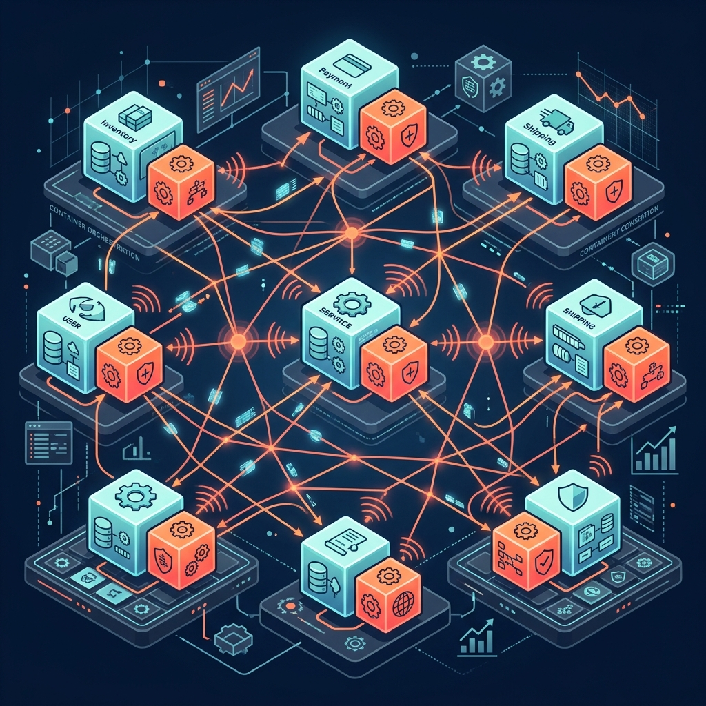
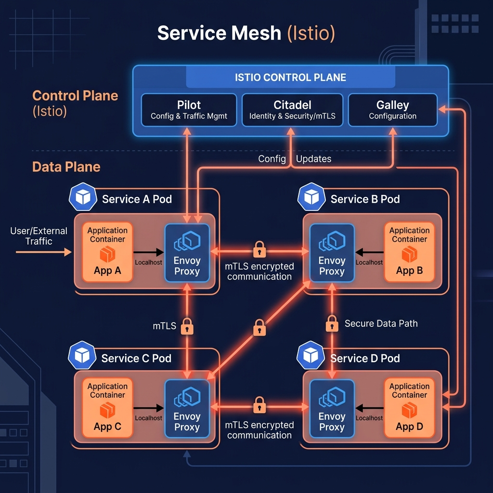

# 53: Microservices in Practice

  

> 🧠 **The Feynman Hook:** Drawing microservices on a whiteboard is like drawing a blueprint for a city; it looks clean and perfect. *Running* microservices in production is like being the mayor of that city during a traffic jam, a power outage, and a snowstorm. This chapter bridges the gap between theoretical whiteboard boxes and the brutal reality of keeping distributed systems alive in production.

## 🎯 What You'll Learn

> **After this chapter, you will understand the practical realities of deploying microservices, including the Service Mesh pattern, Sidecar proxies, Health Checking, and container orchestration realities.**

Drawing from practitioner literature like *Microservices for Java Developers*, this chapter moves past the "why" of microservices and focuses on the "how" of deployment, network resilience, and operational reality.

---

## 1. 🪢 The Fallacies of Distributed Computing

> **Feynman Insight:** If you write a Monolith, calling a function is like talking to your brain: it happens instantly and never fails. If you write Microservices, calling a function is like yelling a message across a crowded room to a friend: it takes time, they might not hear you, and the room might suddenly get noisy.

When moving to microservices, architects often fail because they ignore the **Fallacies of Distributed Computing**:
1. The network is reliable. *(It isn't. Packets drop constantly.)*
2. Latency is zero. *(It isn't. Network hops add up quickly.)*
3. Bandwidth is infinite. *(It isn't. Massive JSON payloads choke pipes.)*
4. The network is secure. *(It isn't. Traffic must be encrypted.)*

To survive these realities, you cannot rely on simple HTTP requests. You must implement Circuit Breakers, Retries, and Timeouts on *every single network call*.

---

## 2. 🕸️ The Service Mesh and Sidecar Pattern

> **Feynman Insight:** Asking every developer to write complex retry logic and security encryption in their application code is like asking every citizen to build their own roads and traffic lights. A Service Mesh provides the infrastructure; the developer just drives the car.

  

In early microservice architectures, developers imported heavy libraries (like Netflix Hystrix) into their Java code to handle circuit breaking and load balancing. This bloated the application and forced everyone to use the same language.

The modern solution is the **Service Mesh (e.g., Istio, Linkerd)** using the **Sidecar Pattern**.

- **The Data Plane (Sidecar):** A tiny proxy container (like Envoy) is deployed directly alongside your application container inside the same pod. Your application makes a simple, dumb HTTP call to `localhost`. The proxy intercepts it, adds mTLS encryption, handles retries, enforces timeouts, and routes it to the destination.
- **The Control Plane:** A central manager that pushes routing rules and security certificates down to the thousands of sidecar proxies in the mesh.

The application remains completely ignorant of the complex network topology.

---

## 3. 💓 Health Checks and Liveness/Readiness Probes

> **Feynman Insight:** You have two questions for an employee: "Are you alive?" and "Are you ready to work?" An employee might be alive but still drinking their morning coffee (not ready). Container orchestrators ask microservices these exact two questions.

In a containerized environment (like Kubernetes), the infrastructure must constantly monitor the state of microservices to route traffic properly.

1. **Liveness Probe:** "Are you broken?" The orchestrator pings an endpoint (`/health/live`). If the service returns a 500 error or hangs, the orchestrator ruthlessly kills the container and restarts it.
2. **Readiness Probe:** "Can you take traffic?" The orchestrator pings (`/health/ready`). A service might be alive, but it is currently loading a massive cache into memory. It returns a 503. The orchestrator won't kill it, but it will temporarily stop sending user traffic to it until it reports ready.

---

## 4. 🗄️ Database per Service Pattern

The golden rule of microservices is **loose coupling**. If Service A and Service B share the same relational database table, they are tightly coupled. If Service A alters a column, Service B breaks.

**The Rule:** Every microservice must have its own isolated database (or at least its own isolated schema). 
- Service A cannot query Service B's database directly. 
- Service A must make an API call to Service B to request the data.

This introduces massive complexity: How do you perform a join across two microservices? You must implement patterns like **API Composition** (an aggregator service fetches from both and joins in memory) or **CQRS** (maintaining a combined read-only materialized view).

---

## 🤔 Reflection Questions

1. **Service A calls Service B. Service B is overloaded and taking 10 seconds to respond. You haven't implemented any Timeouts or Circuit Breakers. What happens to Service A?**

💡 View Answer

Service A will suffer **Thread Pool Exhaustion**. Every incoming request to Service A will open a thread to call Service B. Because Service B takes 10 seconds, those threads hang open. Very quickly, Service A runs out of available threads and crashes, causing a cascading failure across the entire system.

2. **Why is the Sidecar Pattern superior to compiling networking libraries (like Netflix OSS) directly into your application code?**

💡 View Answer

The Sidecar pattern isolates the infrastructure logic from the application logic. This provides **Polyglot Support**—you can write a microservice in Java, Go, or Node.js, and they all get the exact same retry/routing logic because the Envoy proxy runs out-of-process. It also allows you to update network policies without redeploying the application code.

3. **Your microservice takes 45 seconds to boot up and connect to its database. Kubernetes keeps killing and restarting it every 15 seconds. What is configured incorrectly?**

💡 View Answer

Your **Liveness Probe** is failing during the startup sequence. You need to configure a `initialDelaySeconds` or implement a specific **Startup Probe** in Kubernetes to give the application enough time to establish its database connections before the orchestrator assumes it is dead and kills it.

---

## 📝 Key Interview Talking Points

- Assume the network will fail. Every external call must be wrapped in a **Timeout**, **Retry**, and **Circuit Breaker**.
- The **Service Mesh (Sidecar Pattern)** abstracts complex network resilience, routing, and mTLS security away from the application code into an out-of-process proxy.
- Differentiate between **Liveness Probes** (restart me) and **Readiness Probes** (stop sending me traffic).
- Microservices must strictly adhere to the **Database per Service** pattern to maintain true loose coupling.

---

[<< Previous: Continuous API Management](./52_Continuous_API_Management.md) | [Home: System Design Curriculum](./README.md) | [Next: The Clean Coder >>](./54_Clean_Coder_Professionalism.md)
