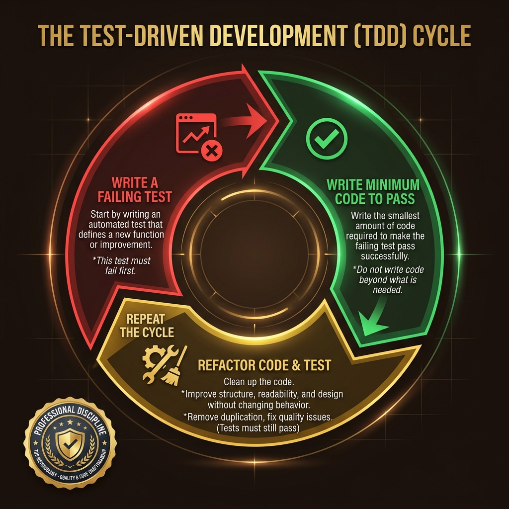

# 54: The Clean Coder: Professional Software Craftsmanship

  

> 🧠 **The Feynman Hook:** If you hire a plumber to fix your pipes, and you tell them to use cheap tape instead of a wrench to "save time," a professional plumber will refuse. They know the pipe will burst tomorrow, flooding the house. Software developers often lack this discipline. When a manager says "skip the tests to meet the deadline," a professional developer must say "no." Professionalism isn't about writing code; it's about taking ultimate responsibility for the systems you build.

## 🎯 What You'll Learn

> **After this chapter, you will understand the human side of system design from Robert C. Martin's *The Clean Coder*: professional discipline, accurate estimation, the ethics of saying "no," and Test-Driven Development (TDD) as a mandatory professional standard.**

Architectures don't fail because computers are bad at math. They fail because humans cave to pressure, write messy code, and communicate poorly. System design requires engineering discipline.

---

## 1. 🛑 The Professionalism of Saying "No"

> **Feynman Insight:** A doctor won't skip washing their hands just because a hospital administrator says they are behind schedule. The doctor's primary responsibility is the health of the patient, not the schedule. The developer's primary responsibility is the structural integrity of the code.

In *The Clean Coder*, Uncle Bob asserts that the most important word in a professional's vocabulary is **"No."**

Managers are paid to push for faster delivery. Developers are paid to protect the quality of the product. These are opposing, healthy forces.
- When a manager asks, "Can you have this done by Friday?" and you know it takes two weeks, saying "I'll try" is a lie. It is unprofessional.
- "I'll try" implies you hold a secret reserve of effort you haven't been using. 
- A professional says: "No, it will be done in two weeks." This forces the business to make an actual decision (cut scope, extend deadline) rather than hoping for a miracle.

---

## 2. ⏱️ The Reality of Estimation

> **Feynman Insight:** Asking "How long will this take?" is like asking "How long will it take to drive across the country?" You can give a guess, but a blizzard might hit, or the car might break down. Estimates are not blood-oaths; they are probability distributions.

An estimate is **not a commitment**. A commitment is a promise you *must* keep (e.g., "I will deploy the patch by 5 PM"). An estimate is a guess based on incomplete information.

Professionals use the **PERT (Program Evaluation and Review Technique)** for estimation, providing three numbers:
1. **Optimistic (O):** Everything goes perfectly. (1 day)
2. **Nominal (N):** The most likely scenario with normal hiccups. (3 days)
3. **Pessimistic (P):** The database explodes and the library is deprecated. (10 days)

*Expected Time = (O + 4N + P) / 6*

Communicating probability, rather than a single absolute date, manages business expectations professionally.

---

## 3. 🧪 TDD: The Professional Obligation

> **Feynman Insight:** Writing code without tests is like doing a trapeze act without a net. You move very slowly because you are terrified of falling. With a massive, secure net (automated tests), you can perform complex flips and refactorings at blistering speed because you know the net will catch you if you break something.

  

Test-Driven Development (TDD) is not a "nice to have" or a trendy workflow. According to *The Clean Coder*, it is a fundamental professional obligation, akin to double-entry bookkeeping for an accountant.

**The 3 Rules of TDD:**
1. You are not allowed to write any production code unless it is to make a failing unit test pass.
2. You are not allowed to write any more of a unit test than is sufficient to fail (compilation failures are failures).
3. You are not allowed to write any more production code than is sufficient to pass the one failing unit test.

This cycle (Red -> Green -> Refactor) ensures 100% test coverage, allowing you to fearlessly modify system architecture knowing the test suite will catch regressions instantly.

---

## 4. 🧹 The Boy Scout Rule and Technical Debt

> **Feynman Insight:** If you drop a piece of trash in your house and never pick it up, eventually your house is a landfill. The "Boy Scout Rule" says: Always leave the campground cleaner than you found it.

Technical debt is inevitable. But a professional does not ask management for a "Refactoring Sprint" (which management will always deny). 

Refactoring is part of the daily workflow. When you open a file to add a feature, if you see a messy function or a confusing variable name, you clean it up *before* you add your feature. Over time, the codebase constantly improves, rather than slowly rotting. 

---

## 🤔 Reflection Questions

1. **Your manager says: "We must ship this feature by Friday for a major client. We don't have time to write tests. Just write the code and we'll test it next month." What is the professional response?**

💡 View Answer

The professional response is **"No."** Dropping tests does not speed you up; it slows you down because you will spend Friday debugging broken code manually. A professional states clearly that writing tests *is* the process of writing code, and the only way to meet the deadline reliably is to maintain discipline. If scope must be cut to meet the date, features are cut, not quality.

2. **Why is the phrase "I will try to get it done by tomorrow" considered a lie in software engineering?**

💡 View Answer

"I will try" implies that you possess a reserve of extra effort or magic that you can unleash to bend reality. If you are already working professionally, you are already giving your best effort. Therefore, "trying harder" won't alter the laws of physics. It is a passive-aggressive way of avoiding a difficult conversation about scope or deadlines.

3. **How does a comprehensive TDD test suite solve the "fear of refactoring" in legacy architectures?**

💡 View Answer

In legacy systems without tests, developers are terrified to touch code because they don't know what will break. This causes architectures to rot because no one will clean them up. A fast, comprehensive suite of automated tests acts as an absolute safety net. You can tear apart a complex class, run the tests, and know with 100% certainty within 3 seconds if you broke the system. This eliminates fear and enables continuous architectural improvement.

---

## 📝 Key Interview Talking Points

- System Design is a human endeavor; **professional discipline** is as critical as algorithmic knowledge.
- Never commit to an **Estimate**. Use probabilistic models (PERT) and communicate uncertainty clearly to stakeholders.
- The phrase **"I'll try"** is unprofessional. Say "Yes" and commit, or say "No" and negotiate scope.
- **TDD (Test-Driven Development)** is the engine of speed. The test suite is the safety net that allows fearless architectural refactoring.

---

[<< Previous: Microservices in Practice](./53_Microservices_Java_Practice.md) | [Home: System Design Curriculum](./README.md) | [Next: System Design Interview Mastery >>](./55_System_Design_Interview_Mastery.md)
