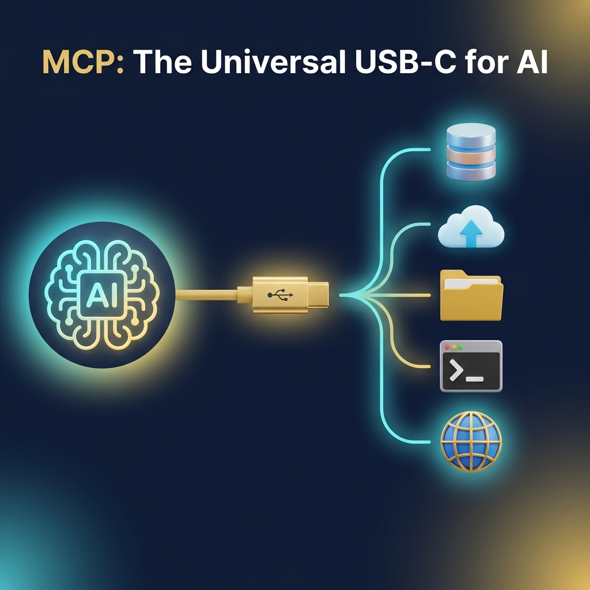
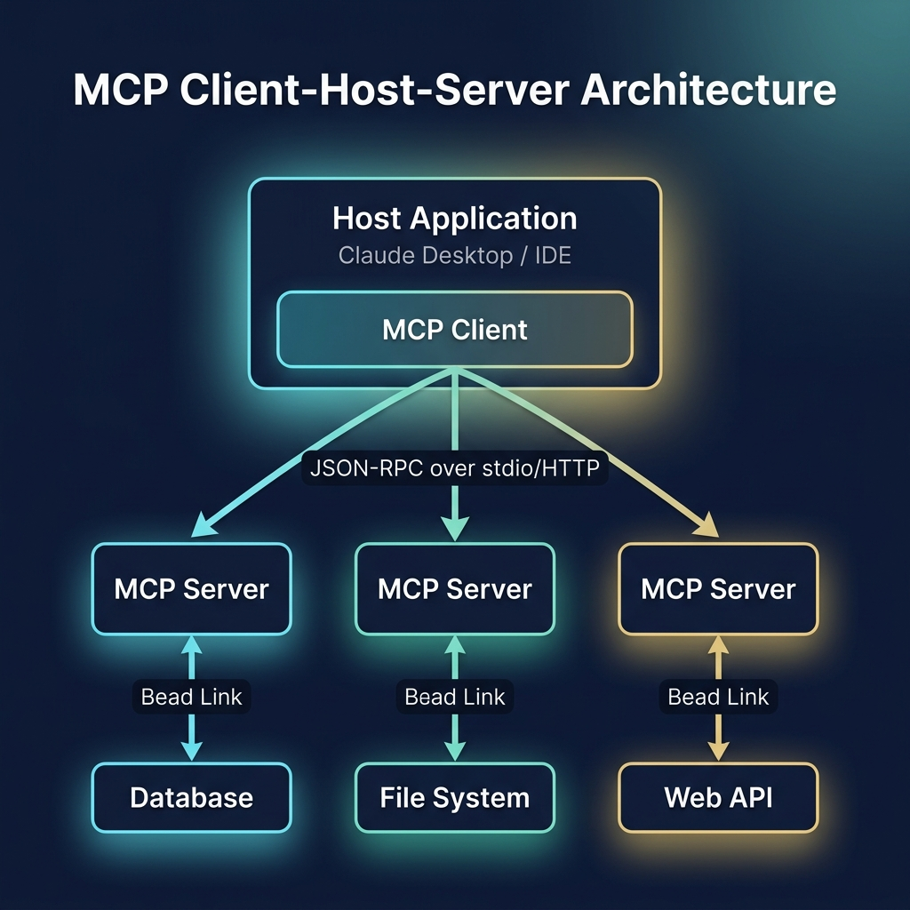

# 55: Model Context Protocol Fundamentals

  

> 🧠 **The Feynman Hook:** Imagine buying a new printer, a new keyboard, and a new hard drive. In the 1990s, every single device needed its own completely unique custom port on the back of your computer. It was a tangled nightmare of incompatible cables. Then came USB: a single, universal standard. Suddenly, one port connected everything. Until recently, connecting an AI model to an external tool (like a database or a file system) was like the 1990s—every integration required a custom API. The Model Context Protocol (MCP) is the USB-C of AI. It provides one universal standard so an AI can instantly plug into any data source without custom code.

## 🎯 What You'll Learn

> **After this chapter, you will understand the fundamental architecture of the Model Context Protocol (MCP), why it is critical for scaling AI integrations, the Client-Host-Server model, and the underlying transport mechanisms (stdio and SSE/HTTP).**

As AI models evolve from simple chatbots into autonomous agents, their usefulness is entirely bottlenecked by the data and tools they can access. MCP standardizes this access layer.

---

## 1. 🔌 The Integration Bottleneck

Before MCP, if you wanted an LLM (like Claude or GPT-4) to access your company's proprietary Salesforce data, you had to write custom "glue code." If you then wanted it to access Jira, you wrote *more* custom glue code. 

**The N x M Problem:**
If there are *N* different AI applications and *M* different data sources, the industry would need to write and maintain **N × M** custom integrations. This scales terribly.

**The MCP Solution:**
MCP introduces a standardized middle layer. If an AI application speaks MCP, and a data source speaks MCP, they can connect instantly. The complexity drops from N × M to **N + M**.

---

## 2. 🏗️ The Client-Host-Server Architecture

  

> **Feynman Insight:** Think of a restaurant. The **Host Application** is the dining room where the user sits. The **Client** is the waiter who takes the order. The **Server** is the kitchen in the back. The waiter (Client) communicates the user's request to the kitchen (Server) using a standard ticket format (the Protocol).

MCP defines a strict architectural topology to ensure security and standardization:

### 1. The MCP Server
The server is a lightweight program running close to the data source. Its only job is to securely expose specific capabilities (like reading a file or querying a database) via the MCP standard. 
*   *Example:* A PostgreSQL MCP Server that allows executing `SELECT` statements.

### 2. The MCP Client
The client sits inside the AI application. It is responsible for initiating connections to servers, discovering what capabilities the servers offer, and routing the AI's requests to the appropriate server.

### 3. The Host Application
The host is the actual application the user interacts with (e.g., Claude Desktop, Cursor IDE, or an enterprise internal tool). It contains the MCP Client and provides the user interface.

---

## 3. 🚄 Transport Mechanisms

How do the Client and Server actually talk to each other? MCP uses **JSON-RPC 2.0** as its message format, but it can be sent over two different transport layers depending on the network topology.

### 1. Local Transport: `stdio` (Standard Input/Output)
> **Feynman Insight:** `stdio` is like two people in the same room passing notes directly to each other. It's fast, secure, and private.

When the MCP Server is running locally on the user's machine (e.g., inside an IDE allowing the AI to read local files), the communication happens over `stdio`. The Host Application spawns the Server as a child process and communicates directly via the command line streams. This requires no network ports and is extremely secure.

### 2. Remote Transport: SSE (Server-Sent Events) over HTTP
> **Feynman Insight:** SSE is like a radio broadcast. The client tunes in (connects) and the server continuously streams updates (events) over a single open connection.

When the MCP Server is remote (e.g., a cloud database), `stdio` won't work. Instead, MCP uses a dual-channel HTTP approach:
*   The Server sends data to the Client via **SSE (Server-Sent Events)**, keeping an open connection for real-time updates.
*   The Client sends commands to the Server via standard **HTTP POST** requests.

---

## 4. 🔄 The Protocol Lifecycle

An MCP connection follows a strict lifecycle, ensuring both sides agree on what they can do before any data changes hands.

1.  **Initialization:** The Client connects and sends an `initialize` request detailing its capabilities (e.g., "I support sampling"). The Server responds with its capabilities (e.g., "I provide tools and resources").
2.  **Negotiation:** Both sides agree on the protocol version.
3.  **Discovery:** The Client asks the Server to list its available Tools and Resources.
4.  **Execution:** The user asks a question, the LLM decides to use a tool, the Client sends the execution request to the Server, and the Server returns the result.
5.  **Termination:** A clean disconnect when the host application closes.

---

## 🤔 Reflection Questions

1. **Why does MCP use JSON-RPC instead of REST for its underlying message format?**

💡 View Answer

JSON-RPC is designed specifically for remote procedure calls—executing actions and getting responses. REST is designed for stateful resource manipulation (CRUD). Because MCP needs to execute arbitrary tools (like `calculate_math()` or `search_web()`), RPC is a much more natural and flexible fit than trying to map every tool to an HTTP verb and RESTful noun.

2. **If you are building an MCP server to expose your local personal notes to an AI, which transport should you use and why?**

💡 View Answer

You should use the `stdio` transport. Since the notes and the AI client (like Claude Desktop) are on the same local machine, `stdio` avoids opening local network ports, eliminating firewall issues and preventing malicious software on your local network from accessing the server.

---

## 📝 Key Interview Talking Points

*   **The Problem:** The N×M integration problem stifles AI agent scalability.
*   **The Solution:** MCP acts as the "Universal USB-C" protocol, reducing integration complexity to N+M.
*   **Architecture:** MCP enforces a strict Client-Host-Server separation of concerns.
*   **Transport:** Supports local execution via secure `stdio` and remote execution via SSE/HTTP.

---

## 📚 References

*   Infante, Roberto. *AI Agents and Applications With LangChain, LangGraph, and MCP*.
*   Stratis, Kyle. *AI Agents with MCP (First Early Release)*.
*   Sekar, Srinivasan. *The MCP Standard: A Developer's Guide to Building Universal AI Tools with the Model Context Protocol*.

---

[<< Previous: The Clean Coder](./54_Clean_Coder_Professionalism.md) | [Home: System Design Curriculum](./README.md) | [Next: MCP Tools, Resources & Prompts >>](./56_MCP_Tools_Resources_Prompts.md)
