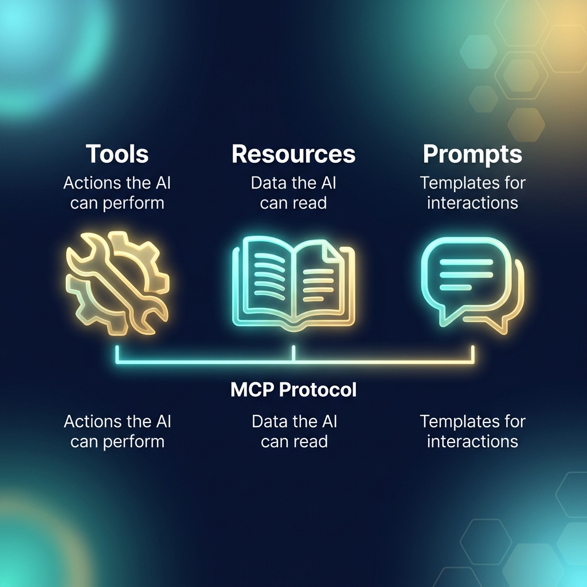
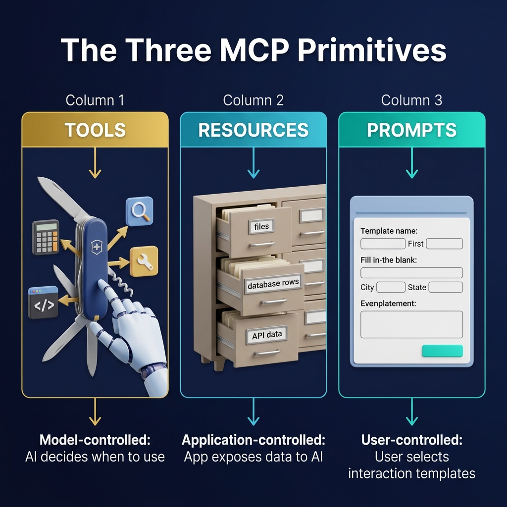

# 56: MCP Tools, Resources & Prompts

  

> 🧠 **The Feynman Hook:** If you hire a smart assistant (the AI), their intelligence is useless if they are locked in an empty room. To do real work, they need three things: 1) A library of files to read (Resources), 2) A toolbox to take actions in the real world (Tools), and 3) A set of standardized forms to know exactly how you want them to report back (Prompts). These are the three foundational primitives of the Model Context Protocol.

## 🎯 What You'll Learn

> **After this chapter, you will understand the three core primitives of the Model Context Protocol (MCP)—Tools, Resources, and Prompts—and how the control flow differs for each, enabling secure and flexible AI interactions.**

MCP defines exactly three ways an AI can interact with the outside world. Understanding the distinction between these primitives is crucial for designing secure MCP servers.

---

## 1. 📐 The Three Primitives

  

When an MCP Client connects to a Server, the server advertises its capabilities using one or more of these three primitives. The critical difference between them is **who is in control**.

---

## 2. 🧰 Tools: Model-Controlled Actions

> **Feynman Insight:** Tools are like the attachments on a Swiss Army Knife. The AI holds the knife and actively decides, "Ah, I need the screwdriver right now," and pulls it out. 

**Tools allow the AI to take action.** They are functions exposed by the server that the LLM can decide to execute based on the user's prompt. 

### How Tools Work
1. The Server defines a tool with a name, a description, and a JSON Schema detailing the required arguments (e.g., `tool_name: "query_database", arguments: { "sql": "string" }`).
2. The Client sends this schema to the LLM.
3. The LLM reasons about the user's request and decides if it needs the tool.
4. If yes, the LLM generates the JSON arguments, the Client executes the tool on the Server, and the result is fed back into the LLM's context window.

### System Design Considerations for Tools
*   **Side Effects:** Tools often change state (e.g., `write_file`, `drop_table`). Therefore, they require the highest level of security and often a "Human-in-the-Loop" approval step in the Host application.
*   **Idempotency:** Whenever possible, design tools to be idempotent (safe to retry) because LLMs may hallucinate or retry failed calls unpredictably.

---

## 3. 📚 Resources: Application-Controlled Data

> **Feynman Insight:** Resources are like a library card catalog. The librarian (the Host Application) curates exactly which books are on the shelf. The AI cannot write new books; it can only read the data that the application has explicitly chosen to expose.

**Resources provide context.** They represent data that the server exposes for the AI to read, such as local files, database schemas, or internal API responses.

### How Resources Work
1. Resources are identified by URIs (e.g., `file:///path/to/logs.txt` or `postgres://schema/users`).
2. The Server provides a list of available resources.
3. **Crucial Difference:** Unlike tools, the *Host Application* or the *User* typically selects which resources to attach to the conversation context, not the model. The model simply receives the data.

### System Design Considerations for Resources
*   **Read-Only:** Resources are inherently read-only.
*   **Resource Templates:** Servers can define templates (e.g., `file:///{path}`) so the client knows how to dynamically request specific resources without listing millions of files upfront.
*   **Pub/Sub Updates:** MCP supports a publish/subscribe model for resources. If a log file updates, the Server can notify the Client, allowing the AI to react to real-time events.

---

## 4. 📝 Prompts: User-Controlled Templates

> **Feynman Insight:** Prompts are like standard intake forms at a doctor's office. Instead of the patient (user) guessing what information to provide, the receptionist (the Server) hands them a form with fill-in-the-blank fields to ensure the doctor (the AI) gets exactly the context needed.

**Prompts are reusable interaction templates.** They are defined by the Server to help users quickly execute complex, multi-step workflows without having to type out massive, repetitive instructions.

### How Prompts Work
1. The Server exposes a prompt template with required arguments (e.g., `prompt_name: "code_review", arguments: ["github_pr_url"]`).
2. The User selects the prompt in the Host Application UI and fills in the URL.
3. The Server resolves the prompt, fetching necessary context (like the actual PR diff), and sends a massive, perfectly formatted instruction block to the LLM.

### System Design Considerations for Prompts
*   **UI Integration:** Prompts are designed to be surfaced directly in the Host Application's graphical user interface (like slash commands or UI buttons).
*   **Context Assembly:** Prompts shift the burden of assembling context from the user to the server.

---

## 🤔 Reflection Questions

1. **You want the AI to analyze a specific 500MB log file on a remote server. Should you expose this as a Tool (`read_log(filepath)`) or a Resource (`file://remote/log.txt`)?**

💡 View Answer

It should be exposed as a **Resource**. If exposed as a tool, the model might try to pull the entire 500MB file into its context window, crashing the system or exceeding token limits. By exposing it as a Resource, the Host Application can manage the data loading, perhaps utilizing Resource Templates to paginate the file or using UI controls to let the user attach specific chunks to the context securely.

2. **Why is it dangerous to design a Tool that requires 15 different JSON arguments to function?**

💡 View Answer

LLMs are probabilistic. The more complex the JSON schema required to call a tool, the higher the probability the LLM will hallucinate a field, use the wrong data type, or fail to populate a required argument, leading to a tool execution failure. Tools should be designed with simple, single-responsibility interfaces (like microservices).

---

## 📝 Key Interview Talking Points

*   **Tools (Model-Controlled):** Allow the AI to take action and cause side effects. Requires strict security and clear JSON schemas.
*   **Resources (Application-Controlled):** Provide read-only context to the AI via URIs. Supports pub/sub for real-time updates.
*   **Prompts (User-Controlled):** Reusable UI templates that assemble complex context to standardize AI interactions.
*   **Security Posture:** The distinction between who controls the primitive (Model vs. App vs. User) dictates the security and validation requirements of the server design.

---

## 📚 References

*   Infante, Roberto. *AI Agents and Applications With LangChain, LangGraph, and MCP*.
*   Stratis, Kyle. *AI Agents with MCP (First Early Release)*.
*   Sekar, Srinivasan. *The MCP Standard: A Developer's Guide to Building Universal AI Tools with the Model Context Protocol*.

---

[<< Previous: MCP Fundamentals](./55_MCP_Fundamentals.md) | [Home: System Design Curriculum](./README.md) | [Next: MCP in AI Agent Architectures >>](./57_MCP_AI_Agents_Architecture.md)
