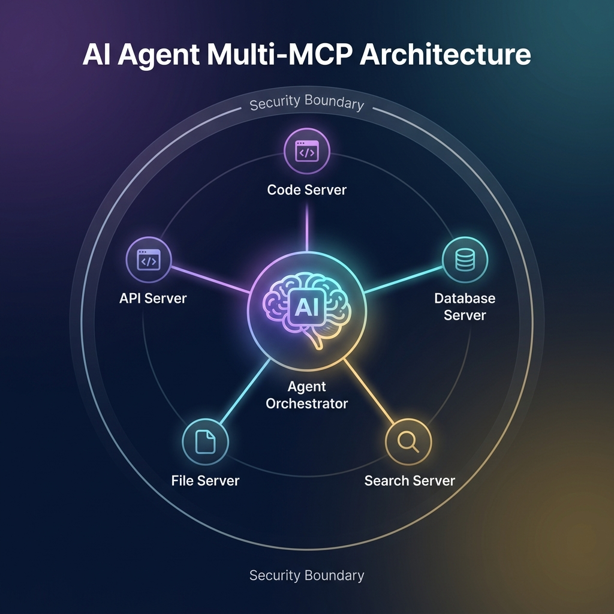
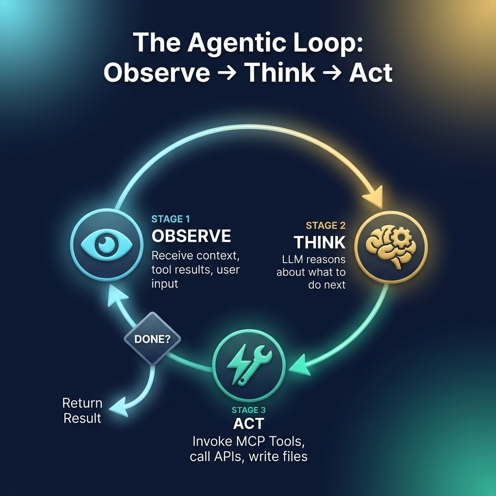

# 57: MCP in AI Agent Architectures

  

> 🧠 **The Feynman Hook:** An LLM on its own is just a brain floating in a jar. It can think, but it can't interact with the world. An AI Agent is a brain connected to a body. It has eyes to observe, hands to act, and memory to learn. When building these agents, you don't want to hardcode the "hands" directly onto the brain. You want a modular system where you can swap out tools dynamically. MCP is the nervous system that connects the central reasoning brain (the Agent Orchestrator) to an infinite array of peripheral tools securely.

## 🎯 What You'll Learn

> **After this chapter, you will understand how MCP acts as the foundational infrastructure for Multi-Agent Systems, the mechanics of the Agentic Loop (Observe → Think → Act), and the system design challenges of running MCP at scale, including rate limiting and security.**

MCP doesn't just connect simple chatbots to databases; it is the critical standard required to build autonomous, multi-agent systems at enterprise scale.

---

## 1. 🔄 The Agentic Loop

  

Autonomous agents operate using a continuous feedback loop, often implemented via frameworks like **LangGraph** or **LangChain**. MCP fits perfectly into the "Act" phase of this loop.

1.  **OBSERVE:** The agent receives the user's prompt and reads its current context. If connected to MCP Resources, it might observe real-time file changes via pub/sub notifications.
2.  **THINK (Reasoning):** The LLM analyzes the observation. It looks at the JSON schemas of all the MCP Tools available to it and decides, "To answer this, I need to query the database first."
3.  **ACT:** The agent invokes the chosen MCP Tool. The MCP Client sends the JSON-RPC execution command to the Server.
4.  **FEEDBACK:** The Server executes the tool and returns the result (e.g., a SQL table). The agent loops back to "OBSERVE," feeding this new result into its context window, and the loop repeats until the goal is achieved.

---

## 2. 🤖 Multi-Agent Orchestration

> **Feynman Insight:** In a large corporation, the CEO doesn't write the code, review the legal contracts, and balance the budget. The CEO orchestrates specialized experts. Multi-Agent systems work the same way.

When scaling AI, relying on a single massive LLM context window with 500 different tools attached leads to severe hallucination and "tool confusion."

Instead, modern system design uses **Multi-Agent Architecture**:
*   **The Router Agent:** Acts as the CEO. It receives the user request and delegates it to specialist agents.
*   **Specialist Agents:** You deploy a "DevOps Agent," a "DBA Agent," and a "QA Agent." 
*   **MCP Boundaries:** Each specialist agent is equipped with a specific, isolated MCP Server. The DBA Agent connects to the Postgres MCP Server. The DevOps Agent connects to the AWS MCP Server. 

By using MCP, you enforce strict boundary contexts. The DBA Agent physically cannot access the AWS infrastructure because the Host application only routes the Postgres MCP connection to it.

---

## 3. 🛡️ System Design at Scale: Security & Observability

When deploying MCP Servers in a production environment, the architecture must account for the fact that AI models are unpredictable clients. 

### 1. The Confused Deputy Problem
An LLM might be tricked by a prompt injection attack (e.g., a malicious hidden instruction on a webpage) into using its MCP tools destructively (e.g., `delete_all_files()`). 
*   **Design Solution:** Implement strict **Role-Based Access Control (RBAC)** at the MCP Server level. The Server must validate that the *Host Application User* has the permissions to execute the tool, regardless of what the LLM requests. Use "Human-in-the-Loop" UI prompts for state-mutating actions.

### 2. Rate Limiting and Infinite Loops
If an agent gets stuck in a logic loop (e.g., failing a SQL query, attempting slightly modified incorrect queries endlessly), it can accidentally DDoS your internal databases.
*   **Design Solution:** The MCP API Gateway must implement **Token Bucket** rate limiting per connection and set hard limits on maximum Agentic Loop iterations (e.g., max 5 steps before aborting).

### 3. Observability and Auditing
You must know *why* an AI took an action. 
*   **Design Solution:** Implement structured logging on the MCP Server. Every JSON-RPC tool execution must be logged with a correlation ID linking it back to the original user prompt and the specific LLM reasoning trace.

---

## 🤔 Reflection Questions

1. **You are building an AI agent that analyzes massive financial datasets. The agent keeps hallucinating which tool to use because there are 50 different financial APIs exposed via a single MCP server. How do you fix the architecture?**

💡 View Answer

You should transition from a single-agent architecture to a **Multi-Agent Orchestration** model. Break the single MCP server down into domain-specific servers (e.g., Equities Server, Bonds Server, Crypto Server). Create smaller, specialized AI agents for each domain. A master Router Agent will evaluate the user's prompt and delegate the task to the specific specialist agent, preventing tool confusion.

2. **Why is it critical to enforce RBAC at the MCP Server level rather than relying on the LLM's system prompt to "act safely"?**

💡 View Answer

LLMs are non-deterministic and highly susceptible to prompt injection. A system prompt instructing the AI "never to delete files" can be overridden by clever adversarial input. Security must be enforced at the infrastructure boundary (the MCP Server execution layer), guaranteeing that destructive actions are mathematically blocked by authorization tokens, rather than relying on the LLM's semantic compliance.

---

## 📝 Key Interview Talking Points

*   **The Agentic Loop:** Agents operate continuously by observing context, reasoning about available MCP Tools, and acting upon them.
*   **Multi-Agent Architecture:** Use MCP to enforce domain boundaries, giving specialized agents specific, isolated toolsets to prevent hallucination.
*   **Security Posture:** Assume the LLM is compromised (Confused Deputy). Enforce RBAC and Human-in-the-Loop validations at the Server boundary.
*   **Resilience:** Protect downstream resources from infinite agent loops using strict API Gateway rate limiting.

---

## 📚 References

*   Infante, Roberto. *AI Agents and Applications With LangChain, LangGraph, and MCP*.
*   Stratis, Kyle. *AI Agents with MCP (First Early Release)*.
*   Sekar, Srinivasan. *The MCP Standard: A Developer's Guide to Building Universal AI Tools with the Model Context Protocol*.

---

[<< Previous: MCP Tools, Resources & Prompts](./56_MCP_Tools_Resources_Prompts.md) | [Home: System Design Curriculum](./README.md) | [Next: System Design Interview Mastery >>](./58_System_Design_Interview_Mastery.md)
