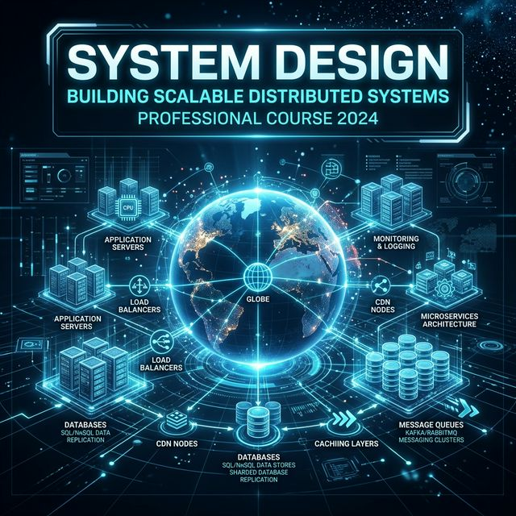

# The System Design Mastery Curriculum

  

Welcome to the **System Design Mastery Guide**. This repository contains a complete, **32-chapter curriculum** spanning 8 phases, designed to take you from fundamental concepts to designing real-world systems at scale.

This curriculum was synthesized from **over 30 professional-grade textbooks**: *Designing Data-Intensive Applications* (Kleppmann), *System Design Interview Volumes 1 & 2* (Alex Xu), *ByteByteGo Big Archive 2023*, *AlgoMaster System Design Handbook*, *The C4 Model* (Simon Brown), *CQRS Journey Guide*, *Making Sense of Stream Processing* (Confluent), *Mastering Kafka Streams and ksqlDB*, *Kafka: The Definitive Guide*, and *The Clean Coder*.

---

## 📖 Curriculum Map

### Phase 1: Foundations
*The building blocks every system architect must know.*

* [**01: Scalability Fundamentals**](./01_Scalability_Fundamentals.md) - Vertical vs horizontal scaling, load balancers, CDN, stateless design, and the scaling roadmap from 100 to 100M users.
* [**02: Databases & Storage**](./02_Databases_and_Storage.md) - SQL vs NoSQL, ACID properties, indexing (B-Tree, hash), replication, and sharding strategies.
* [**03: Caching Strategies**](./03_Caching_Strategies.md) - Cache-aside, write-through, write-back, eviction policies (LRU, LFU), Redis, and cache invalidation.
* [**04: Networking & Protocols**](./04_Networking_and_Protocols.md) - HTTP, REST vs GraphQL vs gRPC, WebSockets, DNS resolution, TCP vs UDP, and TLS encryption.

### Phase 2: Distributed Systems
*The theory that powers every large-scale system.*

* [**05: CAP Theorem & Consistency**](./05_CAP_Theorem_Consistency.md) - CAP triangle, CP vs AP systems, consistency spectrum, ACID vs BASE, and conflict resolution.
* [**06: Replication & Partitioning**](./06_Replication_and_Partitioning.md) - Leader-follower, multi-leader, leaderless replication, sharding, consistent hashing, and rebalancing.
* [**07: Transactions & Concurrency**](./07_Transactions_and_Concurrency.md) - Isolation levels, two-phase commit, Saga pattern, optimistic vs pessimistic locking.
* [**08: Consensus & Coordination**](./08_Consensus_and_Coordination.md) - Raft consensus, quorum, ZooKeeper/etcd, distributed locks, and heartbeat failure detection.

### Phase 3: Building Blocks
*The components that connect modern systems together.*

* [**09: Message Queues & Streaming**](./09_Message_Queues_and_Streaming.md) - Kafka vs RabbitMQ, pub/sub, event-driven architecture, and event sourcing.
* [**10: API Design & Gateway**](./10_API_Design_and_Gateway.md) - API gateway, rate limiting (token bucket), pagination, versioning, and idempotency.
* [**11: Microservices Architecture**](./11_Microservices_Architecture.md) - Service decomposition, circuit breaker, service discovery, and communication patterns.
* [**12: Data Processing Pipelines**](./12_Data_Processing_Pipelines.md) - Batch (MapReduce) vs stream processing, ETL, Lambda architecture, and windowing.

### Phase 4: Architecture & Patterns
*Design patterns and operational practices for production systems.*

* [**13: Architectural Patterns**](./13_Architectural_Patterns.md) - Monolith, microservices, serverless, event-driven, CQRS, event sourcing, and the C4 model.
* [**14: Security & Authentication**](./14_Security_and_Authentication.md) - OAuth 2.0, JWT, symmetric vs asymmetric encryption, and API security best practices.
* [**15: Observability & Reliability**](./15_Observability_and_Reliability.md) - Logs, metrics, traces, SLI/SLO/SLA, error budgets, and the RED method.
* [**16: DevOps & Deployment**](./16_DevOps_and_Deployment.md) - CI/CD pipelines, Docker, Kubernetes, blue-green, and canary deployments.

### Phase 5: Real-World System Designs
*End-to-end system design exercises modeled on interview-style problems.*

* [**17: Design a URL Shortener**](./17_Design_URL_Shortener.md) - Base62 encoding, pre-generated keys, 301 vs 302 redirects, caching, and analytics.
* [**18: Design a Chat System**](./18_Design_Chat_System.md) - WebSocket, message delivery, group chat fan-out, presence (heartbeats), and message storage.
* [**19: Design a News Feed**](./19_Design_News_Feed.md) - Fan-out on write vs read, hybrid approach, ranking algorithms, and feed cache (Redis sorted sets).
* [**20: Design a Video Platform**](./20_Design_Video_Platform.md) - Upload pipeline, transcoding, adaptive bitrate (HLS/DASH), CDN, and recommendation engine.

### Phase 6: Advanced Architectural Patterns
*Focusing heavily on breaking down legacy monoliths securely and establishing robust decoupled microservice boundaries intelligently.*

* [**21: Monolith to Microservices**](./21_Monolith_to_Microservices.md) - The Strangler Fig Pattern, Anti-Corruption Layers, and Domain-Driven Design Contexts.
* [**22: Event-Driven Microservices Architectures**](./22_Event_Driven_Microservices.md) - Flow Architectures, Event Choreography vs Orchestration, and Log vs Broker.
* [**23: CQRS & Event Sourcing**](./23_CQRS_and_Event_Sourcing.md) - Segregating Reads from Writes, materialized views, and replaying event ledgers.
* [**24: Micro-Frontends & Web Architecture**](./24_Micro_Frontends_Web_Architecture.md) - Scaling frontend organizational models, Module Federation, and vertical slicing.

### Phase 7: Modern Trade-Off Analysis & Governance
*Managing distributed complexity optimally securely accurately exactly flawlessly.*

* [**25: Software Architecture: The Hard Parts**](./25_Software_Architecture_Hard_Parts.md) - Distributed Transactions, Saga Pattern, Two-Phase Commits (2PC).
* [**26: Evolutionary Architectures & Metrics**](./26_Evolutionary_Architectures_Metrics.md) - Building Fitness Functions to prevent drift, cycle time, and technical debt.
* [**27: Visualising Software Architecture (C4 Model)**](./27_Visualising_Software_Architecture_C4.md) - Scaling diagrams using Context, Containers, Components, Code flexibly.

### Phase 8: Advanced Real-World System Designs
*Drawing directly structurally from System Design Interview Volume 2 and Data-Intensive Applications.*

* [**28: Design a Proximity Service (Maps)**](./28_Design_Proximity_Service_Maps.md) - Geohashes, Quadtrees, and calculating geospatial overlap intelligently.
* [**29: Design a Metrics Monitoring System**](./29_Design_Metrics_Monitoring_System.md) - Time-series databases (TSDB), push vs pull models, and ingestion pipelines powerfully.
* [**30: Design a Distributed Message Queue**](./30_Design_Distributed_Message_Queue.md) - Write-Ahead Logs (WAL), replication strategies, partitioning, and exact offsets.
* [**31: Apache Kafka Deep Dive**](./31_Apache_Kafka_Deep_Dive.md) - Deep dive into Zero-Copy transfers, OS PageCache exploitation, and immutable distributed commit logs natively.
* [**32: Load Balancers Deep Dive**](./32_Load_Balancers.md) - Layer 4 vs 7, routing algorithms, health checks, and Docker NGINX implementations.
* [**33: Content Delivery Networks (CDN)**](./33_Content_Delivery_Networks.md) - Global architecture edge caching, Pull vs Push, Cache invalidation techniques, and TTL configurations.
* [**34: Tackling System Design Interviews**](./34_Tackling_System_Design_Interviews.md) - Systematic 4-step framework, back-of-the-envelope estimation, and navigating architecture trade-offs.

---

## 🚀 How to Use This Curriculum

1. **Beginners:** Start with Phase 1 and work through sequentially
2. **Interview Prep:** Focus on Phases 3-5 for the most common interview topics
3. **Deep Dive:** Phase 2 covers the distributed systems theory behind everything
4. **Quick Reference:** Each chapter includes a 📝 Key Talking Points section
