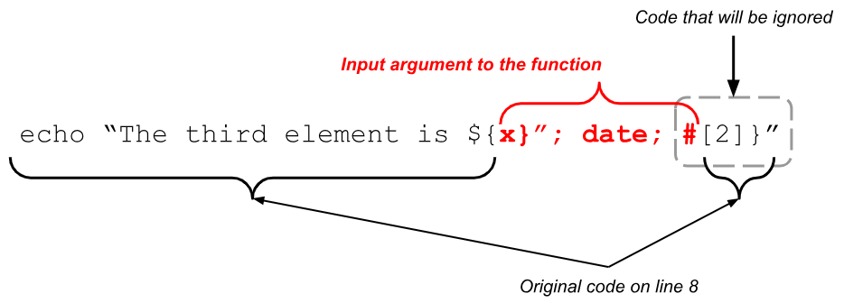
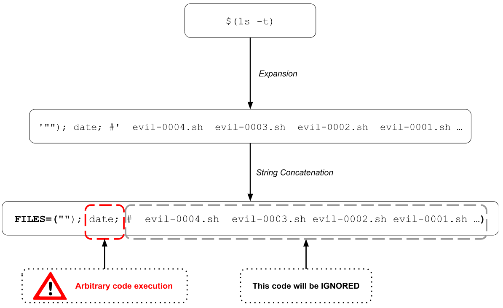

# Chapter 13: Execution of commands

In Bash there are a few ways to execute a command and it depends on the purpose that you have in mind.

If you want to execute a command without saving the result, you can just add the command with the necessary options (if any) in a line and the command will just be executed.

In the following example we are using the command “`ls`” to list the contents of the current folder.

```bash
#!/usr/bin/env bash
#Script: execution-of-commands.sh
echo "Executing ls command"
ls    # Lists the content of the current folder
echo "Done executing ls command"
```

If we wanted to store the result of the command in a variable then we need to use Command Substitution. This way of executing commands **will create a child process**<a id="footnote-1-ref" href="#footnote-1" style="font-size:x-small">[1]</a> that will execute the command. There are two ways of Command Substitution that we will explore in the next section.

Finally, if we wanted to execute a command in the current shell **without creating a child process** we should use the “`eval`” command. We will talk more about this command in one of the coming sections.

When you run the previous script you will get the following result in the terminal window.

```txt
$ ./execution-of-commands.sh
Executing ls command
execution-of-commands.sh
Done executing ls command
```

## Command Substitution

If you want to save the result of the command in a variable, you can use 2 different ways.

### Backticks
The first one is by using backticks like 

```bash
    `commands`
```

This way to execute a command is being deprecated and **is recommended not to use it**.

For illustration purposes we will show an example script.

```bash
#!/usr/bin/env bash
#Script: command-substitution-0001.sh
echo "Saving the result of ls"
RESULT=`ls`
echo -e "Result is:\n $RESULT"
```

When you execute the script you will get something similar<a id="footnote-2-ref" href="#footnote-2" style="font-size:x-small">[2]</a> to the following.

```txt
$ ./command-substitution-0001.sh
Saving the result of ls
Result is:
 command-substitution-0001.sh
execution-of-commands.sh
```

The next approach to command substitution is easier to use, we will explain why in the section where we compare both approaches.


### The “`$(...)`” approach

The second approach, which is going to be the one we will use along the rest of the chapters, is “`$(commands)`”. Again, for illustration purposes, we will rewrite the previous “`command-substitution-0001.sh`” script using this approach, giving the following script as result.

```bash
#!/usr/bin/env bash
#Script: command-substitution-0002.sh
echo "Saving the result of ls"
RESULT=$(ls)
echo -e "Result is:\n $RESULT"
```

When you run this script in the same folder as “`command-substitution-0001.sh`” script you will get something similar to the following.

```txt
$ ./command-substitution-0002.sh
Saving the result of ls
Result is:
 command-substitution-0001.sh
command-substitution-0002.sh
execution-of-commands.sh
```

The previous script will save the result of the command “`ls`” as a string in the variable “`RESULT`”. We could also save the result of the command inside an array like this.

```bash
#!/usr/bin/env bash
#Script: command-substitution-0003.sh
echo "Saving the result of ls"
RESULT=($(ls))
echo "Number of file: ${#RESULT[@]}"
for file in ${RESULT[@]}; do
    echo "File: $file"
done
echo "End of script"
```

When you execute the previous script, you will get a result similar to the following.

```txt
$ ./command-substitution-0003.sh
Saving the result of ls
Number of file: 4
File: command-substitution-0001.sh
File: command-substitution-0002.sh
File: command-substitution-0003.sh
File: execution-of-commands.sh
End of script
```

In the next section we will compare both approaches and will explain why we will stick to the “`$(...)`” way for the rest of the book.

### Backticks versus `$(...)`

The main difference between the two styles appears when you start nesting commands.

With backticks you need to escape the backtick characters in the nested command. With the “`$(...)`” approach you don’t have to do anything special.

Let’s take a look to the following example

```bash
#!/usr/bin/env bash
#Script: compare.sh
# Approach with $(...)
echo $(echo $(echo $(echo $(uname))))
# Approach with backticks
echo `echo \`echo \\\`echo \\\\\\\`uname\\\\\\\`\\\`\``
```

In both approaches we are using the “`uname`”<a id="footnote-3-ref" href="#footnote-3" style="font-size:x-small">[3]</a> command to print the kind of operating system we are working on (“**Linux**” in our case) and will use nested “`echo`” commands to print that value.

The two “`echo`” commands presented in the previous script are equivalent but as you can notice in the second one (which uses the backticks) you need to escape the command to make it work. The more nested commands you have, the more escape sequences you will have to add. This adds quite a lot of complexity when you need to nest commands.

So the major reason to prefer “`$(...)`” over backticks is the ability to nest commands within commands without losing your sanity trying to figure out how many backticks you need to use.

## `eval` built-in command

The “`eval`” built-in command is used as well to execute commands but it’s quite a different beast from the previous command substitution. The purpose of “`eval`” is to convert a string into a command.

The syntax of “eval” is as follows.

```bash
    eval [arg ...]
```

Each time that “`eval`” is invoked it forces a re-evaluation of its arguments. A better way to understand is that everytime that “`eval`” is invoked, the arguments will be evaluated **twice**.

This double evaluation can be divided into two different phases which are **Preparation** and **Execution**.

During the **preparation phase**, the arguments of “`eval`” will be concatenated as a single string. Once this concatenation is done, if variables appear in the string they will be expanded.

During the **execution phase**, the resulting string from the preparation phase will be executed in the current shell without the creation of a child process. If the resulting string from the preparation phase contains any variable, they will be expanded before the command is executed.

This is a very powerful command because the string admitted can contain anything that we use in a Bash script. The string can contain variable assignments, conditional statements (like “`if then else`”), loops (“`while`” or “`for`”), function declarations, calls to other commands, etc.

Let’s see an example to better understand how it works, shall we?

Let's take a look to the following script.

```bash
#!/usr/bin/env bash
#Script: eval-0001.sh
VAR1='$VAR2'
VAR2='$VAR3'
VAR3='Some message'
# Using the echo command directly
echo $VAR1
# Using eval
eval echo $VAR1
# Using eval eval
eval eval echo $VAR1
```

When you run the previous script you will see the following in the terminal window.

```txt
$ ./eval-0001.sh
$VAR2
$VAR3
Some message
```

So, what is happening here? Let’s go line by line.

On line 7, where “`eval`” is not used, the variable “`$VAR1`” is expanded to the value assigned on line 3, meaning “`$VAR2`”. 

On line 9, where “`eval`” is used once, the variable “`$VAR1`” is expanded to “`$VAR2`” and will be concatenated to “`echo`” resulting in the string “`echo $VAR2`” that will be executed, giving as result “`$VAR3`” in the output.

On line 11, where “`eval`” is used twice. In the execution of the first “`eval`”, the variable “`$VAR1`” is expanded to “`$VAR2`” and will be concatenated to “`eval`” (the second one) and “`echo`” resulting in the string “`eval echo $VAR2`” that will be executed. 

Then, in the execution of the second “`eval`”,  “`$VAR2`” is expanded to “`$VAR3`” which will be concatenated to “`echo`” resulting in the string “`echo $VAR3`” that will be executed, giving as result “`Some message`” in the output.

Although “`eval`” is very powerful it has associated some security concerns that we will discuss in the following subsection.

### Security concerns with `eval`

As we already mentioned previously, *each time that “`eval`” is invoked it forces a re-evaluation of its arguments*.

As the purpose of “`eval`” is to convert a string of characters into a command, there is sometimes the possibility of having execution of arbitrary code.

Let’s see an example by modifying slightly the previous script.

```bash
#!/usr/bin/env bash
#Script: evil-0001.sh
VAR1='$VAR2; date'
VAR2='$VAR3'
VAR3='Some message'
# Using echo directly
echo $VAR1
# Using eval with echo
eval echo $VAR1
# Using double eval with echo
eval eval echo $VAR1
```

As you can see, the only change we made was adding “`; date`”<a id="footnote-4-ref" href="#footnote-4" style="font-size:x-small">[4]</a> to the value of the variable “`VAR1`” on line 3.

Let's see what happens when we run the previous script.

```txt
$ ./evil-0001.sh
$VAR2; date
$VAR3
Sat Sep 28 08:12:05 AM CEST 2024
Some message
Sat Sep 28 08:12:05 AM CEST 2024
```

Now the current date appears! Why is that?

On the previous script “`eval-0001.sh`” the command that was generated on line 9 before being executed was “`echo $VAR2`” which printed “`$VAR3`” to the screen. Now, the command generated was “`echo $VAR2; date`” which is a string composed of two commands. In this case, “`$VAR3`” will still be printed to the screen and, additionally, the current date will be printed.

Although the previous example is a very simple thing, think about a scenario where you have access to a function in Bash that uses “`eval`” and is executed with privileges<a id="footnote-5-ref" href="#footnote-5" style="font-size:x-small">[5]</a>.

Let's take a look to the following script.

```bash
#!/usr/bin/env bash
#Script: evil-0002.sh
# Code used with privileges
some_important_function() {
  _array=$1
  # DANGER!
  eval echo "\"The third element is \${$_array[2]}\""
}
a=(zero one two three four five)
some_important_function a
```

When you execute this script you have the following result in the terminal window.

```txt
$ ./evil-0002.sh
The third element is two
```

What would happen if we invoke that “`some_important_function`” with something that is **not an array**, a string, for example.

```bash
#!/usr/bin/env bash
#Script: evil-0003.sh
# Code used with privileges
some_important_function() {
    _array=$1
    # ... some important code ...
    eval echo "\"The third element is \${$_array[2]}\""
}
#a=(zero one two three four five)
#some_important_function a
some_important_function 'x}"; date; #'
```

What will happen when we execute this script? Let’s see it!

```txt
$ ./evil-0003.sh
The third element is
Sat Sep 28 08:22:24 AM CEST 2024
```

Ok. What happened here?

On line 7, the command generated before being executed was as follows.

<p align="center">
    
</p>

As you can see in the previous diagram, the variable “`$_array`” is expanded to “`x}"; date; #`” which closes the string with a variable “`${x}`” that expands to nothing, executes the arbitrary command “`date`” and uses “`#`” to ignore the rest of the line.

In the previous example the “`date`” command was used, but it could be the case that a more harmful command is executed.

Another thing to know is that “`eval`” could be vulnerable without even calling a script or a function. Let’s say you have the following script that captures the files/folders of the current folder and prints them.

```bash
#!/usr/bin/env bash
#Script: evil-0004.sh
eval FILES=($(ls -t))
# Loop iterating through files
for ((I=0; I < ${#FILES[@]}; I++)); do
    echo "FILE: ${FILES[I]}";
done
```

When you run the previous script you get a line with the format “`FILE: <filename>`” for every single file you have in the current directory. In our case we do have the following.

```txt
$ ./evil-0004.sh
FILE: command-substitution-0001.sh
FILE: command-substitution-0002.sh
FILE: command-substitution-0003.sh
FILE: compare.sh
FILE: eval-0001.sh
FILE: evil-0001.sh
FILE: evil-0002.sh
FILE: evil-0003.sh
FILE: evil-0004.sh
FILE: execution-of-commands.sh
```

If you notice, on line 3 of the script we are using “`eval`” to do an assignment of the lists files in the current folder to the variable “`FILES`” which happens to be an array.

What would happen if we created a file with the name “`\"\"); date; #`”? Let’s see what happens.

```txt
$ touch "\"\"); date; #"
$ ls
command-substitution-0001.sh
command-substitution-0002.sh
command-substitution-0003.sh
compare.sh
""); date; #
eval-0001.sh
evil-0001.sh
evil-0002.sh
evil-0003.sh
evil-0004.sh
execution-of-commands.sh
$ ./evil-0004.sh
Sat Sep 28 08:40:44 AM CEST 2024
FILE:
```

What happened here? Remember that the purpose of “`eval`” is to convert a string into a command and it does that in two steps, Preparation and Execution.

In the preparation step it will expand the command substitution “`$(ls -t)`” like follows.

<p align="center">
    
</div>

Now imagine that the name of the file contains a more harmful command like “`rm`”<a id="footnote-6-ref" href="#footnote-6" style="font-size:x-small">[6]</a>. This could cause serious trouble.

Up till now we have explored how “`eval`” can be exploited to cause harm to our system. 

In the next section we will explore some tips to protect against users trying to abuse “`eval`” in one of our scripts.

### Tips on how to use “`eval`” safely

There are a few ways to make sure that “`eval`” is used properly in our scripts.

The first way is to use literal strings (single quoted) without variables. If there are no variables at all, you protect your script from arbitrary code execution as there is no input from the user. The purpose of using single quotes is to avoid expansions, if the string contains variable references. The downside of this approach is that you are using the full power of “`eval`” (but, of course, it depends on your use case).

The second way is to check the type of the variable before executing the “`eval`” command. To be able to do that we can use the “`declare`” built-in command with the flag “`-p`”. Let’s see an example with the script “evil-0004.sh” that we saw before.

```bash
#!/usr/bin/env bash
#Script: evil-0004-safe.sh
# Code used with privileges
some_important_function() {
    _array=$1
    # DANGER?
    local type_signature=$(declare -p "$_array" 2>/dev/null)
    if [[ $type_signature =~ "declare -a" ]]; then
        eval echo "\"The third element is \${$_array[2]}\""
    else
        echo "WRONG INPUT TYPE. ARRAY EXPECTED."
    fi
}
a=(zero one two three four five)
some_important_function a
some_important_function 'x}"; date; #'
```

On line 7 we are using the command substitution that we learnt before to run a command and store the result in a variable (“`type_signature`” in our case).

On line 8 we are using the operator “`=~`” to check if the value of the variable “`type_signature`” matches a declaration of an array. We will learn more about the “`=~`” operator in a later chapter.

When you run the previous script you will get the following output.

```txt
$ ./evil-0004-safe.sh
The third element is two
WRONG INPUT TYPE. ARRAY EXPECTED.
```

As you can see from the execution, it works well with the expected type (an array) and it throws an error with the wrong type (a string).

The third way to try to have a secure use of “`eval`” is to check for the values of the variables used in the string passed to “`eval`”. Although this approach is very effective, it can quickly become very cumbersome and hard to maintain when we need to check for a lot of possible allowed values. 
The fourth, and last, way that we present here to work safely with “`eval`” is using the argument “`%q`” of the “`printf`” built-in command. As it was already mentioned, the argument “`%q`” will quote the string so that it’s reusable as input.

Let’s see a reviewed version of the script “`evil-0001.sh`” that we saw before.

```bash
#!/usr/bin/env bash
#Script: evil-0001-safe.sh
VAR1='$VAR2; date'
VAR2='$VAR3'
VAR3='Some message'
# Using echo directly
echo $VAR1
# Using eval with echo
eval echo "$(printf "%q " $VAR1)"
# Using double eval with echo
eval eval echo "$( printf "%q " "$(printf "%q " $VAR1)")"
```

In the last script we replaced every single appearance of the variable “`$VAR1`” with a command substitution that calls to “`printf “%q “`”, per “`eval`”.

You can see the main changes on lines 9 and 11.

On line 9, the output of the command substitution “`$(printf "%q " $VAR1)`” will be “`\$VAR2\;date`”. When this output is used as concatenated with “`echo`” it will generate the string “`echo “\$VAR2\;\ date”`” which will be executed generating “`$VAR2; date`” as output.

On line 11 a similar thing as the one on line 9 is happening, with the difference that is nested.

When you execute the previous script, you get the following as output.

```txt
$ ./evil-0001-safe.sh
$VAR2; date
$VAR2; date
$VAR2; date
```

The last script assures that you do not have arbitrary code execution while running the commands with “`eval`”. The downside of this approach is that, although you are generating the command string without being exposed to arbitrary code execution, you lose the advantage of variable expansion.


## Summary

In this chapter we learnt one of the most powerful tools of Bash, which is the execution of commands.

We learnt how to execute commands via something called “Command Substitution”. There are two ways of command substitution:
* Backticks: Legacy one that you will find in some old scripts. When using it with nested command substitution it becomes difficult to use.
* `$(...)` : The recommended approach.

Both approaches of command substitution will generate a child process that will execute the command.

Then we learnt about “`eval`”. This approach to execute commands, will not generate a child process but will execute the given commands in the current shell/terminal.

About “`eval`” we also learnt some concerns about security and how to tackle them.

You went through a lot of material in this chapter. Now it’s up to you to practice.

## References

1. <https://gist.github.com/CMCDragonkai/f1ed5e0676e53945429b>
2. <https://mywiki.wooledge.org/BashFAQ/048>
3. <https://stackoverflow.com/questions/11065077/the-eval-command-in-bash-and-its-typical-uses>
4. <https://stackoverflow.com/questions/17529220/why-should-eval-be-avoided-in-bash-and-what-should-i-use-instead>
5. <https://tecadmin.net/bash-command-substitution/>
6. <https://tldp.org/LDP/abs/html/commandsub.html>
7. <https://tldp.org/LDP/abs/html/internal.html#EX43>
8. <https://unix.stackexchange.com/questions/23111/what-is-the-eval-command-in-bash>
9. <https://unix.stackexchange.com/questions/440088/what-is-command-substitution-in-a-shell>
10. <https://www.baeldung.com/linux/bash-safe-use-eval>
11. <https://www.baeldung.com/linux/parameter-expansion-vs-command-substitution>
12. <https://www.computerhope.com/unix/bash/eval.htm>
13. <https://www.gnu.org/software/bash/manual/html_node/Command-Substitution.html>


<hr style="width:100%;text-align:center;margin-left:0;margin-bottom:10px;">

<p id="footnote-1" style="font-size:10pt">
1. More about this in a later chapter dedicated to processes.<a href="#footnote-1-ref">&#8617;</a>
</p>
<p id="footnote-2" style="font-size:10pt">
2. You might get a different result depending on the contents of the folder where you run the script.<a href="#footnote-2-ref">&#8617;</a>
</p>
<p id="footnote-3" style="font-size:10pt">
3. Type “<code style="font-size:10pt">man uname</code>” in your terminal for more information.<a href="#footnote-3-ref">&#8617;</a>
</p>
<p id="footnote-4" style="font-size:10pt">
4. The “<code style="font-size:10pt">date</code>” command displays the current date.<a href="#footnote-4-ref">&#8617;</a>
</p>
<p id="footnote-5" style="font-size:10pt">
5. Maybe the script is run with the user "root".<a href="#footnote-5-ref">&#8617;</a>
</p>
<p id="footnote-6" style="font-size:10pt">
6. The “<code style="font-size:10pt">rm</code>” command is used to delete files and folders. We will learn about it in a later chapter.<a href="#footnote-6-ref">&#8617;</a>
</p>

