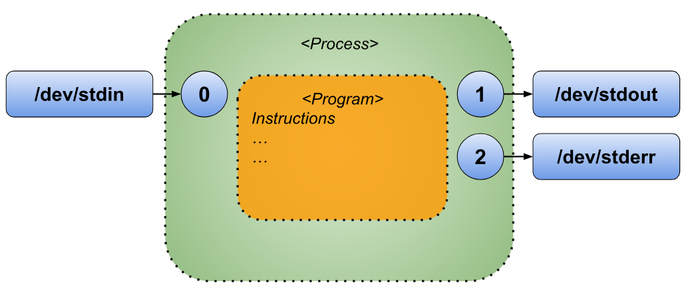
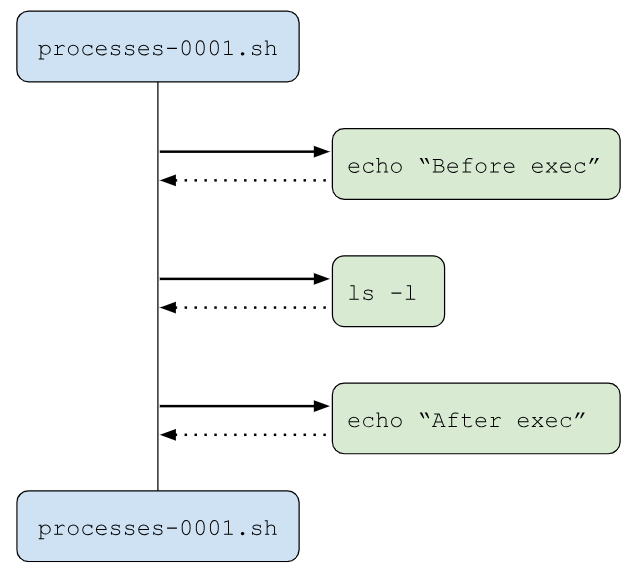
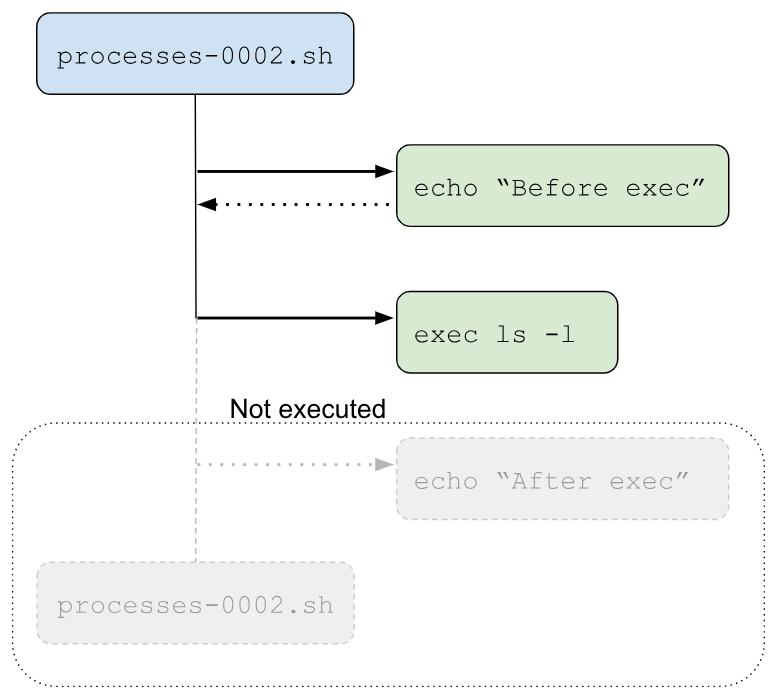

# Chapter 22: Processes

## What is a Process?

In software engineering, a **Process** is essentially a program in action. Unlike a static program—such as a script or a binary file stored on disk—a process is dynamic, representing the live execution of that program in memory. When a program is launched, the operating system (in our case, Linux) loads the program’s code and data into memory, allocates it the necessary resources, and assigns it a unique identifier called a **Process ID (PID)**. The process also includes crucial execution details, such as its current state, program counter, register values, open files, and allocated memory.

In this execution phase, a process interacts with its environment through **File Descriptors**, which act as conduits to manage input and output streams, access files, or communicate with other programs and scripts. A single program can even spawn multiple processes, either to run different tasks simultaneously or to handle discrete operations separately, as with web browsers that assign each tab its own process. Child processes created through system calls can either share certain resources with the parent or operate in isolation, depending on their configuration.

As the process runs, it transitions through various states, like "running," "waiting," or "terminated," based on its needs and the resources available. This state management is handled by the operating system’s scheduler, which switches between processes to balance resource usage and enable multitasking. When a process completes, it exits with a **Status Code** (accessible in Bash with "`$?`"), which indicates the outcome of its execution and can inform the behavior of other processes or scripts. Effective process management is crucial, as it impacts system performance, particularly in complex or multi-user environments.

## File Descriptors and their relationship with Processes

For a process in Unix-like operating systems, nearly every interaction with its environment is handled through a **File Descriptor (FD)**. A file descriptor is a unique identifier, usually represented as a non-negative integer, that points to an I/O resource such as a file, keyboard, or terminal screen. Each process maintains its own local set of file descriptors, meaning multiple processes can have identical FD values (like 0, 1, 2) but refer to different resources.

By default, every process begins with three standard file descriptors:

* **Standard Input (FD 0)**: This FD is used for reading input data, which, by default, comes from the keyboard. It is typically represented by the file "`/dev/stdin`".
* **Standard Output (FD 1)**: This FD handles the process’s output, usually directed to the terminal screen. It corresponds to "`/dev/stdout`".
* **Standard Error (FD 2)**: This FD is designated for error messages, which also commonly display on the terminal screen. It is represented by "`/dev/stderr`".

These default file descriptors can be expanded or modified based on the needs of the process, allowing it to handle additional resources as required. We’ll explore file descriptors in greater detail later in the course.

A graphical representation of a process could be something like the following.

<p align="center">
    
</p>

Why dive into the details of processes and file descriptors? Because understanding these foundational elements helps you see why combining commands works seamlessly in Bash. Grasping these "little details" gives you insight into the mechanics behind command interactions, making your work more intuitive and efficient.

## The "`exec`" Command

When you execute a command, the operating system loads the associated program into memory and runs its instructions. However, there's a way to replace the current program mid-execution by using the exec command.

The exec command effectively replaces the current shell process with a new program, ending the original shell instance and starting the specified command in its place. Its syntax is as follows.

```bash
    exec [-c] [-l] [-a NAME] [command [arguments ...]] [redirection ...]
```

The options for exec are not required but provide additional functionality:
* "`-a NAME`": Sets "`$0`" to "`NAME`" instead of the actual command name.
* "`-c`": Runs the command in a clean environment, without inherited variables.
* "`-l`": Marks the zeroth argument with a dash, indicating the shell should behave as a login shell (covered further in the Types of Shell chapter).
* "`command [arguments ...]`": Specifies the command and its arguments, replacing the current shell.
* "`[redirection ...]`": Allows I/O redirections, which will be explored in the I/O Redirections chapter.

Using "`exec`" can streamline scripts or processes by fully replacing one command with another, saving resources by eliminating the need to launch a new shell instance.

### What does "`exec`" do?

The "`exec`" command **replaces** the current shell process with a new command passed as its argument, effectively ending the current shell instance and transferring control to the specified command. Let's look at an example to see what this means in action.

Consider the following script.

```bash
#!/usr/bin/env bash
#Script: processes-0001.sh
echo "Before exec"
ls -l
echo "After exec"
```

In the script "`processes-0001.sh`", you’ll notice that it calls external commands and programs. Once each of these commands completes, control automatically returns to the main script, resuming execution from where it left off.

The following diagram is a graphical representation of what is happening in the previous script.

<p align="center">
    
</p>

Here you can see that inside the script “`processes-0001.sh`” external commands/programs are called. When the execution of these commands/programs are done, the execution comes back to the main script.

When you execute the previous script you will see the following output in your terminal.

```txt
$ ./processes-0001.sh
Before exec
total 8
-rwxrwxr-x 1 username username 90 Nov 10 13:24 processes-0001.sh
-rwxrwxr-x 1 username username 95 Nov 10 13:25 processes-0002.sh
After exec
```

Now let's consider the following script.

```bash
#!/usr/bin/env bash
#Script: processes-0002.sh
echo "Before exec"
exec ls -l
echo "After exec" # WILL NOT BE EXECUTED
```

This script closely resembles the previous one, but it adds the "`exec`" command before calling "`ls -l`".

As before, the script begins by printing "`Before exec`" to the screen. However, when it reaches "`exec ls -l`", instead of simply executing "`ls -l`", the "`exec`" command replaces the current script ("`processes-0002.sh`") with the "`ls`" program. This means the original script is no longer active in memory; "`ls`" has taken its place. Consequently, the last line of the script isn’t executed because the script itself has effectively been terminated and replaced by the "`ls`" process.

We can imagine this replacement visually as if the original script hands over control entirely to the ls command.


<p align="center">
    
</p>

This illustration shows that when the "`exec`" command is executed, the current script ("`processes-0002.sh`") halts in favor of running the "`ls -l`" command. Execution does not return to the script afterward, as "`exec`" has fully replaced it with "`ls -l`".

When you execute the previous script you will see the following output in your terminal window.

```txt
$ ./processes-0002.sh
Before exec
total 8
-rwxrwxr-x 1 username username  90 Nov 10 13:24 processes-0001.sh
-rwxrwxr-x 1 username username 118 Nov 10 13:58 processes-0002.sh
```

Which is almost the same output as the script "`processes-0001.sh`" but in the script "`processes-0002.sh`" the second "`echo`" command will not be used as the process of the script was replaced with the process "`ls -l`".

## Summary

In this chapter, we explored the concept of a process—essentially, a program actively running in memory. We learned that each process in Bash has a set of “file descriptors” that facilitate its communication with the external world, such as files and other processes. By default, a process has three key file descriptors:

1. **Standard Input (FD 0)** - manages input directed to the script, often from the keyboard.
2. **Standard Output (FD 1)** - allows the script to display results, typically outputting to the screen.
3. **Standard Error (FD 2)** - specifically designated for outputting error messages generated during script execution.

Finally, we looked into the "`exec`" command, a powerful tool that can invoke other commands while replacing the current script entirely with the specified command. When "`exec`" is called, the original script is fully replaced, allowing the new command to run directly in its place. This ability can streamline processes and facilitate direct execution control over other programs.

*"When you grasp the magic of processes, you’re no longer just writing scripts. You’re architecting workflows that bring your ideas to life."*

## References

1. <https://medium.com/@rodbauer/understanding-programs-processes-and-threads-fd9fdede4d88>
2. <https://stackoverflow.com/questions/39972978/option-l-of-exec-shell-command>
3. <https://www.baeldung.com/linux/exec-command-in-shell-script>
4. <https://www.computerhope.com/unix/bash/exec.htm>
5. <https://www.geeksforgeeks.org/formation-of-process-from-program/>

