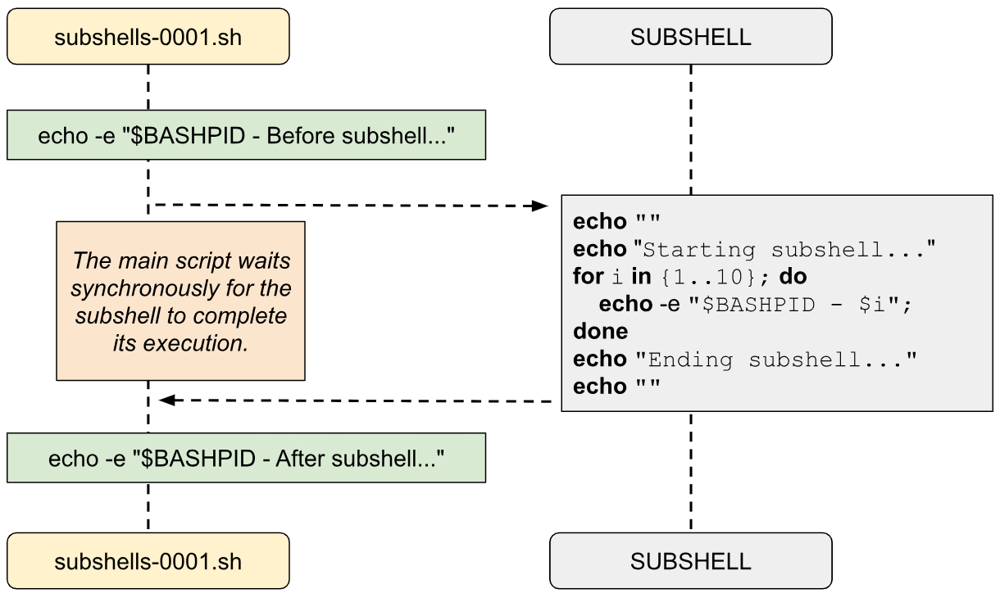

# Chapter 23: Subshells

## What is a Subshell?

In Bash, a **Subshell** is a separate shell instance launched as a child process by the current shell or a script, running independently yet within the environment of the parent script. This isolation allows it to execute commands without affecting the main shell’s variables, settings, or working directory, which is particularly useful for temporary tasks or isolated test commands. To create a subshell, enclose the commands in parentheses, like the following.

```bash
    ( # <- Beginning of subshell
      command1 ;
      command2 ;
      ...
    ) # <- Ending of subshell
```

When a subshell is invoked, the main script pauses, waiting for it to complete before continuing. Although a subshell inherits the parent shell’s environment, any modifications, such as variable assignments or directory changes, remain contained within the subshell. For instance, assigning a new variable or switching directories in a subshell does not impact the main script’s state once the subshell exits. This makes subshells ideal for testing, looping, temporary file manipulations, or running complex pipelines that don’t disrupt the main script’s environment.

A unique identifier, known as a process ID (PID), distinguishes the subshell from the parent shell. You can check this using the special "`$BASHPID`" variable, which reveals the PID of the current Bash process. Within a subshell, this PID will differ from the main shell’s PID, confirming that it’s a separate process. This structure supports effective script management and allows complex scripts to handle parallel operations without altering the core environment.

Let's write an example script to test what we know for now.

```bash
#!/usr/bin/env bash
#Script: subshells-0001.sh
echo -e "$BASHPID - Before subshell..."
( # <= Beginning of the subshell
    echo ""
    echo "Starting subshell..."
    for i in {1..10}; do
        echo -e "$BASHPID - $i";
    done
    echo "Ending subshell..."
    echo ""
)  # <= Ending of the subshell
echo -e "$BASHPID - After subshell..."
```

In the previous script we have a subshell between lines 4 and 12. 

When you execute the previous script you will see the following output in your terminal window<a id="footnote-1-ref" href="#footnote-1" style="font-size:x-small">[1]</a>.

```txt
$ ./subshells-0001.sh
2874475 - Before subshell...

Starting subshell...
2874478 - 1
2874478 - 2
2874478 - 3
2874478 - 4
2874478 - 5
2874478 - 6
2874478 - 7
2874478 - 8
2874478 - 9
2874478 - 10
Ending subshell...

2874475 - After subshell...
```

The subshell code executes *synchronously*, meaning that the original script (in our example with PID 2874475) will pause and wait for the subshell to complete its tasks before continuing. Later in the book, we’ll explore ways to make this process asynchronous.

The following diagram is graphic representation of what is happening in the script.

<p align="center">
    
</p><br>


## What happens when a subshell is launched?

So, what exactly occurs when a subshell is launched? When a subshell is created, it initiates a **new child process** that has access **to all** the variables, functions, and environment settings available at that specific point in the script. This ensures that the subshell has all the necessary resources while also isolating any changes it makes from the main script’s environment.

Let's see how it works with the following example script.

```bash
#!/usr/bin/env bash
#Script: subshells-0002.sh
GLOBAL_VAR="GLOBAL_VARIABLE"
my_test() {
    echo "Testing... Testing..."
}
main() {
    local my_var="LOCAL_VARIABLE"
    ( # Beginning of subshell
        echo "MY_VAR: $my_var"
        echo "Global: $GLOBAL_VAR"
        my_test
        subshell_var="Only for subshell"
        echo "Subshell var: $subshell_var"
    ) # Ending of subshell
    echo "main - Subshell var: $subshell_var"
}
echo "Begin"
main
echo "End"
```

In the previous script you will see that there is a variable declared on line 3 named "`GLOBAL_VAR`" then you will see that there are 2 functions declared ("`my_test`" function on line 4 and "`main`" function on line 7). 

Inside the function "`main`" we first declare a variable named "`my_var`". 

Last thing to notice is that we create a subshell inside the function "`main`" between lines 9 and 15.

When you execute the previous script "`subshells-0002.sh`" you will see the following output in your terminal window.

```txt
$ ./subshells-0002.sh
Begin
MY_VAR: LOCAL_VARIABLE
Global: GLOBAL_VARIABLE
Testing... Testing...
Subshell var: Only for subshell
main - Subshell var:
End
```

In the previous output, take note of the following:
* The subshell can access the global variable "`$GLOBAL_VAR`".
* It can also access the local variable "`$my_var`" within the "`main`" function.
* The subshell has visibility of both the "`main`" and "`my_test`" functions.
* However, the parent shell **cannot** access the variable "`$subshell_var`", since this variable was created within a separate, child process. The original script, running in a different process, does not have direct access to this subshell-specific variable.

Each of these details highlights how the subshell inherits specific parts of the parent environment, but also remains isolated where needed.

## "`SHLVL`" and "`BASH_SUBSHELL`" variables

When working with subshells, two Bash variables are particularly useful:

* "`SHLVL`": This variable represents the "shell level," directly related to the Bash process itself. When a Bash process starts, "`SHLVL`" is set to 1. If another Bash instance is launched within this process, "`SHLVL`" increments by one for the new process. However, the creation of subshells does not affect this variable; each subshell, even nested ones, will inherit the same "`SHLVL`" as its parent Bash process.
* "`BASH_SUBSHELL`": This variable keeps track of the depth of subshells within a given Bash process, starting at zero when the initial script runs. Each time a subshell is created, "`BASH_SUBSHELL`" increments by one, reflecting the current level of subshell nesting.

Let's play with the these two variables in the following script.

```bash
#!/usr/bin/env bash
#Script: subshells-0003.sh
print_variables() {
    echo ""
    echo "#########"
    echo "### $1"
    echo "#########"
    echo "BASHPID: $BASHPID"
    echo "BASH_SUBSHELL: $BASH_SUBSHELL"
    echo "SHLVL: $SHLVL"
    echo "#########"
    echo "### END - $1"
    echo "#########"
    echo ""
}
custom() {
    print_variables "Custom"
}
print_variables "Main program"
(
    print_variables "Subshell"
    (
       print_variables "Subshell - 2"
       custom
    )
)
# Sub Bash Process
bash -c 'echo -e "Bash - SHLVL: $SHLVL\nBash - Subshell: $BASH_SUBSHELL\nBash - BASHPID:$BASHPID\n"'
```

What is happening in this script?

First of all between lines 3 and 15 there is a function declared named "`print_variables`" that takes one argument ("`$1`") and prints the values for the variables "`BASHPID`", "`BASH_SUBSHELL`" and "`SHLVL`". Just to summarize what we already learnt the content of those variables are as follows:
* "`BASHPID`": the process ID of the current Bash process.
* "`BASH_SUBSHELL`": the subshell level within the current Bash session.
* "`SHLVL`": the shell level, representing how many Bash shells have been spawned in sequence.

The "`print_variables`" function also includes a footer to indicate the end of each block of printed information.

Between lines 16 and 18 we do have the "`custom`" function that calls the previous function "`print_variables`" with "`Custom`" as argument.

On line 19 the script starts by calling "`print_variables`" with "`Main program`" as the argument, printing environment details for the main script process.

Between lines 20 and 26 the script creates two nested subshells:
1. The outer parentheses create a new subshell, which calls "`print_variables`" with the label "`Subshell`".
2. Inside this outer subshell, another subshell is created, and "`print_variables`" is called with "`Subshell - 2`" as the label.
3. Inside the innermost subshell, "`custom`" is called, printing the environment variables under the label "`Custom`".

Each subshell has a **unique** "`BASHPID`", but all share the same "`SHLVL`" as they are part of the same Bash session. "`BASH_SUBSHELL`" increments for each level of subshell nesting.

Finally, on line 28, a new Bash process is spawned using "`bash -c`". This new Bash shell is entirely separate from the main script, so it resets "`BASH_SUBSHELL`" to 0 and increments "`SHLVL`" by 1. It prints values of "`SHLVL`", "`BASH_SUBSHELL`", and "`BASHPID`" for this new shell instance, demonstrating a distinct environment from the main script and its subshells.

When you execute the previous "`subshells-0003.sh`" script you will see something like the following in your terminal window.

```txt
$ echo $SHLVL
1 
$ echo $BASHPID
368474
$ ./subshells-0003.sh

#########
### Main program
#########
BASHPID: 368654
BASH_SUBSHELL: 0
SHLVL: 2
#########
### END - Main program
#########


#########
### Subshell
#########
BASHPID: 368655
BASH_SUBSHELL: 1
SHLVL: 2
#########
### END - Subshell
#########


#########
### Subshell - 2
#########
BASHPID: 368656
BASH_SUBSHELL: 2
SHLVL: 2
#########
### END - Subshell - 2
#########


#########
### Custom
#########
BASHPID: 368656
BASH_SUBSHELL: 2
SHLVL: 2
#########
### END - Custom
#########

Bash - SHLVL: 3
Bash - Subshell: 0
Bash - BASHPID:368657
```

Before running the Bash script, the value of the variable "`SHLVL`" is printed. As mentioned earlier, "`SHLVL`" starts at 1 in a fresh Bash shell and increments by 1 for each nested Bash process. Let’s analyze what happens in each section of the script:

* `"Main program"`
    * A new Bash process is created with its own process ID (e.g., 368654).
    * Since this process is initiated from an existing Bash shell, the "`SHLVL`" variable is incremented to 2.
    * At this stage, no subshells have been created, so the value of "`BASH_SUBSHELL`" remains 0.
* `"Subshell"`
    * Parentheses initiate a new subshell, creating a new child Bash process with a unique PID (e.g., 368655).
    * As this is a subshell of the main script, "`BASH_SUBSHELL`" is incremented to 1.
    * Since no new explicit Bash process is launched, the "`SHLVL`" remains 2.
* `"Subshell - 2"`
    * Another set of parentheses creates a nested subshell with a new PID (e.g., 368656).
    * Being a subshell within the first subshell, "`BASH_SUBSHELL`" increases to 2.
    * Like before, "`SHLVL`" stays at 2, as no new Bash process is explicitly created.
* `"Custom"`
    * The values of "`BASHPID`", "`BASH_SUBSHELL`", and "`SHLVL`" in this function remain identical to those in "`Subshell - 2`" since it is executed **within the same environment**.
* `"# Sub Bash Process"`
    * A new Bash process is explicitly created using the bash -c command. This results in a new PID (e.g., 368657).
    * As this is an independent Bash process, "`BASH_SUBSHELL`" resets to 0.
    * The "`SHLVL`" value increments by 1, resulting in a value of 3, reflecting the additional Bash process level.

This detailed breakdown shows how subshells and new Bash processes differ in behavior, particularly regarding how "`BASH_SUBSHELL`" and "`SHLVL`" are updated. Subshells are nested within the current environment, while explicit Bash processes represent entirely new instances.


## Summary

In Bash, a subshell is a child process spawned by a parent shell or script to execute commands in isolation from the main environment. When a subshell is created, it inherits the environment of the parent shell, including variables, functions, and settings, but any modifications it makes, such as variable assignments or directory changes, remain local to the subshell. This isolation ensures that the main script's environment stays unaffected, making subshells an effective tool for testing commands, running temporary tasks, or organizing complex scripts. Subshells are created by wrapping commands in parentheses, and their execution is synchronous, meaning the parent script waits for the subshell to finish before continuing.

A subshell operates as a separate process with its own unique process ID (PID), distinct from the parent process. Key Bash variables help us understand the behavior of subshells. The "`BASHPID`" variable provides the current process ID, which changes in a subshell since it is a child process. "`BASH_SUBSHELL`" indicates the nesting level of subshells, starting at 0 for the main shell and incrementing with each subshell. Unlike these, "`SHLVL`", which tracks the level of Bash processes, does not change when a subshell is created but increases only when a new explicit Bash process is launched.

The relationship between a parent shell and a subshell is hierarchical but temporary. A subshell can access all variables, functions, and resources available at the time of its creation. However, any changes made within the subshell, such as setting variables or defining new functions, do not propagate back to the parent shell. For instance, creating a variable in a subshell makes it accessible only within that subshell's scope. Similarly, commands executed within nested subshells increment the "`BASH_SUBSHELL`" variable, reflecting their deeper level of isolation.

Subshells are valuable for managing tasks that require temporary environments. They are often used for grouping commands in pipelines, testing operations without affecting the main script, or running loops in isolation. Nested subshells are particularly useful when dealing with complex pipelines or scripts requiring multiple levels of temporary operations. For example, you can create a subshell to change directories, execute commands in the new location, and return to the original directory without impacting the parent shell's working directory.

Understanding subshells deepens your knowledge of Bash scripting and equips you to write more robust and efficient scripts. By isolating commands and preserving the integrity of the main script, subshells enable you to handle tasks with precision and flexibility. They are an essential tool for any advanced Bash script, allowing for better control over execution environments, resource management, and script modularity.

*"By understanding subshells, you gain the power to control complexity, manage tasks independently, and execute commands with precision—skills that separate a good scriptwriter from a great one."*

## References
1. <https://backreference.org/2010/10/23/on-pipes-subshells-and-descriptors/index.html>
2. <https://bash.cyberciti.biz/guide/What_is_a_Subshell%3F>
3. <https://stackoverflow.com/questions/34799161/difference-between-linux-variables-bash-subshell-vs-shlvl>
4. <https://sysxplore.com/subshells-in-bash/>
5. <https://tldp.org/LDP/abs/html/subshells.html>
6. <https://unix.stackexchange.com/questions/442692/is-a-subshell>
7. <https://uomresearchit.github.io/shell-programming-course/04-subshells_and_functions/index.html>
8. <https://www.geeksforgeeks.org/shell-scripting-subshell/>
9. <https://www.oreilly.com/library/view/bash-cookbook/0596526784/ch19s08.html>
10. <https://www.shell-tips.com/bash/environment-variables/#gsc.tab=0>


<hr style="width:100%;text-align:center;margin-left:0;margin-bottom:10px">
<p id="footnote-1" style="font-size:10pt">
1. Most likely the PIDs will be different.<a href="#footnote-1-ref">&#8617;</a>
</p>

