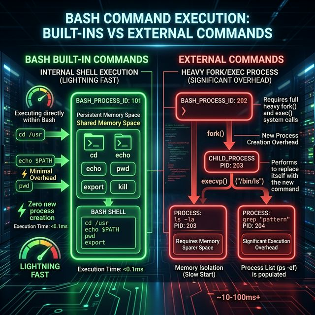

# Chapter 4: Basics

<p align="center">
  
</p>


In this chapter we are going to introduce the basics of Bash scripting. We will first introduce you to the structure of a Bash script.

After that you will learn your first 3 commands to read from and write information to the screen.

Last but not least you will learn about two commands that will allow you to read what is the purpose of the commands and how to use them.

Let’s begin!

## Structure of a script
The typical structure of a Bash script is as follows.

```bash
#!<hashbang>

# My comment
command1
command2
...
```

There is no need to add comments to your script, but it’s a good practice as it will be easier for you to read your script in the future.

Another thing to know about bash scripts is that every command returns a status when it terminates normally or abnormally. This exit status can be used in either the terminal or other bash scripts to determine how to continue.

The possible values of the exit status are:
* Zero (0) when the command or script is successful
* Non-Zero (1-255) when there was some failure in the script
    * Special case for exit status with value 126: Command found but not executable
    * Special case for exit status with value 127: The command was not found

When the script is executed, the exit status of the script is stored in a variable called "`$?`" (Don't worry about this variable for now, we will revisit it later).

The exit status of a given script is determined by the last command that will be executed in the script. Let's see a couple of examples.

```bash
#!/bin/bash
#Script: fail.sh
dodo # << This command does not exist
```

When you execute the previous script and check for the value of the variable you will see the following.

```shell
$ ./fail.sh
./fail.sh: line 2: dodo: command not found
$ echo $?
127
```

As mentioned previously the exit status is `127` because the command `dodo` does not exist.

However, if we modify the script and add a succesful command at the bottom, the exit status of the script will be successful.

```bash
#!/bin/bash
#Script: fail.sh
dodo # << This command does not exist
echo "hello"
```

And then you execute the script same as before.

```shell
$ ./fail.sh
./fail.sh: line 2: dodo: command not found
hello
$ echo $?
0
```

With this information you can assume that a script whose exit status is "`0`" is a correct execution and that if the exit status is different then you can assume that the execution was a failure.

## Command terminator characters

Each command in a bash script must finish with a “terminator character”. Depending on the terminator character, a different behavior will happen. What are the possible terminator characters?
* Newline character: It means that the command is finished and the shell should execute it (provided the newline is not escaped).
* Semicolon (**;**) is used to separate different commands **in one line**. Useful when working at an interactive terminal, not from a script.
* An ampersand (**&**) denotes an asynchronous execution. The shell will execute the command but it will not wait for it to finish. We will take a deep look at it later in the book.

## `echo` and `read` commands

As we are going to be writing some scripts along this course, what we are going to do is to arm ourselves with a couple of commands (our first 2 commands! 🥳 ) to be able to follow and interact with our scripts.

### `echo` command
This `echo` command is going to be our command to print messages so that we can follow our script.

An example can be the same `echo “Hello World”` that  we saw before.

By default the `echo` command adds a newline character at the end of the line. 

The `echo` command comes with the `-n` option. If that option is used the message passed will be printed without a newline character at the end of the line.

This `-n` option could be very useful for prompts and to interact with the user.

### `read` command
This command is used to get information from the input. Typically from interacting with the user.

The “`read`” command can be used in two different ways.

The first way is to read information into a variable. In the following example you see that the script is saving the information provided through the standard input inside the variable “`myAnswer`”.

```bash
#!/bin/bash
#Script: read.sh
echo -n "Write something: "
read myAnswer

echo "You wrote: $myAnswer"
```

The second way is by using **the default variable** where the “`read`” command stores information if no variable name is provided. In the following example you will see that the “`read`” command receives no parameter. In this case, the command will store the information provided via the standard input in the variable “`REPLY`” that can be accessed with “`$REPLY`”<a id="footnote-1-ref" href="#footnote-1" style="font-size:x-small">[1]</a> as you will see in the following script.

```bash
#!/bin/bash

echo -n "Write something: "
read 

echo "You wrote: $REPLY"
```
## `printf` builtin command
“`printf`” is a command that is a bit more advanced than the “`echo`” command, that we already learnt in the previous section, and that allows more control on the formatting of the output.

According to the man page<a id="footnote-2-ref" href="#footnote-2" style="font-size:x-small">[2]</a> its syntax is:

```
printf [-v var] format [arguments...]
```

It prints the `arguments` provided according to the format passed.

The `format` is the part of the command that will give you more control on the output. It accepts many types like the following:
* Alphabetical and numerical characters that are just printed out as they are
* Octal characters in the format “`\XXX`” (e.g: `\007`). “`printf`” will print the character associated with the octal code. You can see the map between the octal code and the associated character by consulting the man page for ascii (“`man ascii`”).
* Hexadecimal characters in the format “`\xHH`” (e.g: `\x41`). “`printf`” will print the character associated with the hexadecimal code. You can see the map between the hexadecimal code and the associated character by consulting the man page for ascii (again “`man ascii`”).
* Numbers in scientific notation (`1234e-2`, `1234e3`, `123.4e-2`, etc)
* Backslash-escaped characters that are first interpreted and then printed.
    * `\a` - Produces a bell sound.
    * `\\` - Displays a backslash character.
    * `\b` - Displays a backspace character.
    * `\n` - Displays a new line.
    * `\r` - Displays a carriage return.
    * `\t` - Displays a horizontal tab.
    * `\v` - Displays a vertical tab.
* Conversion specifications<a id="footnote-3-ref" href="#footnote-3" style="font-size:x-small">[3]</a>. They begin with a percent sign “`%`” followed by a character that specifies the type of data to be formatted.
    * `%[flags][width][.precision]specifier`
        * `flags`
            * `-` : Left align the printed text within the field. By default, the text is right-aligned.
            * `+` : Prefix the numbers with a + or - signs. By default, only negative numbers are prefixed with a negative sign.
            * `0` : Pads numbers with leading zeros rather than space.
            * blank (` `) : Prefix the positive numbers with a blank space and negative numbers with a minus (`-`).
        * `width`
            * Placed after any flag characters and specifies the minimum number of characters the conversion should result in.
            * If the outputted text width is less than the specified width, it’s padded with spaces. The width can be specified as a non-negative decimal integer or an asterisk (*).
            * By default, it’s right justified. To justify left you need to add “`-`” at the beginning of “`width`”.
            * If it’s specified as an asterisk, the corresponding argument should indicate the width. The asterisk acts as another placeholder.
        * `.precision`
            * The precision can be either a positive integer or an asterisk.
            * If the conversion type is an integer, the precision specifies the minimum number of digits to be printed. If the number of digits in the argument is less than precision, leading zeros are printed.
            * If the conversion type is a floating-point, the precision specifies the number of digits that follow the decimal-point character. The default precision is 6.
            * When precision is set to an asterisk (`*`), its value is set by the precision argument that precedes the argument that’s being formatted.
        * `specifier`
            * `%b` : Print the argument while expanding backslash escape sequences.
            * `%q` : Print the argument shell-quoted, reusable as input.
            * `%d`, `%i` : Print the argument as a signed decimal integer.
            * `%u` : Print the argument as an unsigned decimal integer.
            * `%o` : Print the argument as an unsigned octal integer.
            * `%x`, `%X` : Print the argument as an unsigned hexadecimal integer. `%x` prints lower-case and `%X` prints upper-case.
            * `%e`, `%E` : Print the argument as a floating-point number in exponential notation. `%e` prints lower-case and `%E` prints upper-case.
            * `%a`, `%A` : Print the argument as a floating-point number in hexadecimal fractional notation. `%a` prints lower-case and `%A` prints upper-case.
            * `%g`, `%G` : Print the argument as a floating-point number in normal or exponential notation, whichever is more appropriate for the given value and precision. `%g` prints lower-case and `%G` prints upper-case.
            * `%c` : Print the argument as a single character.
            * `%f` : Print the argument as a floating-point number.
            * `%s` : Print the argument as a string.
            * `%%` : Print a literal % symbol.

The “`arguments`” operand is what is used along with “`format`” to print a rich text. It will be treated as a string if the specifier is “`b`”, “`c`” or “`s`”. Otherwise, it will be treated as an unsuffixed C integer constant, with the following extensions:
* A leading “`+`” or “`-`” is allowed (e.g: “`printf “%d” -3`”)
* If the leading character is a single-quote or double-quote, the value shall be the numeric value in the underlying codeset of **the character** following the single-quote or double-quote (e.g: “`printf “%d” “‘A”`” would print “`65`”).

As usual, let’s take a look at a few examples to have a better understanding.

First we are going to write the following script where you will see several examples of characters being printed:

```bash
#!/usr/bin/env bash
#Script: different_formats.sh
printf "Message with normal characters and numbers (1,2,3...)\n"
printf "\115\145\163\163\141\147\145\040\167\151\164\150\040\157\143\164\141\154\040\143\150\141\162\141\143\164\145\162\163\n"
printf "\x4d\x65\x73\x73\x61\x67\x65\x20\x77\x69\x74\x68\x20\x48\x45\x58\x20\x63\x68\x61\x72\x61\x63\x74\x65\x72\x73\n"
printf "New line character: 12345\n6789\n"
printf "Backslash character: \\ \n"
printf "Backspace character: 1\b2 \n"
printf "Horizontal\ttab\n"
printf "Vertical\vtab\n"
```

When you run the previous script you will get the following.

```shell
$ ./different_formats.sh
Message with normal characters and numbers (1,2,3...)
Message with octal characters
Message with HEX characters
New line character: 12345
6789
Backslash character: \
Backspace character: 2
Horizontal      tab
Vertical
        tab
```

In the output of the previous script please notice:
* How the octal numbers are interpreted as characters.
* How the hexadecimal numbers are interpreted as characters.
* That although the vertical tab looks like a new line, it’s not a new line (you can check it by yourself by using of the commands that shows the ASCII codes underneath, like “`hexdump`”).

As it was already mentioned in the Introduction, there is a difference between the terminal and the shell (in our case, Bash). The main difference is the interpretation of the escape sequences. 

On one side, Bash will work with the escape sequences mentioned earlier without applying any special behavior. It will be up to the terminal to interpret the escape sequences and produce the wanted effect.

### Bell character
Let’s play with the bell character “`\a`”.

This special character will make a sound when the script is executed. Let's see a simple example.

```bash
#!/usr/bin/env bash
#Script: alarm.sh
printf "A little alarm will sound next\n"
printf "ALARM\a\n" # <<< Bell character used here
printf "End of alarm\n"
```

When you run the previous script you will get the following output and a little bell will sound.

```shell
$ ./alarm.sh
A little alarm will sound next
ALARM
End of alarm
```

As you can see, there is no special character printed. The only thing you will notice, when executing this script, is that a small bell (or alarm) will sound briefly.

### Carriage return character
The carriage return character (“`\r`”) can be easily misunderstood. In this section we will explain and provide several examples to leave this character as clear as possible.

The carriage return is telling the terminal to move the cursor to the beginning of the current line and to continue writing from there.

In the following script we illustrate with a very simple example what is the behavior of this character.

```bash
#!/usr/bin/env bash
#Script: carriage_return_1.sh
printf "Beginning of example\n"
printf "This part of the line will NOT appear\rThis part of the line WILL BE appearing\n"
printf "End of example\n"
```

When you run the previous script you will have the following output.

```shell
$ ./carriage_return_1.sh
Beginning of example
This part of the line WILL BE appearing
End of example
```

This does not mean that carriage return gets rid of the present line. The cursor will be moved to the beginning of the line and the next text will be written on top of the old one.

In the following example we will use different letters to show how the override happens.

```bash
#!/usr/bin/env bash
#Script: carriage_return_2.sh
printf "Beginning of example\n"
printf "WWWWWWWWWWWW\rXXXXXXXXXX\rYYYYYYYY\rZZZZZZ\rVVVV\rUU\n"
printf "End of example\n"
```

The output of the previous script is as follows.

```shell
$ ./carriage_return_2.sh
Beginning of example
UUVVZZYYXXWW
End of example
```

So... what is happenning in the “`printf`” of line 4?
* It prints “`WWWWWWWWWWWW`” and moves the cursor to the beginning of the line.
* It then prints “`XXXXXXXXXX`” on top, resulting in “`XXXXXXXXXXWW`” and moves the cursor to the beginning of the line.
* It then prints “`YYYYYYYY`” on top, resulting in “`YYYYYYYYXXWW`” and moves the cursor to the beginning of the line.
* It then prints “`ZZZZZZ`” on top, resulting in “`ZZZZZZYYXXWW`” and moves the cursor to the beginning of the line.
* It then prints “`VVVV`” on top, resulting in “`VVVVZZYYXXWW`” and moves the cursor to the beginning of the line.
* It then prints “`UU`” on top, resulting in “`UUVVZZYYXXWW`” as the final result.

As you can see, the carriage return character allows us to overwrite the content previously written in the same line.

One way to show another proof that is the terminal the one interpreting the carriage return character is by using the “`xclip`” command. The “`xclip`” command allows us to store some content in the clipboard of the system (similar to selecting a text and making “Control+C”). 

We are going to save the previous script in a file named “`carriage_return_2.sh`”. Then we are going to execute it like follows:

```shell
$ ./carriage_return_2.sh | xclip -sel clip
```

This command will store the output to the clipboard. If you go to a plain text editor and do “Control+V” you will see the following:

```txt
Beginning of example
WWWWWWWWWWWW
XXXXXXXXXX
YYYYYYYY
ZZZZZZ
VVVV
UU
End of example
```

If you go back to the command line and execute the equivalent of a “Control+V” you will see the following:

```shell
$ xclip -sel clip -o
Beginning of example
UUVVZZYYXXWW
End of example
```

The reason for these different behaviors is because of something we already mentioned. It’s because the terminal will interpret the escaped characters (carriage return in our example) producing the desired effect.

The same would happen if we would redirect the output to a file. In the following script we send<a id="footnote-4-ref" href="#footnote-4" style="font-size:x-small">[4]</a> the information to the file called “`output.txt`”.

```bash
#!/usr/bin/env bash
#Script: carriage_return_3.sh
printf "Beginning of example\n" >> output.txt
printf "WWWWWWWWWWWW\rXXXXXXXXXX\rYYYYYYYY\rZZZZZZ\rVVVV\rUU\n" >> output.txt
printf "End of example\n" >> output.txt
```

When we execute the script and do a “`cat`”<a id="footnote-5-ref" href="#footnote-5" style="font-size:x-small">[5]</a> of the file generated we will see the following.

```shell
$ ./carriage_return_3.sh
$ cat output.txt
Beginning of example
UUVVZZYYXXWW
End of example
```

Then, if you open the “`output.txt`” file with a standard text editor you will see the following.

```txt
Beginning of example
WWWWWWWWWWWW
XXXXXXXXXX
YYYYYYYY
ZZZZZZ
VVVV
UU
End of example
```

Which proves again that it’s the terminal that interprets the escaped characters.

### Specifiers

The “`printf`” command, as we saw previously, supports the so called “*specifiers*”. These special characters tell the command how to interpret the arguments passed, allowing us to print them with different representations (decimal, octal, hexadecimal, etc), different widths, different precisions and alignments.

In this section we are going to play a bit with these elements to have a better understanding of how to use them.

First of all we are going to create a script called “`specifiers.sh`” that we are going to use to try different things.

We will start by adding to our script a few lines with every value of “*flag*” to see the differences. We are added a vertical bar “`|`” at the beginning and end of every example to be able to see the differences more clearly.

```bash
#!/usr/bin/env bash
#Script: specifiers.sh
# Flags
printf "Examples with Flags\n"
printf "|%f|\n" 12.345
printf "|%-f|\n" 12.345
printf "|%+f|\n" 12.345
printf "|%0f|\n" 12.345
printf "|% f|\n" 12.345
```

When the script is executed it produces the following output.

```shell
$ ./specifiers.sh
Examples with Flags
|12.345000|
|12.345000|
|+12.345000|
|12.345000|
| 12.345000|
```

With the exception of a space and a plus sign at the beginning, after the first vertical bar, we do not see a lot of difference between the different lines. To be able to see a bit more, we are going to add the a few more lines to the script adding the “width” to each one of the previous lines setting it to 20.

```bash
#!/usr/bin/env bash
#Script: specifiers_2.sh
# Flags
printf "Examples with Flags\n"
printf "|%f|\n" 12.345
printf "|%-f|\n" 12.345
printf "|%+f|\n" 12.345
printf "|%0f|\n" 12.345
printf "|% f|\n" 12.345
printf "\n"
# Flags + width
printf "Examples with Flags & Width\n"
printf "|%20f|\n" 12.345
printf "|%-20f|\n" 12.345
printf "|%+20f|\n" 12.345
printf "|%020f|\n" 12.345
printf "|% 20f|\n" 12.345
```

When you run the previous script you will get the following output.

```shell
$ ./specifiers_2.sh
Examples with Flags
|12.345000|
|12.345000|
|+12.345000|
|12.345000|
| 12.345000|

Examples with Flags & Width
|           12.345000|
|12.345000           |
|          +12.345000|
|0000000000012.345000|
|           12.345000|

```

This output gives us more information. Setting the “width” to 20 characters between the two vertical bars gives us a better visualization of how the flags affect the text passed as argument.

With this last example we can see the effect of “flags” and “width”. Let’s evolve our example to use precision.

```bash
#!/usr/bin/env bash
#Script: specifiers_3.sh
# Flags
printf "Examples with Flags\n"
printf "|%f|\n" 12.345
printf "|%-f|\n" 12.345
printf "|%+f|\n" 12.345
printf "|%0f|\n" 12.345
printf "|% f|\n" 12.345
printf "\n"
# Flags + width
printf "Examples with Flags & Width\n"
printf "|%20f|\n" 12.345
printf "|%-20f|\n" 12.345
printf "|%+20f|\n" 12.345
printf "|%020f|\n" 12.345
printf "|% 20f|\n" 12.345
printf "\n"
# Flags + width + precision
printf "Examples with Flags & Width & Precision\n"
printf "|%20.2f|\n" "12.345"
printf "|%-20.2f|\n" "12.345"
printf "|%+20.2f|\n" "12.345"
printf "|%020.2f|\n" "12.345"
printf "|% 20.2f|\n" "12.345"
```

When you execute the last version of the script you will get the following.

```shell
$ ./specifiers_3.sh
Examples with Flags
|12.345000|
|12.345000|
|+12.345000|
|12.345000|
| 12.345000|

Examples with Flags & Width
|           12.345000|
|12.345000           |
|          +12.345000|
|0000000000012.345000|
|           12.345000|

Examples with Flags & Width & Precision
|               12.35|
|12.35               |
|              +12.35|
|00000000000000012.35|
|               12.35|
```

With this output we can extract some information out of the specifiers used:
* The “`f`” specifier is used for floating point numbers (numbers with decimal part) and will show, by default, 6 decimal digits
* The “`-`” flag will align the text to the left, being alignment to the right the default one.
* The “`+`” flag will add the sign to the number. “`+`” for positive numbers and “`-`” for negative numbers.
* The “`0`” flag will pad the space not occupied by the number with zeroes.
* The “` `“ flag will pad the space not occupied by the number with spaces.
* The precision will keep the number of decimals specified and will round the last decimal to the next unit if the decimal following it is bigger than or equal to “`5`”. In our previous example “`12.345`” becomes “`12.35`”.
* The width specified is the minimum space to be used for the field. If fewer characters are used, the minimum space will be used. If more characters are used, that amount of characters will be used.

As you can see, “`printf`” comes with a long list of special characters and flags that we can use to create a rich output. 

### Variables (`-v` option)

By default, “`printf`” sends the text to the standard output. The “`printf`” builtin command allows us to store the content generated into a variable by using the “`-v`” option. The way to use it is as follows.

```txt
printf -v VAR “<Text with rich format>” <arguments…>
```

The effect of this would be the declaration of a new variable “`VAR`” whose content will be the text with rich format with the arguments applied.

Let's see it with an example.

```bash
#!/usr/bin/env bash
#Script: printf_v_option.sh
printf "Beginning of example\n"
printf -v MY_VAR "First line of the variable\nSecond line of the variable\nThird line"
printf "Content of the variable:\n###\n$MY_VAR\n###\n"
printf "End of example\n"
```

When you execute the previous script it will give you the following output.

```shell
$ ./printf_v_option.sh
Beginning of example
Content of the variable:
###
First line of the variable
Second line of the variable
Third line
###
End of example
```

As you can see in this example, line 4 declares a variable called “`MY_VAR`” that contains 3 lines. Then the variable “`MY_VAR`” is used on line 5 to print its contents between two blocks of “`###`”.

## `man` and `help`

In this section we are going to learn about two commands that we are going to use regularly to consult what other commands can do.

These commands are “`man`” and “`help`”.

### `man` command
What is the “`man`” command? The “`man`” is a command used to consult the system’s manual pager.

For every command that we will learn about later, there is a “man page” (manual page) that gives an explanation of the purpose of the command, how to use it, the different options admitted and, in some cases, examples of how to use the command in the local system.

The man pages come with 2 different descriptions. The first one is the “short description” which gives a very high level overview of what the command does. The second one is a more in depth description of the topic/command that is structured in different subsections named “`NAME`”, “`DESCRIPTION`”, “`OPTIONS`”, “`ERRORS`”, “`ENVIRONMENT`”, “`FILES`” and so on.

These “*man pages*” give us the needed knowledge so that we can understand and play with a command without the need to google the command. There are, of course, exceptions like the “`sed`” command whose man page can be a bit cryptic<a id="footnote-6-ref" href="#footnote-6" style="font-size:x-small">[6]</a>.

The “man pages” are divided into sections where each section contains information about a particular topic. The following table gives an overview of the content in each section.

| Section number | Description |
| :----: | :---- |
| 1 | Executable programs, user commands or shell commands |
| 2 | Functions provided by the Kernel (System calls) |
| 3 | Library functions |
| 4 | Special device files which are usually found in “`/dev`” |
| 5 | File formats and conventions |
| 6 | Games |
| 7 | Miscellaneous (including macro packages and conventions) |
| 8 | Linux system admin commands (commands used by admin user) |
| 9 | Kernel routines|

The section number is something we can use when consulting the manual page of a command/topic, although it’s not mandatory.

There are different ways to use this command and here we are going to learn of the ones that, I think, are the most useful. We are going to present the different ways to use “`man`” with some use cases.

Typically we start wondering how to use a command or want to get more information about a topic (it could be a system call, something about Linux…). For this we do have the option “`-k`”. 

The “`-k`” option accepts as argument a term that is used to do a search in the short description of the man pages. Let’s see an example with “`printf`”.

```shell
$ man -k printf
PA_CHAR (3const)     - define custom behavior for printf-like functions
PA_DOUBLE (3const)   - define custom behavior for printf-like functions
PA_FLAG_LONG (3const) - define custom behavior for printf-like functions
PA_FLAG_LONG_DOUBLE (3const) - define custom behavior for printf-like functions
PA_FLAG_LONG_LONG (3const) - define custom behavior for printf-like functions
PA_FLAG_PTR (3const) - define custom behavior for printf-like functions
PA_FLAG_SHORT (3const) - define custom behavior for printf-like functions
PA_FLOAT (3const)    - define custom behavior for printf-like functions
PA_INT (3const)      - define custom behavior for printf-like functions
PA_LAST (3const)     - define custom behavior for printf-like functions
PA_POINTER (3const)  - define custom behavior for printf-like functions
PA_STRING (3const)   - define custom behavior for printf-like functions
PA_WCHAR (3const)    - define custom behavior for printf-like functions
PA_WSTRING (3const)  - define custom behavior for printf-like functions
asprintf (3)         - print to allocated string
dprintf (3)          - formatted output conversion
fprintf (3)          - formatted output conversion
fwprintf (3)         - formatted wide-character output conversion
printf (1)           - format and print data
...
vsprintf (3)         - formatted output conversion
vswprintf (3)        - formatted wide-character output conversion
vwprintf (3)         - formatted wide-character output conversion
wprintf (3)          - formatted wide-character output conversion
XtAsprintf (3)       - memory management functions
```

In this example we are asking “`man`” for information about the term “`printf`”. The result is giving back the actual terms we can use (`asprintf`, `dprintf`, `fprintf`, etc), the section number between parenthesis and a short description of the topic.

If you pay attention, you will notice there are two entries for “`printf`”, one of them in section 1 (Executable programs, user commands or shell commands) and the other in section 3 (Library functions). We can use the section numbers to consult the corresponding manual page as follows.

```shell
$ man 1 printf
```

Or.

```shell
$ man 3 printf
```

These executions of the “`man`” command will print to the terminal the corresponding manual page for “`printf`”. Just give it a try! Don't be afraid to fail as failure is a way of learning.

Sometimes you know the command/topic you want to read about but you do not remember the section. For this case, the “`-f`” option comes in handy. The way to use it is as follows.

```txt
man -f <term>
```

For example, using it with “`printf`” would give the following as result.

```shell
$ man -f printf
printf (1)           - format and print data
printf (3)           - formatted output conversion
```

With the knowledge of these options we are set to learn by ourselves using the man pages. If you want to know more about this command, be curious and type the following.

```shell
$ man man
```

### `help` command

The “`help`” built-in command is like the previously learnt “`man`” command but targeting built-in commands in Bash.

The way to use this command is as follows.

```txt
help [-dms] [pattern ...]
```

When used without arguments it prints a generic overview of all the keywords and built-in commands you can ask about. Give it a try and just type “`help`” in your Bash terminal.

When used with “`pattern`”, it provides a detailed description of the command or topic you want to know about. Let’s say we want to know more about functions in bash. For that we would type the following.

```shell
$ help function
function: function name { COMMANDS ; } or name () { COMMANDS ; }
    Define shell function.

    Create a shell function named NAME.  When invoked as a simple command,
    NAME runs COMMANDs in the calling shell's context.  When NAME is invoked,
    the arguments are passed to the function as $1...$n, and the function's
    name is in $FUNCNAME.

    Exit Status:
    Returns success unless NAME is readonly.
```

Did you notice the “`...`” after “`pattern`”? This means that we can provide several terms to get information. For example, if we wanted to get information about “`continue`” and “`alias`” (terms that we saw in the output when we typed “`help`” and hit enter previously), we would do it like the following.

```shell
$ help continue alias
continue: continue [n]
    Resume for, while, or until loops.
    
    Resumes the next iteration of the enclosing FOR, WHILE or UNTIL loop.
    If N is specified, resumes the Nth enclosing loop.
    
    Exit Status:
    The exit status is 0 unless N is not greater than or equal to 1.
alias: alias [-p] [name[=value] ... ]
    Define or display aliases.
    
    Without arguments, `alias' prints the list of aliases in the reusable
    form `alias NAME=VALUE' on standard output.
    
    Otherwise, an alias is defined for each NAME whose VALUE is given.
    A trailing space in VALUE causes the next word to be checked for
    alias substitution when the alias is expanded.
    
    Options:
      -p	print all defined aliases in a reusable format
    
    Exit Status:
    alias returns true unless a NAME is supplied for which no alias has been
    defined.
```

The “`help`” command comes with the following 3 options:
* “`-d`” : It prints out a short description of the patterns provided.
* “`-m`” : It displays the information of the command using a format that looks like a manual page.
* “`-s`” : Outputs a short description for each topic matching the pattern.

Let’s see a few examples to better understand the options.

If we wanted to get a short description (“`-d`”) of a few terms (like “`alias`”, “`case`” and “`cd`”) we could do it as follows.
```shell
$ help -d alias case cd
alias - Define or display aliases.
case - Execute commands based on pattern matching.
cd - Change the shell working directory.
```

If we wanted to print the help of a specific Bash built-in command (for example the `alias` command) in a format that looks like a man page, we could do it as follows.

```shell
$ help -m alias
NAME
    alias - Define or display aliases.

SYNOPSIS
    alias [-p] [name[=value] ... ]

DESCRIPTION
    Define or display aliases.

    Without arguments, `alias' prints the list of aliases in the reusable
    form `alias NAME=VALUE' on standard output.

    Otherwise, an alias is defined for each NAME whose VALUE is given.
    A trailing space in VALUE causes the next word to be checked for
    alias substitution when the alias is expanded.

    Options:
      -p	print all defined aliases in a reusable format

    Exit Status:
    alias returns true unless a NAME is supplied for which no alias has been
    defined.

SEE ALSO
    bash(1)

IMPLEMENTATION
    GNU bash, version 5.2.21(1)-release (x86_64-pc-linux-gnu)
    Copyright (C) 2022 Free Software Foundation, Inc.
    License GPLv3+: GNU GPL version 3 or later <http://gnu.org/licenses/gpl.html>
```

Last but not least is the “`-s`” option. We can consider this option as the equivalent of the “`-k`” option of the “`man`” command. We can consider it as a search function for terms inside the help pages of Bash.

For instance, let’s say we want to have some information for the topics that start with “`ex`” inside the Bash help.

```shell
$ help -s ex
exec: exec [-cl] [-a name] [command [argument ...]] [redirection ...]
exit: exit [n]
export: export [-fn] [name[=value] ...] or export -p
```

## Summary

In this chapter we learnt our first 3 commands to read input information into our script (`read` command) and to print information from our script (`echo` and `printf` commands).

We also learnt how to use the commands “`man`” and “`help`” being “`man`” the one to be used to get information about other commands whose manual pages are stored in the local system, and “`help`” being the one to use to get information for Bash specific topics.

With these commands you can write scripts that request information from the user and that print information to the user.

Give it a try and write some simple scripts!

## References
1. <https://askubuntu.com/questions/506510/what-is-the-difference-between-terminal-console-shell-and-command-line>
2. <https://linuxize.com/post/bash-printf-command/>
3. <https://phoenixnap.com/kb/bash-printf>
4. <https://pubs.opengroup.org/onlinepubs/9699919799/utilities/printf.html>

<hr style="width:100%;text-align:center;margin-left:0;margin-bottom:10px">
<p id="footnote-1" style="font-size:10pt">
1. Do not worry for now about how to access variables. This is something we will see later in the book.<a href="#footnote-1-ref">&#8617;</a>
</p>
<p id="footnote-2" style="font-size:10pt">
2. We will address the `man` command later in this chapter.<a href="#footnote-2-ref">&#8617;</a>
</p>
<p id="footnote-3" style="font-size:10pt">
3. Bash uses "conversion specifications" to control the formatting and display of data.<a href="#footnote-3-ref">&#8617;</a>
</p>
<p id="footnote-4" style="font-size:10pt">
4. Those arrows “>>” that you see in the script are a redirection operator that appends content to a file. Don’t worry about it for now, we will learn more about it in a different chapter.<a href="#footnote-4-ref">&#8617;</a>
</p>
<p id="footnote-5" style="font-size:10pt">
5. The "<span style="font-family:'Courier New'">cat</span>" command allows you to print the content of a given file.<a href="#footnote-5-ref">&#8617;</a>
</p>
<p id="footnote-6" style="font-size:10pt">
6. Just for your information we have a whole chapter dedicated only to the “<span style="font-family:'Courier New'">sed</span>” command <a href="#footnote-6-ref">&#8617;</a>
</p>


---
[Previous Chapter](../03-Pre-Scripting-Basics/README.md) | [Next Chapter](../05-Types-of-Shell-and-Configuration-Files/README.md)
