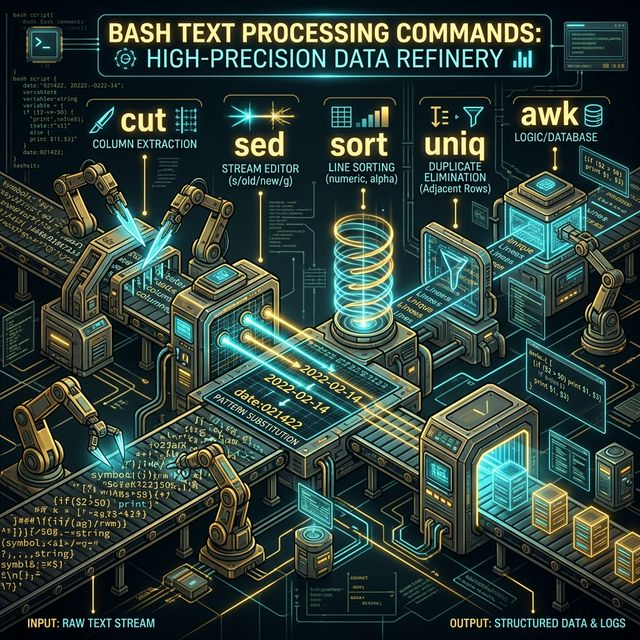

# Chapter 34: Text Processing Commands

  

## Introduction

## Summary

## References

---
[Previous Chapter](../33-Programmable-Completion/README.md) | [Next Chapter](../35-Time-and-date-commands/README.md)
